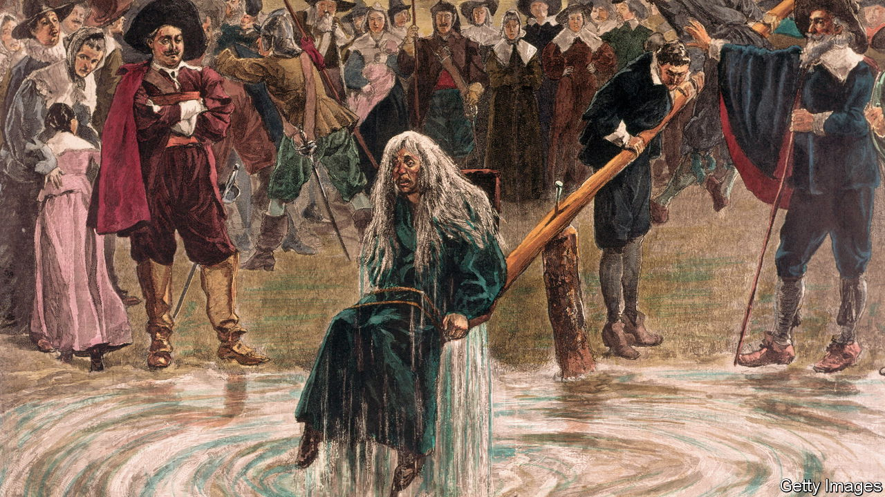

###### Damned Yankees

# Why Connecticut is exonerating witches 

##### Little-known victims of witch trials may finally receive justice 

 

> Mar 2nd 2023 

IN 1642 COLONIAL Connecticut adopted a list of 12 capital crimes, which included murder, kidnapping, treason—and witchcraft. Five years later Alse Young was the first person recorded in colonial America to be executed for the crime of witchcraft. On May 26th 1647 she was hanged on the grounds of the Hartford meeting house, now the site of Old State House. Ten other people were executed for witchcraft in Connecticut and more than 30 people were indicted for it between 1647 and 1697. More than 375 years after Young was executed, her absolution may be nigh.

Last month a judiciary committee of the state legislature agreed to consider a resolution that would exonerate those accused of witchcraft in Connecticut. At a hearing on March 1st William Schloat, a nine-year-old, testified that he wished he had a time machine so he could help the accused. John Kissel, a Republican state senator, wondered about the state’s role in any exoneration, since the trials took place before the United States existed, when Connecticut was a colony: “Once you go down that path, where does it end?” Luther Weeks, a descendant of a deacon who may have been involved in the prosecutions, countered that the state had no issue celebrating the positive aspects of colonial history; it needed to acknowledge the dark side, too.

Many accused of witchcraft were vulnerable. Unmarried pregnant woman were frequent targets. Young, a new arrival, may have been targeted because some thought she caused an outbreak of influenza. Beth Caruso, co-founder of the Connecticut Witch Trial Exoneration Project, made up of amateur historians and descendants, says her husband’s ancestor was found guilty of bewitching a gun that had accidentally killed someone three years earlier, even though she was not there. Some may have been coerced into confessing. Many met their end at the gallows. Others faced the ducking test: suspected witches were dropped into water; the innocent sank and the guilty floated. 

Sarah Jack, co-host of “Thou Shalt Not Suffer”, a witch-trial podcast, discovered three years ago that she was a descendant of Winifred Benham, the last person accused of witchcraft in Connecticut. “I was confused,” she says. “I had no idea there were more witch trials in New England outside of Salem.” Schoolchildren learn about the witch trials that took place in neighbouring Massachusetts. Arthur Miller, a playwright, used the trials of 1692 as an allegory of the anti-Communist panic. Salem, the heart of the hysteria, has embraced its history and become a kitschy, witchy tourist spot, with plenty of wands for sale. 

Massachusetts has made several efforts to atone. In 1702 the General Court of Massachusetts declared the trials unlawful. A decade later the state overturned the convictions. In 1957 and 2001 more alleged witches were exonerated. Thanks to the efforts of children working on a history project, the last accused witch in Massachusetts was cleared of wrongdoing last summer. Also last year Nicola Sturgeon, then Scotland’s first minister, issued a posthumous apology to the thousands of people persecuted as witches in Scotland.

But in Connecticut efforts have been successful only on the local level. The town council in Windsor, where Young lived, exonerated her in 2017. Proponents of the bill hope a history trail remembering those accused would be meaningful. Some say lawmakers have more pressing matters to deal with than exonerating those dead for nearly four centuries. Jane Garibay, who introduced the bill in the state’s House of Representatives, says exoneration has been a long time coming, and that any injustice is worth putting right. “It was a wrong,” she says. The bill is “saying we’re sorry”.■


