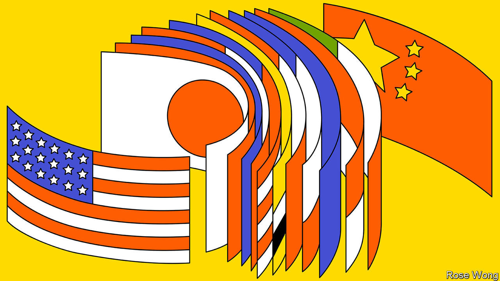
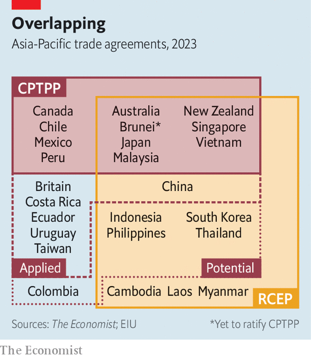
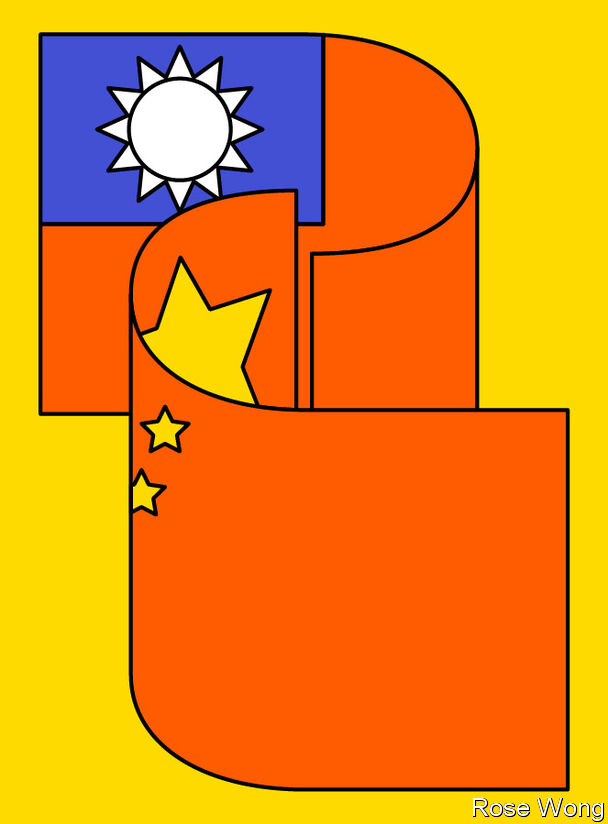

###### Free trade in Asia

# How Donald Trump damaged America’s interests in Asia 

##### China is itching to join the region’s premier trade pact 

 

> Mar 7th 2023 

Donald trump entered the White House in 2017 with a long hit list. The  (TPP), a trade deal which he called “a rape of our country”, was near the top. Just three days into his presidency, Mr Trump moved to kill it—and succeeded only in denying America its benefits. While America ditched the pact, others defied expectations by staying wedded to it and the principles of free trade and multilateral rule-making it represented. Five years ago this week, ministers from the 11 remaining countries met in Chile to sign the renamed  (CPTPP).

How has it fared? Without America—whose Democratic president, Joe Biden, dares not offend the protectionists in his party by undoing Mr Trump’s error—the economic impact has been less than was once envisaged. Certain pairs within the group, especially those such as Vietnam and Canada that did not have free-trade agreements, have seen big rises in trade. In some industries import values within the bloc rose by as much as 22.9% and export values by as much as 11.6% for every percentage-point drop in tariffs, reckons the Asia Competitiveness Institute, a research centre in Singapore. But external shocks—the pandemic, the US-China trade war, the actual war in Ukraine—have muddied the picture and complicated data analysis.

Companies have also been slow to seize the potential gains from big tariff cuts. And member countries have themselves failed to implement the behemoth agreement fully. Cracking down on laggards was, after all, supposed to be America’s role. The CPTPP has no dedicated secretariat with full-time responsibility for enforcement, notes Deborah Elms of the Asian Trade Centre in Singapore: “They didn’t set one up because we anticipated that this is where America will hold feet to the fire.”

 


Even so, other countries, including America’s greatest rival, are clamouring to join the deal. Indonesia, the Philippines, South Korea and Thailand have all expressed interest in joining. The pact may soon have its first new member: Britain is expected to reach an “agreement in principle” to join as early as this week. That will put the spotlight on applications from China and Taiwan, which were submitted in late 2021. The group’s handling of those duelling bids will have big implications for the balance of power in Asia, as well as the future of what’s left of the liberal international trading system. “Just as the mettle of the TPP project has been tested by the United States, now it will be tested by China,” says Mireya Solís of the Brookings Institution, a think-tank in Washington. 

The CPTPP originated in the halcyon days of the 1990s, when great-power competition was over, America was ascendant and globalisation in vogue. The leaders of the Asia-Pacific Economic Co-operation, or APEC, grouping gathered at a beach resort in Bogor, Indonesia in 1994, and, clad in intricately patterned Javanese shirts, pledged to pursue “free and open trade and investment” in the region by 2020. A big step towards that vision came in 2005 when an agreement between four small economies—Brunei, Chile, New Zealand and Singapore—caught America’s eye. Australia, Peru and Vietnam joined the talks that ensued, followed by Canada, Malaysia, Mexico and, in 2013, Japan. The monster free-trade pact taking shape became the economic centrepiece of Barack Obama’s much-touted “pivot” to Asia. Encompassing some 40% of global GDP, the TPP was sold in America as offering open markets and enforcing high standards to counter China’s growing unruliness.

If its economic punch has been subdued, the CPTPP has had much more impact on global trade rules. Its provisions on digital governance, customs procedures and intellectual-property protection have become reference points for deals elsewhere. “These rules are living beyond the corners of CPTPP,” says Wendy Cutler, a former American official who negotiated the TPP. America’s revised free-trade deal with Mexico and Canada, the United States-Mexico-Canada Agreement (USMCA), lifted sections on digital commerce from the CPTPP. This influence is invaluable at a time when the “multilateral system as a whole, the World Trade Organisation at its core, are under threat like never before,” argues Shiro Armstrong of the Australian National University in Canberra. 

 


Britain’s accession will expand the deal’s reach. “It can show it doesn’t have to be just an Indo-Pacific agreement,” Ms Cutler says. For the British government, too, the political pull is stronger than the economic one. Joining would, it is estimated, boost the baseline level of British gdp by £1.8bn or 0.08%. But MPs in the ruling Conservative Party love trade deals and are desperate to secure visible benefits from leaving the EU and to ensure that Britain has a degree of influence in the Indo-Pacific. 

Equally important, the British precedent should help set high standards for the CPTPP itself. Britain’s strict accession process, which admitted no exception to the club’s rules, was intended to establish a “UK model” for future applicants, says Munakata Naoko, a former Japanese trade negotiator. China will try to put that to the test. Its government has in recent months been emphasising its intention to join the CPTPP; China’s departing prime minister, Li Keqiang, called for “active steps” towards accession during a speech before the National People’s Congress on March 5th. 

There is a lot of scepticism about China’s application. China and many existing CPTPP members already belong to the Regional Comprehensive Economic Partnership (RCEP), a lower-standard Asian mega-trade deal signed in 2020. China would have to undertake major economic reforms to join the CPTPP on its current terms. The country lags far behind many of the CPTPP’s standards on treatment of state-owned enterprises, intellectual property, labour rights and digital trade. The “heavy hand of state interference” in recent years has “moved them farther from the starting line”, says Jeffrey Schott of the Peterson Institute for International Economics, an American think-tank. 

Yet many policymakers and trade experts in Asia treat the possibility of Chinese membership more seriously than those outside the region. Officials in the Chinese Ministry of Commerce are in earnest about it, they say, even if the process of negotiation is likely to be protracted. China may try to secure carve-outs from the club’s rules. Meanwhile, the possibility of Chinese membership will exert a strong pull for many in the region and beyond. Research by Peter Petri of Brandeis International Business School and Michael Plummer of Johns Hopkins University finds that if China joined CPTPP, global annual income gains due to the pact would quadruple to $632bn, or a quarter more than under the original TPP with America involved. 

 


China’s bid is already testing the group’s cohesion. Any decision on new members must be unanimous. “China is trying a divide and conquer strategy, obviously,” Ms Munakata says. Among and within CPTPP member countries, there are different schools of thought on how to proceed. Some argue it is better to let China have a hearing, and, ultimately, join if it meets the standards. “It’s in Singapore’s interests to have China in the TPP—it creates a more stable and predictable environment for trade in goods and services, particularly in intellectual property,” says George Yeo, a former Singaporean trade minister. Others, especially Japan, are less keen and aim to hold off on even allowing its initial accession process to commence. 

Whether or not China’s bid proves successful, it has already been effective at complicating Taiwan’s. (Some experts believe this was China’s primary aim.) The island, which China claims as its territory, submitted its bid less than a week after China. Taiwan’s government has been updating its regulations to meet the pact’s standards. If Taiwan joined first, China would be livid. “The crux of the matter isn’t Taiwan’s ability to fulfil the standards—it’s about how you deal with the concerns of many countries in the region about China’s reaction,” Ms Solís says. But if China joined first, it could block Taiwan. Joint accession, after the model of their wto entry in 2001-02, might be a solution; but today’s politics are less amenable to it. 

A drawn-out process on China and Taiwan’s bids could become a distraction, slowing much-needed updates of the pact’s provisions to keep up with technological change. It could also clog up the entry queue. In addition to Asian aspirants, a trio of Latin American countries—Costa Rica, Ecuador, and, as of last December, Uruguay—have applied to join. Despite delays, South Korea is keen; its formal application is a “matter of time”, says Yeo Han-koo, a former South Korean trade minister. 

Can’t count on Uncle Sam

Some in Asia dare to hope that the interest from other suitors will draw America back. Japan’s prime minister, Kishida Fumio, has repeatedly called on Mr Biden to rejoin the CPTPP. It is extremely unlikely. Yet it is not entirely implausible, say two pioneers of a strategy to use smaller trade pacts to pull America into the region: Mr Yeo, the former Singaporean official, and Tim Groser, a former New Zealand trade minister. “Chinese interest will eventually spur the US to become interested again,” says Mr Yeo. Though the CPTPP remains electoral poison in Washington, Mr Groser points to the USMCA agreed in 2018 as a model for a shift.

Certainly, Mr Biden’s current economic offering, the Indo-Pacific Economic Framework, which pointedly lacks any element of trade liberalisation or expanded market access, leaves much to be desired for export-oriented Asian economies. If America, the world’s largest import market, fails to understand that, many in the Indo-Pacific may start to feel pulled ever more towards China, the second-largest. ■

