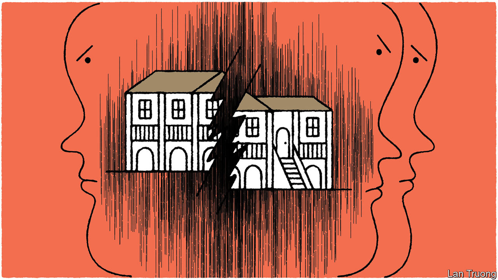

###### Banyan

# The rift in Singapore’s first family turns even nastier 

##### Lee Kuan Yew wanted no memorials but bequeathed a family feud 

 

> Mar 9th 2023 

WHEN LEE KUAN YEW died in 2015, many recalled how he reacted to the idea that a monument should be raised to him. “Remember Ozymandias!” Singapore’s founding prime minister had said, referring to Shelley’s sonnet about a great pharaoh memorialised, in the end, only by a broken statue in a desert. Lee wanted no monument apart from a thriving Singapore.

He tried hard, even from beyond the grave, to preclude the establishment of one potential memorial in particular: the colonial-era bungalow at 38 Oxley Road where he had lived from 1945 until his death. Lee left instructions for it to be bulldozed. Instead, the house, still very much standing, has become the focus of a bitter dispute between his three children. One of them, Lee Hsien Loong, has been Singapore’s prime minister since 2004; another, his daughter Lee Wei Ling, in ill health, lives in the house; the third, their brother Lee Hsien Yang, is being investigated for perjury over the row and has fled the country.

The squabble has gripped Singaporeans, and no wonder. It is hard to think of a better allegory for the island-state’s power politics and economic development than an intra-Lee family dispute over a British-era property. The disagreement centres on the handling of Lee Kuan Yew’s will, the last of seven iterations. Signed in December 2013, it was handled not by his usual solicitor but by his daughter-in-law, Lee Hsien Yang’s wife Lee Suet Fern, and her law firm. Like most earlier drafts, it contained what has become known as “the demolition clause”, instructing that the house should be demolished either immediately after Lee’s death or, if Lee Wei Ling still wanted to live in it, as soon as she had moved out. Singapore’s founding father must have felt strongly about this—it was the one clause in his will he wanted made public. His elder son, the current prime minister, once described him as “unwavering” on the issue.

In 2017 a family dispute over the house’s fate became public when Lee Hsien Yang and Lee Wei Ling issued a long statement accusing their brother, the prime minister, of being “behind what was represented to the family as a government initiative to preserve the house”. The rift has since widened. Lee Suet Fern’s role in the execution of the final will was officially investigated and in 2020 she was suspended as a lawyer for 15 months—even though she was not found to have acted dishonestly in her dealings with her father-in-law. Her husband, Lee Hsien Yang, joined the political opposition, campaigning for the small Progress Singapore Party at a general election that year.

The couple, now living in exile, were on a trip to Singapore last June when they were visited early one morning by two senior policemen. Rather than report for a formal police interview as requested, they promptly rushed to the airport. These events were made public only on March 2nd in a senior minister’s written answer to a parliamentary question about the house controversy. He said the couple were under investigation for having given false evidence in the proceedings against Lee Suet Fern.

Lee Hsien Yang believes this revelation was intended to thwart his ambition. Singapore will hold a presidential election between June and October, and he has hinted at running. The presidency is a largely ceremonial role, but has important veto powers. And Lee Hsien Yang had been a plausible contender. The office, held in six-year terms, is rotated around Singapore’s biggest ethnic communities. This year’s contest will be “open”—meaning that candidates from the ethnic-Chinese majority, to which the Lee family belongs, can stand. Lee Hsien Yang is also one of the few people who could meet the strict criteria for candidates from the private sector, having been chief executive of Singapore Telecommunications for 12 years.

A big believer in both meritocracy and the power of heredity, Lee Kuan Yew would not be perturbed that a son of his should occupy his former office. He might even have taken in stride another son running for president as, in effect, an opposition candidate. But that now seems unlikely to happen. It could not be done from exile. 

Even were Lee Hsien Yang to run, Lee Hsien Loong, like his father, loses few political battles. A son of Lee Hsien Yang and Lee Suet Fern, the Harvard economist Li Shengwu, acknowledged his uncle’s clout in a tweet. “Many families have vindictive relatives. My relatives just happen to control a small authoritarian government.” 


