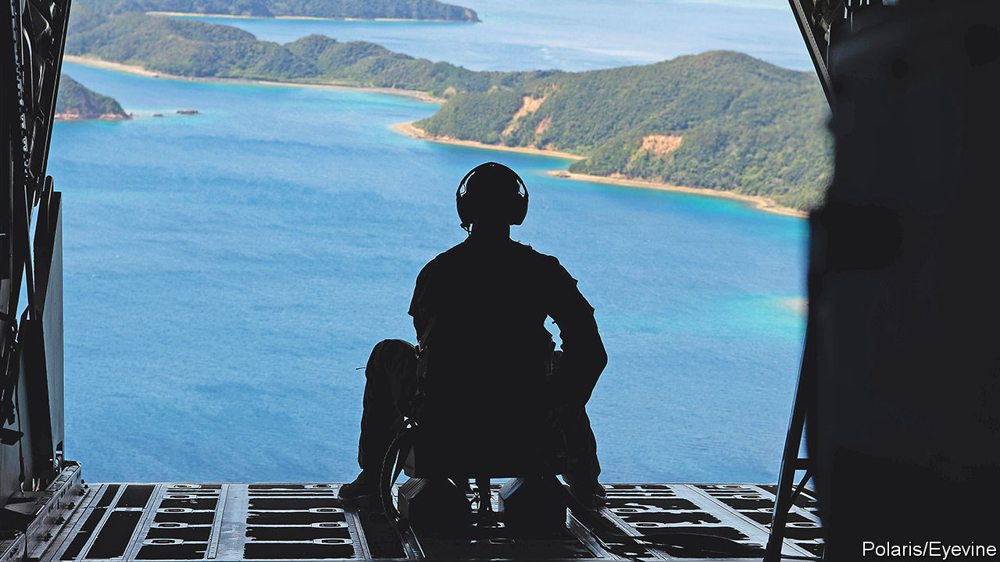
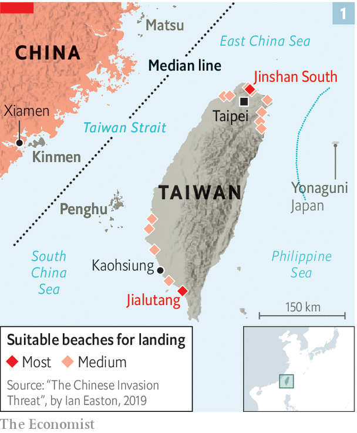
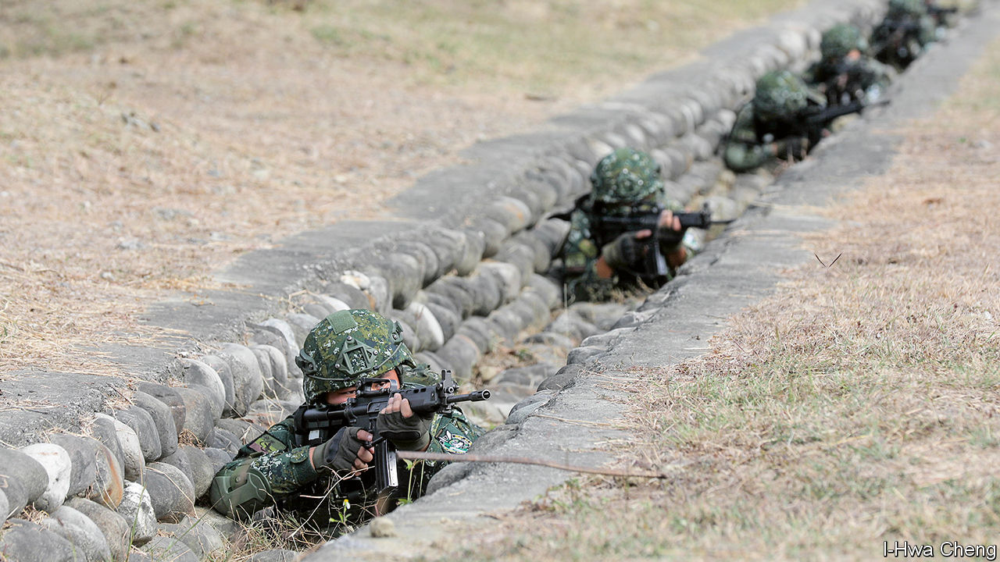
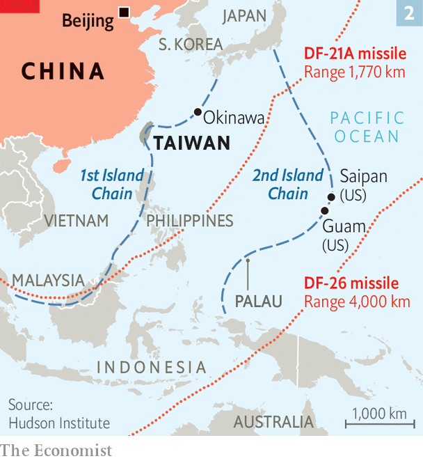
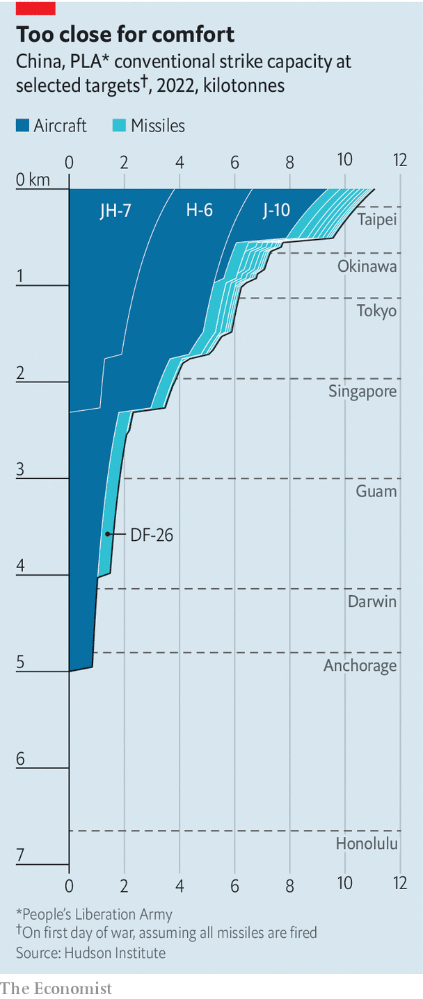

###### Storm warning

# America and China are preparing for a war over Taiwan 

##### It would spread far across the region, with devastating consequences for the world 

 

> Mar 9th 2023 

THEIR FACES smeared in green and black, some with Stinger anti-aircraft missiles on their packs, the men of “Darkside”—the 3rd battalion of America’s 4th marine regiment—boarded a pair of Sea Stallion helicopters and clattered away into the nearby jungle. Their commanders followed in more choppers carrying ultralight vehicles and communications gear. Anything superfluous was left behind. No big screens for video links of the sort used in Iraq and Afghanistan: to avoid detection, the marines must make sure their communications blend into the background just as surely as their camouflage blends into the tropical greenery. The goal of the exercise: to disperse around an unnamed island, link up with friendly “green” allies and repel an amphibious invasion by “red” forces.

Ignore the polite abstractions. The marines are training for a war with China, probably precipitated by an invasion of Taiwan. Their base in Okinawa, at the southern end of the Japanese archipelago, is just 600km (370 miles) from Taiwan. The two islands are part of what American military planners call the “first island chain”: a series of archipelagoes and islands, big and small, that stretches from Japan to Malaysia, impeding naval passage from China to the Pacific. Whether by harrying Chinese ships from a distance or—much less likely—by deploying to Taiwan to help repel a Chinese landing, the marines will be early participants in any conflict.

The hardest part, says Lieutenant-Colonel Jason Copeland, Darkside’s commanding officer, would be dealing with “an adversary that’s coming at you in mass”. As China’s military power grows, predicting how a war over Taiwan might unfold, and thus improving the odds of fending China off without unleashing a nuclear calamity, is getting ever harder. The only certainty is that, even if all nuclear weapons remained in their silos, such a conflict would have horrific consequences, not just for the 23m people of Taiwan, but for the world.

China’s Communist leaders have claimed Taiwan since Nationalist forces fled to it after losing a civil war in 1949. America has long pledged to help the island defend itself. But in recent years, on both sides, rhetoric and preparations have grown more fevered. China’s forces often practise island landings. Its warships and fighter jets routinely cross the “median line” (in effect Taiwan’s maritime boundary) and harass military ships and planes of America and its allies. After Nancy Pelosi, at the time the Speaker of America’s House of Representatives, visited Taiwan last year, China fired missiles towards it.

Dire strait

America, meanwhile, is sending more military trainers to Taiwan. The Taiwanese government recently increased mandatory military service from four months to a year. Prominent congressmen have urged President Joe Biden to learn from Russia’s attack on Ukraine and give Taiwan all the weapons it may need before an invasion, not after one has started. Adding to the sense of impending crisis are America’s efforts to throttle China’s tech industry and Mr Xi’s growing friendliness with Russia. 

American military commanders and intelligence chiefs say Mr Xi has ordered the People’s Liberation Army (PLA) to develop the capacity to invade Taiwan by 2027. Some think conflict is closer. “My gut tells me we will fight in 2025,” General Michael Minihan, head of America’s air mobility command, recently warned subordinates. Both sides fear that time is running out: America worries that China’s armed forces may soon become too strong to deter, while China frets that the prospect of peaceful reunification is evaporating.

“War with China is not inevitable, and it’s not imminent,” declares Admiral John Aquilino, commander of America’s Indo-Pacific Command, who would oversee any fight with China. Speaking in his headquarters overlooking Pearl Harbour, scene of Japan’s pre-emptive strike in 1941, he says his first mission is “to do everything in my power to prevent a conflict”. Nonetheless, he adds, “if deterrence fails, you must be prepared to fight and win.” As Russia’s invasion of Ukraine shows, he warns, “There is no such thing as a short war.” 

The first question for America’s strategists is how much warning they would get of an impending invasion. The PLA, with an estimated 2m active personnel, versus Taiwan’s 163,000, would need extensive preparations to conduct what would be the biggest amphibious assault since the D-Day landings in 1944. It would have to cancel leave, gather landing ships, stockpile munitions, set up mobile command posts and much more. 

But in a war of choice, with Mr Xi able to pick his timing, many of these moves could be disguised as military exercises. American defence officials say they might see unambiguous signs of imminent war, such as stockpiling of blood supplies, only a fortnight ahead. For smaller operations, to seize islands Taiwan controls close to the mainland, say, there might be only a few hours’ warning—if that. 

America would want to expose China’s preparations early, as it did with Russia’s invasion of Ukraine, and rally an international coalition in opposition. That would be easier if Mr Xi embarked on an outright invasion. But China may try to exploit the  of Taiwan’s status: it does not have diplomatic relations with most other countries. If Mr Xi cites some “provocation”, and begins with actions short of war, such as a blockade, America or its allies might equivocate. 

America must also weigh how far its preparations risk precipitating conflict. Send aircraft-carriers to the region as a show of force? Deploy troops to Taiwan? Threaten China’s oil supplies through the Strait of Malacca? All might be deemed provocations by China, if not acts of war.

As war approaches, Taiwan will move navy ships from its vulnerable western coast to the east, behind the mountain range that runs along the eastern side of the island. It would seek to hide jet fighters in underground shelters and mobilise its 2.3m reservists. It would also have to control widespread panic, as multitudes attempted to flee and as transport links to the outside world were cut. 

America, too, would be dispersing jets from exposed bases. The marines would deploy around maritime choke-points. American submarines would slip under the waves, some mustering close to Taiwan. Some American and Taiwanese military commanders would no doubt press for military strikes against China’s gathering invasion force. They would probably be overruled by those seeking a diplomatic solution, or at least not wanting to be blamed for firing the first shot. 

China, for its part, would have to take a momentous decision. Should it limit its attack to Taiwan, hoping to create a  as America and its allies dither? Or should it strike America’s forces in the region, in a new Pearl Harbour? The first option leaves America free to attack the invasion fleet; the latter all but guarantees its wholehearted entry into the war, and probably Japan’s, too, if China attacked American bases there. 

An invasion would almost certainly begin with massive missile and rocket strikes on Taiwan. These would quickly destroy much of Taiwan’s navy, air force and air defences. Wang Hongguang, a former deputy commander of the PLA region opposite Taiwan, predicted in 2018 that there would be 24 hours of bombardment—first on military and political targets, then on civilian infrastructure such as power plants and fuel depots. He suggested that China would blind Taiwan’s satellites, cut its subsea internet cables and use electronic warfare to scramble its command-and-control systems, hobbling co-ordination with American and allied forces. 

General Wang said the onslaught would cause enough havoc to open at least a two-day window for invasion. If American forces did not arrive within three days, he blustered, “don’t bother to make a trip in vain”. China will also do its best to sap Taiwan’s will to fight. Its cyber-forces will try to hack local television and radio, and bombard Taiwanese soldiers with text and social-media messages, offering rewards to mutineers and deserters. 

China must then confront the formidable challenge of an amphibious assault, one of the most difficult forms of warfare. The beaches of Kinmen, a Taiwanese island just 3km from the mainland, are dotted with relics from an attempted invasion in 1949, when Nationalist forces killed or captured almost the entire advance party of 9,000 Communist troops who landed in small fishing boats. The PLA has come far since then, acquiring advanced weaponry and studying precedents such as D-Day, the American-led landings at Incheon in Korea in 1950 and Britain’s recapture of the Falkland Islands from Argentina in 1982. 

Walk of strife

Yet the risks are still great. China has not fought a war since invading Vietnam in 1979. Although the Taiwan Strait is only 130km wide at its narrowest, its currents and tides are powerful and erratic. Conditions are usually propitious only in March-May and September-October. Just 14 of Taiwan’s beaches are suitable for landings and they are heavily fortified, especially the ones close to Taipei, where Chinese forces would probably prefer to start an invasion (see map 1). Taiwan has built lots of bunkers and tunnels in the area.

 


Nor is it certain that the PLA has enough ships to transport an adequate landing force quickly across the strait. It would need 300,000 to 1m troops to be sure of subduing Taiwan. It has six amphibious army brigades stationed nearby, with a combined 20,000 troops, plus a similar number of marines. But China’s amphibious landing ships could probably ferry only about 20,000 soldiers across in the first day or two, depending on how much equipment they take. Likewise, the PLA’s transport aircraft could probably convey only half of its 20,000 airborne troops in the opening phase. The PLA recently practised using ferries and other civilian ships, which could bring across many more units but, for that to work well, China would need to capture a still-usable port. 

The war in Ukraine has raised fresh doubts, too, especially about China’s ground forces. Its combined-arms battalions, including its amphibious ones, are modelled on Russia’s battalion tactical groups, which have struggled in Ukraine. Even if China succeeded in swiftly decapitating Taiwan’s leadership, it might still face protracted fighting against forces replicating the Ukrainians’ use of portable missile-launchers and drones.

Taiwan’s strategy, meanwhile, is to thwart China’s initial landing or prevent it from bringing enough troops. Taiwanese forces would block ports and beaches with sea mines, submerged ships and other obstacles. Backed by surviving aircraft and naval vessels, they would strike China’s approaching force with missiles and pound disembarking Chinese troops with artillery and rockets. Some PLA texts suggest that Taiwan has underwater pipelines off its beaches that could release flammable liquid. Some of its outlying islands are protected by remote-controlled guns. 

If the PLA broke out of its beachheads, it would face a slog through arduous terrain to reach Taipei and other urban centres. Then both sides would face a challenge for which neither is fully prepared: urban warfare. Taiwan is reluctant to fight in its cities, fearing high civilian casualties. The PLA does train for urban warfare, but had long banked on a quick victory if it reached Taipei. Since the war in Ukraine began, however, both sides have been practising fighting in built-up areas more. 

 


Even if a Chinese invasion got bogged down, though, time would not be on Taiwan’s side. “We can fend them off for one or two weeks but no longer,” says Si-fu Ou of Taiwan’s Institute for National Defence and Security Research, a think-tank. Unless Taiwanese forces resist steadfastly, everything else is futile. But, by the same token, Taiwan cannot hope to defend itself in the long run without American help. 

As an island, Taiwan is not just harder to invade than Ukraine, but also harder to support. Its ports might be destroyed by China, its own forces or even America’s. Attempting to bring reinforcements or supplies to the island as Chinese missiles rain down would be almost as difficult as attempting to invade.

At the very least, America and Taiwan would need help from allies. Japan, which hosts tens of thousands of American troops, has capable forces. The Philippines is weak militarily but close to Taiwan. Australia is closely allied but modestly armed and farther away. Countries in the Pacific could provide rear bases. More distant allies, such as Britain, might send naval vessels. A big uncertainty is how much India would help. A lot would depend on how the crisis unfolds and who is blamed for it.

 


America’s plans to help Taiwan used to hinge on aircraft-carriers. It sent one to the area after China fired missiles near Taiwan in 1995 and again after another salvo in 1996. But China has since invested heavily in “anti-access/area-denial” (A2/AD) weapons, designed to fend off American ships and aircraft. They include the DF-26 missile, which can strike deep into the Pacific (see map 2), and new hypersonic missiles that are harder to intercept. China’s navy is now the world’s largest, with a fleet of submarines to attack approaching American ships. Its long-range bombers are also a menace. David Ochmanek of the RAND Corporation, a think-tank that has run classified war-games simulating a Taiwan conflict, argues that old American strategies now “lead to defeat”. 

American planners’ alternative is summed up with three D’s: disrupt Chinese operations within the first island chain, defend allies on it and dominate the sea and air beyond. America must overcome daunting problems: the “tyranny of distance” in the vast Pacific Ocean, the growth of China’s “weapons engagement zone” to encompass American bases in the western Pacific and the sheer mass of China’s manpower and weapons, which exceeds America’s in many categories.

 


The risk of Chinese attack, by missiles or bombers, decreases with distance (see chart). But even Guam, America’s big military hub some 3,000km from China, is vulnerable. What is more, America’s air defence is worryingly thin. It also has few means of passive defence, such as concrete aircraft hangars.

American officers speak of the prospect of war with a mixture of dread at China’s growing power (“Every day I am astounded by their capabilities,” says one), and optimism that new tactics can achieve victory. They emphasise “distributed lethality”, meaning the scattering and constant movement of forces to avoid becoming easy targets, while maintaining the capacity to gather or co-ordinate in attacks. This will rely to an unprecedented degree on America’s experience of fighting as a “joint force”, in which separate military branches and weapons systems reinforce each other.

Military jets would disperse from big bases, gather in the air for battle and settle where they can on specks of land. They would repeat the pattern as quickly as possible by “hot-pit” refuelling with engines running. Sometimes planes would perch in civilian airports; sometimes on austere airfields, many dating from the second world war, which are being refurbished. Adding ever more concrete to protect aircraft “is a fool’s errand”, says Brigadier-General Paul Birch, commander of the 36th Wing at Andersen air base, in Guam. “Being in the air is much safer.”

Engineers, meanwhile, would aim to repair cratered runways within about six hours. Ground crews would set up pop-up hangars as well as traffic-control centres and data links. A big headache would be how to get fuel and munitions to the right places. One aim of this “agile combat employment” is to force China to expend its large but finite stock of missiles. 

Rather than fight near Taiwan, American surface ships would probably hold back, to survive, provide air defence for Guam and other rear bases and blockade Chinese trade. They would “pulse”—sailing briefly in and out of the danger zone—to shoot at Chinese ships and planes.

Brothers with arms

Marines would deploy to “key maritime terrain”, especially islands dominating the straits that separate Taiwan from Japan and the Philippines. They would reinforce the local troops, reconnoitre Chinese dispositions and, armed with new missiles coming into service in the next few months, fire on enemy ships. The marines are creating three new “marine littoral regiments”, each with more than 2,000 troops, giving up their tanks and many of their howitzers.


Some critics say these units would be too vulnerable; others reckon that, without deployment to Taiwan itself, they would be too distant to help much in the main battle. The marines, though, argue that they would multiply the threats China must face, “canalise” Chinese ships into vulnerable positions and, above all, “sense and make sense” of Chinese deployments. General David Berger, the marines’ commandant, talks of “turning the tables” on China by using an A2/AD strategy to defend the first island chain. America won’t have to fight its way in, he says: “We are there persistently, 52 weeks a year.”

Dispersed warfare sacrifices efficiency for resilience. To succeed, though, lots of things need to go well. First, command-and-control networks must be able to withstand Chinese electronic attack. Planners talk of a yet-to-be-perfected “kill web”, in which artificial intelligence helps “sensors” and ”shooters”—including those of allies—operate together even when far apart. Marines on islands, stealthy F-35 fighters, drones and more can all act as nodes. Second, America would need more sophisticated logistics to supply far-flung units. Last, it must persuade allies to risk China’s wrath. Their willingness would become clear only as hostilities erupt, which complicates planning.

Early in the war the job of sinking China’s invasion fleet—the critical task in defending Taiwan—would fall mainly to submarines and long-range bombers. Though its boats are outnumbered by China’s, America retains the edge in underwater warfare. Its attack submarines carry torpedoes, cruise missiles and sea mines. Sooner or later, however, they would run out of munitions, and would have to sail away for several days to replenish in places such as Guam, where they would be vulnerable.

Too far away

Bombers flying from Hawaii, Alaska and the American mainland, meanwhile, would be using munitions that can be fired from beyond the reach of Chinese anti-aircraft missiles. But America’s Long Range Anti-Ship Missiles, which can travel 200 nautical miles or more, would probably run out within a week. Thereafter, American forces would have to move closer to Taiwan to sink ships. America’s hope is that, by then, China has also run short of long-range munitions. 

America and China would debate whether and when to attack each others’ satellites, potentially turning low-earth orbit into a scrapyard. Some war-games suggest they might refrain from doing so for fear of harming themselves. But as a senior American military official puts it, “The side that shoots first gets a big advantage.”

Every stage of the war would be fought in the shadow of nuclear weapons. Mr Biden has talked about reducing America’s reliance on nukes, and China espouses “no first use”. But the risk of disaster is presumably rising as China expands its arsenal. It will grow from 400 or so warheads today, the Pentagon reckons, to 1,000-odd by 2030 (still less than America and Russia have). A recent war game conducted by the Centre for a New American Security, a think-tank, suggested that both sides underestimate the risk of escalation. This grows if either attacks the other’s mainland, or if the conflict becomes protracted. 

The toll of even a purely conventional war would be devastating, for the victors as well as the losers. A war game by the Centre for Strategic and International Studies, another American think-tank, found that under its “base scenario” Taiwanese, American and Japanese forces typically severed PLA supply lines after about ten days, stranding some 30,000 Chinese troops on the island. Taiwan survived as an autonomous entity, but was left with no electricity or basic services. America and Japan suffered, too, losing 382 aircraft and 43 ships, including two American aircraft-carriers. China lost 155 planes and 138 ships.

The economic cost would be enormous, too. RAND estimated in 2016 that a year-long war over Taiwan would reduce China’s GDP by 25-35% and America’s by 5-10%. The Rhodium Group, a consultancy, concluded in 2022 that the disruption to the supply of semiconductors (Taiwan makes 90% of the world’s most advanced computer chips) would cause global shortages of electronic goods, leading to “incalculable” damage to the world economy.

Given the appalling consequences, would America and China really go to war? Chinese officials say their preferred option is still peaceful unification, and deny there is any timetable for an attack. China also has many options short of an all-out invasion. They include economic coercion, a full or partial blockade and the seizure of outlying islands such as Kinmen. China may well embark on this sort of “grey-zone” operation as a substitute for, or a prelude to, a wider attack. 

Mr Xi has strong incentives to bide his time, not least because his forces are growing, whereas American defence spending is near an 80-year low as a share of GDP. But he may also feel pressure to attack if Taiwan abandons all pretence that it might ever reconcile with the mainland, and formally declares independence, or if America deploys troops to Taiwan. The year-long conflict in Ukraine is proof that an irredentist autocrat can miscalculate appallingly. Zhou Bo, a former senior officer in the PLA, notes that to achieve its aims, China does not need to exceed America’s global might; it just needs an edge in the western Pacific. 

Many strategists in America and Asia fear that the loss of Taiwan would replace the American-led order in the region with a Chinese-led one. Japan and South Korea might feel obliged to develop their own nuclear weapons. Rather than constraining China, the first island chain would become a platform for it to project power farther afield. “Taiwan is the cork in the bottle,” as an American military official puts it.

America draws solace from Russia’s failures in Ukraine, believing they have increased Mr Xi’s doubts about his ability to take Taiwan. But to preserve the precarious balance across the Taiwan Strait, America must act with exquisite skill. It needs to reinforce Mr Xi’s hesitation by strengthening itself, its allies and Taiwan, but not go so far that he thinks he must attack fast or give up on seizing Taiwan for ever. ■

