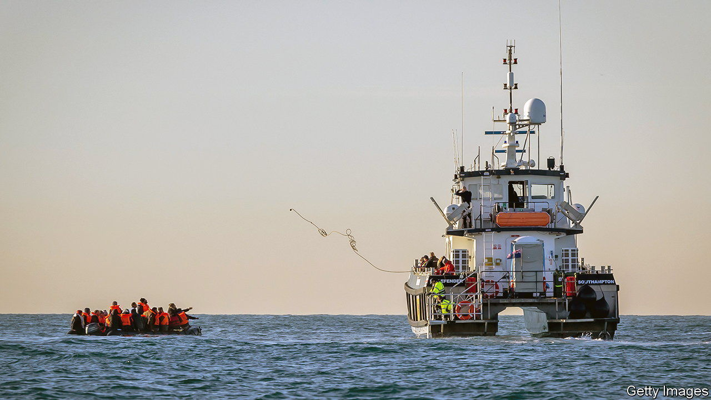

###### Channel crossings

# Britain’s new plan to “stop the boats” 

##### A law to stem the flow of asylum-seekers is unlikely to work 

 

> Mar 7th 2023 

“Stopping the boats” is one of Rishi Sunak’s five promises for 2023. More than 45,000 small-boat migrants crossed the English Channel last year, exposing Britain’s inability to control its borders. That figure was expected to grow this year. Mr Sunak and Suella Braverman, the home secretary, have now come up with a plan. New legislation unveiled on March 7th would render inadmissible asylum claims by those who travel across the English Channel on flimsy dinghies. Instead, they would almost all be detained and deported, never to return. 

Yet it is difficult to imagine how the government’s new Illegal Migration Bill can do much to alleviate the problem. Detaining asylum-seekers is morally and legally dubious: under international law asylum-seekers cannot be deemed “illegal”. The Home Office itself acknowledges that many of those who enter Britain  are legitimately in search of sanctuary. In 2022 migrants from the five countries that accounted for nearly half of those who crossed the Channel had an asylum grant rate of above 80%. For three nationalities—Afghans, Eritreans and Syrians—it was 98%.

The plan has myriad practical flaws, too. Britain has no capacity to hold large numbers of detained migrants. The government’s idea is to deter others from making the journey, thus keeping the numbers locked up and deported manageable. But it is far from clear that the policy would have this effect. Or if it did, how long that would take and how many migrants Britain would first have to detain. 

The next question is where would these migrants then be deported to? Britain already has a returns agreement with Albania, which has reduced the number of Albanians claiming asylum. But it will not be able to strike similar deals with most of the other countries asylum-seekers flee. That is because it is illegal to return them to countries considered unsafe. In the absence of a returns agreement with  (which is not in the offing), Britain could not send them back there. An attempt  as a destination for processing claims and settling those who succeeded is stalled in the courts. Britain has no other arrangement with a safe third country. 

It seems likely, then, that Britain will continue to process the claims of those who come from countries to which they cannot be returned. This would echo an earlier failure to tackle the problem. Under rules introduced in 2022 migrants who have arrived in Britain, having passed through other safe countries without claiming asylum, are classed as “inadmissible”. Yet immigration lawyers say that has made no actual difference to the way their claims are processed, except to lengthen further the wait for a decision. The new law seems likely to have a similar effect, though it may temporarily please some on the right of the Tory party.

Critics of this and previous attempts to tackle the small-boats crisis point out that there are few other routes for people fleeing war and persecution to claim asylum in Britain. There are schemes to reunite refugees with family members, and for Afghans, Hong Kongers and Ukrainians to apply to be resettled (although too few Afghans who helped Britain during its war against the Taliban have been allowed to come to the country). Asylum-seekers from other countries have no way to travel into Britain except by small boat or lorry. 

The government has promised to introduce new safe routes, but says it must first fix the small-boats problem. “That’s the wrong way round,” says Sunder Katwala, director of British Future, a think-tank. He says that introducing new schemes targeted at certain countries could, along with a returns deal with France, reduce the number of people travelling to Britain in small boats. The new law will not stop them. ■


