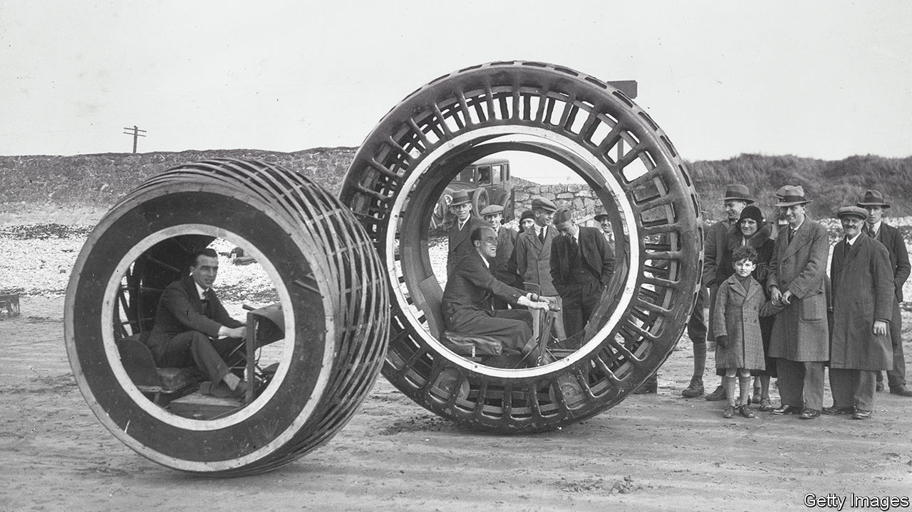

###### Discovery process

# Can an AI be an inventor? 

##### The British Supreme Court considers the arguments 

 

> Mar 9th 2023 

Judicial processes involve slow, deliberative thinking. Artificial intelligence (AI) involves mind-blowing computational speed. On March 2nd, in a hearing at the Supreme Court in London, these two worlds came together to raise big questions for intellectual property in the age of machines. 

In 2019 Britain’s Intellectual Property Office denied Stephen Thaler, an American computer scientist, patents for two inventions—a beverage container and a search-and-rescue device. The applications were not denied because the inventions lacked novelty, but because the named inventor was not a human being.

AI is often used as a tool to help researchers find new inventions. Applicants normally put the name of the person (or people) who worked most closely with the machine as the inventor. Until now this has not been a problem because AI has always required human assistance. But Dr Thaler asserts that his “creativity machine”, DABUS (short for “Device for the Autonomous Bootstrapping of Unified Sentience”), had come up with the two inventions without any intervention and that it would be dishonest to claim that he was the inventor. He is making the same argument in other jurisdictions. But this is the first time it has reached a country’s highest court. 

The immediate stakes may not seem that high. The British government conducted a consultation in 2021 on patents and AI; despite Dr Thaler’s assertions, most respondents said AI is not sufficiently advanced to invent without human involvement. And a ruling in his favour in Britain alone would have limited commercial repercussions. “There is very little point in only the UK protecting AI inventions,” says Matt Hervey of Gowling WLG, a law firm. “If a company has a viable choice to keep its invention a secret and exploit it, it won’t disclose the secret in a patent application to get a monopoly in only one country.” 

But the  and the questions raised by the case are profound. There is ambiguity in British law over who, or what, can claim credit for an invention. The Patents Act of 1977 was written long before its drafters could imagine robots creating anything and refers to the inventor as the “deviser”. If the Supreme Court does interpret the law to include machines, that could undermine the societal bargain on which patents are based.  are encouraged to innovate on the understanding that if they disclose their inventions in a patent, they will be granted monopoly rights to recover their investment. An AI is different: robots do not require any incentive to innovate. 

If the court decides that only a human inventor can hold a patent, its view on how rights can be legitimately transferred from an AI to humans (particularly if it is not clear how the AI works) will be closely watched. Although a machine has not yet created a pharmaceutical product on its own, Avi Goldfarb, an economist researching AI and health care at the University of Toronto, worries that if such inventions are not patentable there will be little incentive for firms to create machines that do drug research. The court is expected to deliver its verdict in a few months. It will not be the last word. 


