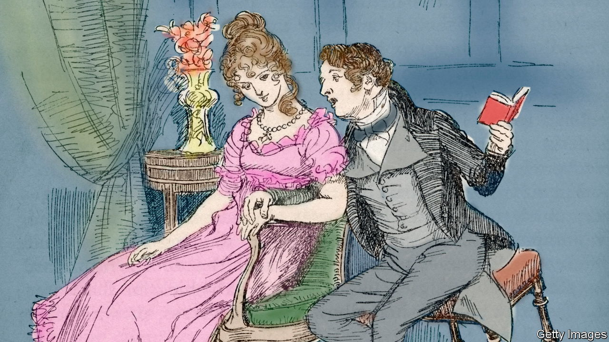

###### Her pulse quickened

# Sales of romance novels are rising in Britain 

##### Tiktokers are falling in love with the genre 

 

> Mar 6th 2023 

Passion is being partitioned. Online, and particularly on TikTok, romantic fiction is being carved into categories by its fans. Where once people merely read a category called “books” now they read categories called #friendstolovers, #enemiestolovers and #academicrivalstolovers. There is #spicytok and there is #smuttok; there is #forbiddenlove and there is the slightly creepy #forcedproximity. Feminism is not this movement’s strong suit. There is a category called #billionaireromance; there is no category named #earningsparity.

Progressive or not, the hashtags are shifting books. Thanks in part to TikTok memes, sales of romance and saga fiction in Britain have risen by 110% in three years, to £53m ($64m) a year—their highest figure in a decade, according to figures from Nielsen BookData. Publishers have started to take notice. For many years the industry had regarded romantic fiction with Darcy-like disdain but now its pulse is quickening. Bookshops no longer stash books with pink covers at the back of shops but put them on tables near the tills; publishers are learning to brave the word “heartwarming” without embarrassment.

It is thought the rise in romance is due, in part, to the pandemic. “We’re looking for escapist fiction,” says Molly Crawford, editorial director at Simon &amp; Schuster UK. But it is also perhaps because the genre lends itself so readily to filters and personalisation. Antique poets might have claimed love was as limitless as the stars but romantic fiction, however good, has always been prone to tropes. A large number of old novels already fit these new paradigms perfectly: online, “Pride and Prejudice” is now categorised as #enemiestolovers. As P.D. James, a novelist, once observed, Jane Austen novels are merely “Mills &amp; Boon written by a genius”. 

Mills &amp; Boon itself is marketed by a genius. Long before most Tiktokers were born, the romantic publisher had cornered the market in categories. Its website offers the drop-dead gorgeous in drop-down menus, with entries for such things as “Historical”, “Medical” and “Desire”. 

The Mills &amp; Boon search bar is a kind of census of female desire. Type in “Italian”, and you will be offered 338 titles; “Sheikh” brings up 282; and “Welsh” four. “Brooding” returns 66 results, while “Cheerful” produces zero. “Billionaire” offers you 754, “Surgeon” 206 and “Doctor” 380 (though to judge by titles such as “Baby Surprise for the Doctor Prince” and “A Doctor in Her Stocking”, neither the doctor’s knowledge nor his morals would seem to deserve such reverence). “Middle Manager” returns the pitiless phrase: “Sorry, no products matched the keyword.”

Middle managers aside, tastes vary when it comes to romantic fiction. Elisabeth Kendall is mistress (the title feels unusually apposite) of Girton College, Cambridge and a world expert in jihadi chick lit. In “I Fell In Love With a Jihadi Fighter”, two distant cousins are thrown together in the same house in the Syrian civil war (#forcedproximity). Smouldering glances are followed, somewhat unexpectedly, by the hero’s death. Happily all is not lost because, as Dr Kendall explains, “the woman decides she wants to join him” and so the rest of the novel is about “her metamorphosis into a suicide-bomber”. The smouldering resumes. 

The novels that straddle the romance-bestseller charts in Britain strike a different tone. Many are modern and American; all have taut-jawed heroes and a fondness for exposition. In one, a #billionaire checks his “Patek Philippe watch. Limited edition, hermetically sealed and waterproof, the stainless-steel timepiece had set [him] back a cool twenty grand.” It’s almost like reading Austen. In another, a surgeon hero has a habit of uttering such improbable sentences as: “I get to perform a very rare…craniopagus separation on Monday” and “I think I like you too much” and “Your mother is wonderful, by the way.” (Naturally he turns out to be a monster.) 

Not every title is modern. The covers of historical bestsellers feature winsome women in shawls; their plot lines feature pirates, illegitimate children and a liberal supply of scoundrels. As the blurb for one explains: “Marcus is excited by Emmy’s virginity and has her kidnapped, but Emmy hits him over the head and escapes.” It was all go in the past. 

Romance is a genre with great continuity. But as Sharon Kendrick, a bestselling Mills &amp; Boon author, points out, the past few years have left their mark. The Black Lives Matter movement has diminished the appeal of the Regency rake because, as with National Trust houses, everyone wonders “how this great wealth was acquired”. Although women still like masterful heroes, #MeToo means “Sheikhs aren’t quite as popular…as they have been” (bit too masterful). Billionaires now far outnumber millionaires because of “the cost of living…I mean, look at the price of a stamp.” ■


