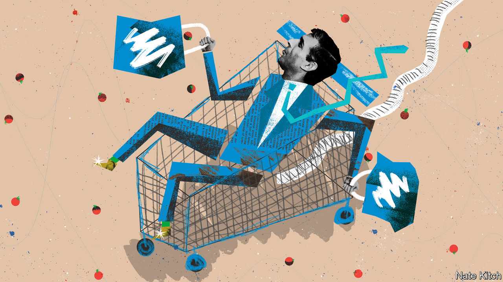

###### Bagehot

# Thatcher, Sunak and the politics of the supermarket 

##### The story of British politics told through the aisles 

 

> Mar 8th 2023 

There is no museum to Margaret Thatcher. There is no need for one, given the Sainsbury’s supermarket on the high street in Finchley, her former constituency. She opened it on March 16th 1987, inspecting the sausages, zapping cans at the till and delivering a sermon to its employees. “The market economy isn’t some theory—it is, in fact, men and women being able to spend their own earnings in the place of their choice, in shops like these.”

The supermarket is the best way to understand Thatcher and her creed. Her father had been a greengrocer. As a young Conservative candidate, she preached fiscal discipline through the analogy of a housewife managing the shopping budget. When she was drawing up an agenda for privatisation as leader of the opposition, she would often compare the cut-throat competition between Tesco and Sainsbury’s with sluggish state-owned industries. In the cold war the supermarket meant freedom itself: to know the difference between our systems, she would say, compare the sparse stores of Moscow with the abundance of an Asda. 

Thatcher’s pocketbook politics has been out of fashion for a while. Brexit, the pandemic and internal party convulsions crowded out more quotidian worries such as the price of sausages. In the wake of Boris Johnson’s victory in 2019, Conservative intellectuals declared that culture had vanquished economics. “It’s not the economy, stupid”, ran one headline. Economics had other ideas. The supermarket is again at the centre of British politics. It is the site of Rishi Sunak’s biggest achievement and worst headaches. What happens at the tills will shape his premiership. 

Politicians like supermarkets partly because their store-card data and consumer panels produce a picture of the electorate that is more sophisticated than anything political parties can draw. “They’d invariably come to me first at the start of the meeting and say ‘What’s going on out there?’” says Justin King, a former CEO of Sainsbury’s and a member of David Cameron’s business council.

What’s going on out there is brutal. In the year before Mr Cameron’s surprise victory in 2015, food prices consistently fell as discounters entered the market. Now, all has changed.  rose by 17% in the year to January, as the war in Ukraine drove up the cost of grain, energy and cooking oil. Shoppers tend to change their habits when inflation hits 4%, says Fraser McKevitt of Kantar, a consultancy, shifting from big brands to own labels and from fancy lines to budget products. A price war is under way. Ocado, a posh online grocer, promises to match Tesco’s prices; Tesco and Sainsbury’s promise to match those of Aldi, a discounter. 

Mr Sunak realises the dangers. He has made halving inflation by the end of the year his priority. (, he correctly remembers Thatcherism as a project to curb inflation first and cut taxes second.) He is likely to succeed in that aim, but its pursuit makes for miserable politics: there is little to do except sit tight and not spend money. Nor will he be thanked. Of 36 countries surveyed by Ipsos, a pollster, British voters are the most likely to blame their government for inflation. History suggests that economic competence is decisive in general elections, and that once a party loses its lead in this area, as the Tories did under Ms Truss, it can take years to claw it back. The feedback from government focus groups is bleak: participants go around the table comparing the price of cheese and milk.

The scruffy Finchley store testifies to the straitened times. The aisles are adorned with banners: “GREAT PRICES”; “SPECIAL OFFERS”; “£2 AND UNDER”. There are large gaps where the celery and tomatoes should be. The return of inflation would dismay Thatcher. But what would distress her more is that parts of her party seem to view supermarkets differently now. She saw the clockwork beauty in the supply chain: her archives contain a note in which she has underlined how one store had tweaked its truck axles to increase load capacity. She asked Roy Griffiths, a Sainsbury’s director, to fix the management of the National Health Service.

But a wing of the Tory party that calls itself Thatcherite has treated the supermarkets’ just-in-time distribution network much as a toddler with a hammer treats a wristwatch. Brexit has been painful for an industry whose business model was built around seamless borders, the free movement of hauliers and a fluid labour force. It will get worse if and when full import controls are finally imposed next year. 

Suspicion seems to have replaced admiration. Andrew Davies, the leader of the Welsh Conservatives, this month mocked an opponent who lamented a shortage of greens as a “metropolitan liberal”; the triumph of the 1980s had been to bring metropolitan tastes to provincial tables. Ministers have responded to the , which is largely due to high energy costs, by summoning retailers for a reprimand. In response, some retailers are refusing to share their data on shortages. “There is a lack of genuine respect for the depth of complexity this [industry] involves,” says one supermarket boss. 

The aisles have it

It often seems that the more the Conservative Party tries to imitate Thatcher, the less well she is remembered. The aesthetics of confrontation and upheaval are easy to mimic. The strategic patience and love of the consumer are often neglected. Mr Sunak, at least, seems to get this and it is in the supermarket that his greatest achievement is found. At the core of his  with the EU on Northern Ireland is a customs fix for supermarkets, an attempt to reconcile the constitutional revolution of Brexit with the simple wish of folk in Belfast to buy shepherd’s pie and microwavable lasagne as easily as residents of Blackpool can. Supermarket bosses have been impressed by the prime minister’s grasp of the technicalities. “He was the first person who really, really got into it in any detail,” says one. That is far from a guarantor of political success. But in miserable times it is an essential start. ■


