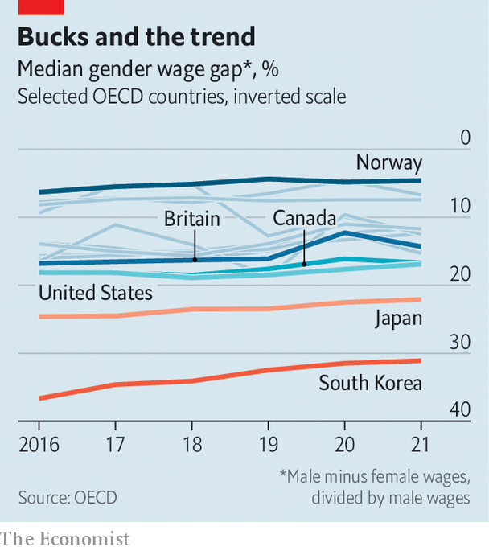

###### The glass-ceiling index

# After years in decline, is the gender pay gap opening up? 

##### With luck, the increase in 2021 was a blip 

 

> Mar 9th 2023 

On average, women earn less than men. Much of this is because of the jobs they perform, by choice or social expectation; these are often worse-paid than typical male occupations. Some, as when women’s pay is lower for the same position, is the result of discrimination. Before the covid-19 pandemic, the gap between median male and female wages was at least edging down. ’s glass-ceiling index of female workplace empowerment, published each year on March 8th, international women’s day, shows that this salutary trend reversed in 2021 in some of the mostly rich members of the OECD, including Britain and Canada (see chart, and economist.com/glassceiling for the full index).

 


One explanation is a hangover from the pandemic. When hotels, restaurants and shops shut their doors amid lockdowns, their workers’ wages suffered disproportionately. And those workers were disproportionately women. If so, the widening pay gap may have been a blip: demand from employers in these sectors has been hot since economies began to reopen. Americans working in leisure and hospitality have seen their earnings grow faster than those toiling in more male-dominated industries such as transport over the past year or so. 

The return to the pre-pandemic trend will be helped by women’s gains at the other end of the income spectrum. In 2022 the share of board members across the OECD who were women crept over 30% for the first time. MSCI now expects parity by 2038, four years earlier than previous estimates. Only 64 out of 3,000 or so big companies in the research firm’s global stock index had a female-majority board. But that was double the number in 2021 and includes giants like Citigroup and Shell. Analysis just published by Moody’s, a credit-rating agency, shows that such firms in North America have consistently higher credit ratings. Disentangling cause and effect is not easy. Empowering women ought to be.


