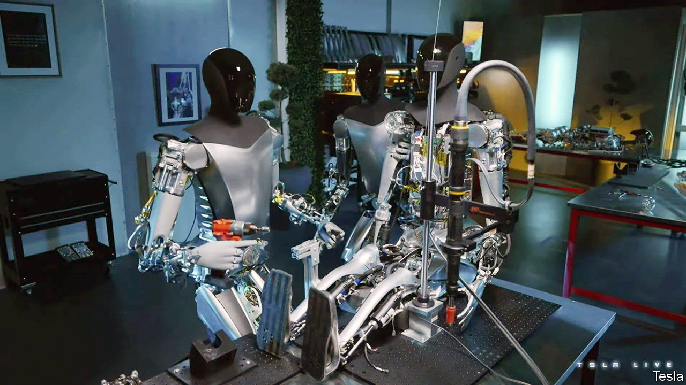
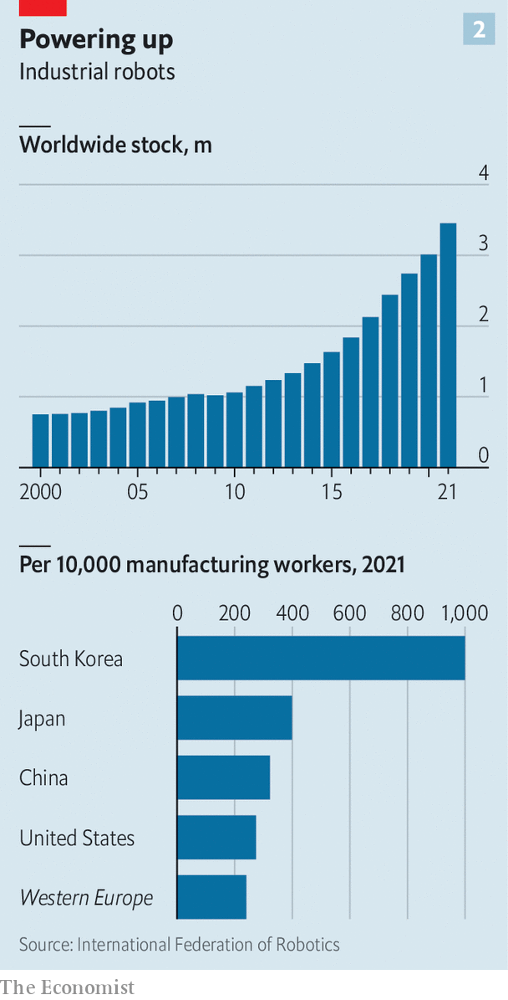
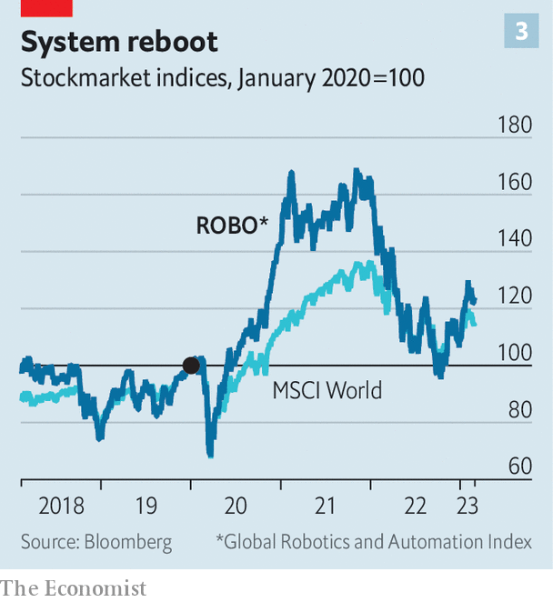
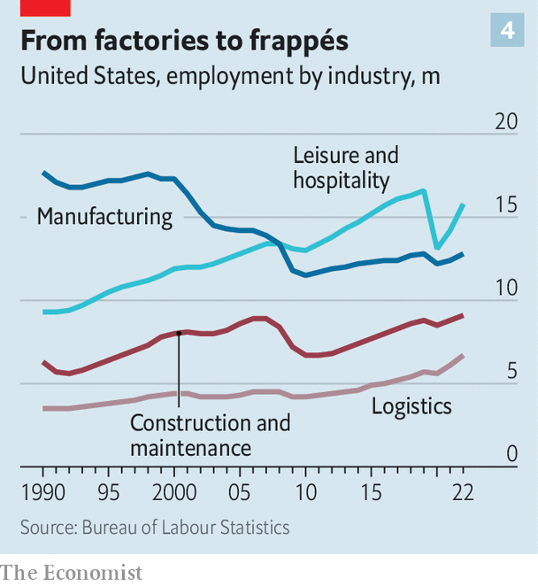

###### Where are all the robots?

# Don’t fear an AI-induced jobs apocalypse just yet 

##### The West suffers from too little automation, not too much 

 

> Mar 6th 2023 

“I think we might exceed a one-to-one ratio of humanoid robots to humans,” Elon Musk declared on March 1st. Coming from the self-styled technoking of Tesla, it was not so much a prediction as a promise. Mr Musk’s car company is developing one such artificially intelligent automaton, codenamed Optimus, for use at home and in the factory. His remarks, made during Tesla’s investor day, were accompanied by a video of Optimus walking around apparently unassisted. 

Given that Mr Musk did not elaborate how—or when—you get from a promotional clip to an army of more than 8bn robots, this might all smack of science-fiction. But he has waded into a very real debate about the future of work. For certain forms of AI-enabled automation are fast becoming science fact. 

Since November ChatGPT, an AI conversationalist, has dazzled users with its passable impression of a human interlocutor. Other “generative” AIs have been conjuring up similarly human-like texts, images and sounds by analysing reams of data on the internet. Last month the boss of IBM, a computing giant, forecast that AI will do away with much white-collar clerical work. On March 6th Microsoft announced the launch of a suite of AI “co-pilots” for workers in jobs ranging from sales and marketing to supply-chain management. Excitable observers murmur about a looming job apocalypse. 

 


Fears over the job-displacing effects of technology are, of course, nothing new. In early 19th-century Britain, the Luddites burned factory machines. The term “automation” first rose to prominence as the adoption of wartime innovations in mechanisation sparked a wave of panic over mass joblessness in the 1950s (see chart 1). In 1978 James Callaghan, Britain’s prime minister, greeted the breakthrough technology of his era—the microprocessor—with a government inquiry into its job-killing potential. Ten years ago Carl Frey and Michael Osborne of Oxford University published a blockbuster paper, since cited over 5,000 times, claiming that 47% of the tasks American workers perform could be automated away “over the next decade or two”. Now even the techno-optimistic Mr Musk wonders what it would mean for robots to outnumber humans: “It’s not even clear what an economy is at that point.” 

Although Messrs Frey and Osborne still have a few years to be proved right, and Mr Musk can be safely ignored for the time being, the earlier fears about job-killing technology never materialised. On the contrary, labour markets across the rich world are historically tight—and getting  as societies age. There are currently two vacancies for every unemployed American, the highest rate on record. America’s manufacturing and hospitality sectors report labour shortages of 500,000 and 800,000 respectively (as measured by the gap between job openings and unemployed workers whose last job was in the sector in question). 

Rage for the machine

The immediate problem for advanced economies is, then, not too much automation but too little. It is exacerbated by the fact that, for large businesses, automating tends to be difficult to get right in practice. And it is likely to prove no easier with the latest buzzy AIs.

Mechanical arms on a factory floor performing repetitive tasks such as welding, drilling or moving an object have been around for decades. Robot usage historically centred on the car industry, whose heavy parts and large batches with limited variety are ideally suited to the machines. The electronics industry, with its need for precise but repetitive movements, was also an early adopter. 

 


More recently the list of industries which are embracing robots has lengthened, observes Jeff Burnstein, president of the Association for Advancing Automation, an American industry group. Advances in computer vision have made machines much more dexterous, points out Sami Atiya, who runs the robotics business of ABB, a Swiss industrial firm. Lightweight “collaborative robots” now work side-by-side with human workers rather than being caged off, and autonomous vehicles ferry objects from one place to another in factories and warehouses. 

At the same time, robot prices have tumbled. The average price of an industrial robot fell from $69,000 in 2005 to $27,000 in 2017, reckons Ark Invest, an asset manager. In December ABB opened a 67,000-square-metre “mega factory‘‘ in Shanghai where robots make other robots. Installation costs have come down, too, with new “no code” systems requiring no programming skills, notes Susanne Bieller, general secretary of the International Federation of Robotics (IFR), another industry body. 

As a consequence of better technology and lower prices, the global stock of industrial robots grew from 1m in 2011 to nearly 3.5m in 2021 (see chart 2). Sales at Fanuc, a large Japanese robot-maker, rose by 17% last quarter, year on year; those of Keyence, a Japanese company that acts as an automation consultant to the world’s factories, shot up by 24%. Although they are down from the frothy peaks of 2021, when chief executives sought alternatives to human workforces incapacitated by covid-19, robot-makers’ share prices remain a fifth higher than before the pandemic (see chart 3). 

 


For all that growth, however, absolute levels of adoption remain low, especially in the West. According to the IFR, even South Korean firms, by far the world’s keenest robot-adopters, employ ten manufacturing workers for every industrial robot—a long way from Mr Musk’s vision. In America, China, Europe and Japan the figure is 25-40 to one. The $25bn that, according to consultants at BCG, the world spent on industrial robots in 2020 was less than 1% of global capital expenditure (excluding the energy and mining sectors). People spent more on sex toys. 

 


The long lifetimes of industrial equipment limit how quickly older, dumber machines can be replaced with cleverer new ones, observes Rainer Brehm, who runs the factory-automation unit of Siemens, a German industrial giant. And most menial jobs in advanced economies these days are anyway in the services industries, where physical tasks are harder to automate (see chart 4). The human body, with its joints and digits affording 244 planes of motion, is a marvel of versatility. A typical robot has six such “degrees of freedom”, notes Kim Povlsen, chief executive of Universal Robots, a manufacturer of industrial robot arms. 

The automation of office work has been similarly halting, for similar reasons of legacy systems and corporate inertia. In theory, digitisation should make it possible to remove most human involvement from routine tasks like ordering inventory, paying suppliers or totting up accounts. 

In practice, most businesses born before the digital era use a tangle of outdated and incompatible systems, notes Cathy Tornbohm of Gartner, a research firm. Rather than shell out on IT consultants to come and untangle the thicket, many firms prefer to outsource the menial office work to low-cost countries like India or the Philippines. IDC, another research firm, puts the market for software that automates unrewarding office tedium at $20bn a year, even less than is being spent on robots of the physical variety.

Automatic for the people

In time, further innovation is likely to remove some of those obstacles. For physical robots, this is well under way in machine-mad South Korea. Doosan Robotics, one of the country’s biggest robot-makers, has opened up its software to outside developers to create pre-programmed applications for its robots. These are now used for everything from making coffee to laying flooring on construction sites. Robert Chicken uses robotic arms to operate its deep fryers at its fast-food restaurants; to keep upfront investment for franchisees down, the company rents the robots out to them for around $900 a month, substantially less than the cost of a human operator. Naver, a South Korean internet giant, has a unit developing robot vehicles that can navigate busy environments with complicated layouts: an army of such bots already whizzes around delivering lunch boxes and parcels to its workers. 

Office-process automation is also becoming more sophisticated. UiPath, a pioneer in automating mindless tasks such as copying and pasting information from one program to another, now offers other tools that extract data from paperwork using image-recognition algorithms or that map business processes by observing what workers do on their computers. Rob Enslin, UiPath’s co-CEO, says the company already serves 10,000 clients. Power Automate, a tool from Microsoft that allows regular desk jockeys with little programming experience to automate tasks, such as expense or travel approvals, now has 7m monthly active users, says Charles Lamanna, who is responsible for many of the software giant’s automation products. 

Some businesses are tentatively beginning to embrace generative AI, too. However, as with robots and process automation, bedding in the new technology will not happen overnight. Allen &amp; Overy, a law firm that in February launched a virtual legal assistant with ChatGPT-like powers, requires its lawyers to cross-check everything the bot spits out. CNET, a tech-news site, starting in November quietly published 73 articles written by a bot, first to the consternation and then the delight of journalists, after the articles were found to be riddled with errors. 

The AI technology that underpins chatbots could one day be a boon for automation, reckons Mr Lamanna. But getting from science fiction to science fact is one thing. Getting from there to economic fact is quite another. ■


