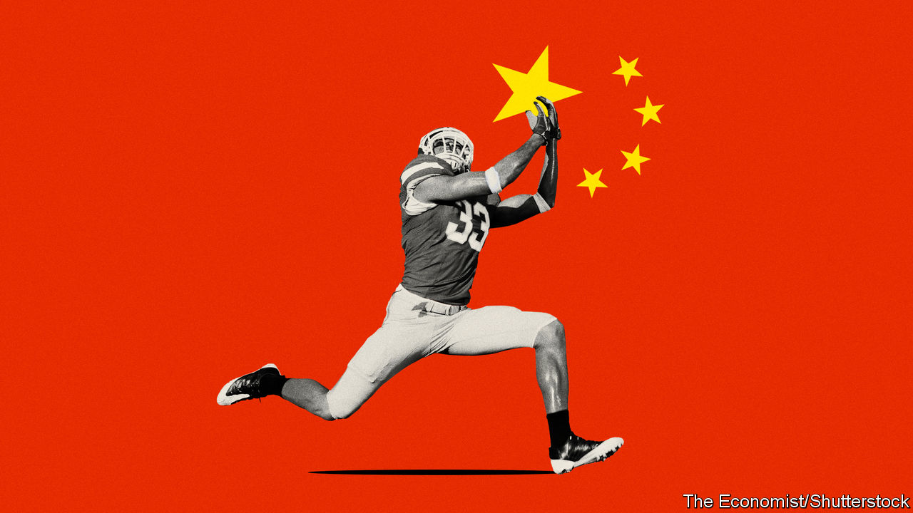
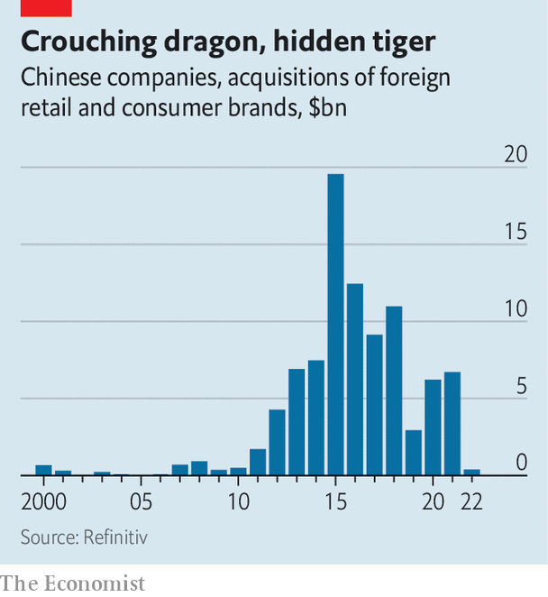

###### Seizing the moment

# How China Inc is tackling the TikTok problem 

##### A CEO’s guide to doing business amid anti-Chinese sentiment 

 

> Mar 7th 2023 

AMERICAN-FOOTBALL fans watching the Super Bowl last month in the sport’s heartland were treated to a surprising TV commercial. In it, a woman switched magically between chic but cheap outfits as she scrolled through a mobile-shopping app called Temu. The jingle—“I feel so rich; I feel like a billionaire”—refers to the sensation of wealth evoked by the endless choice and rock-bottom prices for Temu’s clothes. Since its launch last September Temu has become America’s most-downloaded app for iPhones. That is a feat for a young brand based in Boston. It is all the more impressive because Temu hails from China.

This is a critical moment for Chinese companies in the West. On the one hand, Chinese brands have never been more popular in America. Hot on Temu’s heels in iPhone downloads are CapCut, a video-editor, and TikTok, a time sink. , a fashion retailer, ranks above Amazon. This year it may pull off one of the world’s biggest  (IPOs) in New York.

At the same time, Western suspicions of Chinese business are mounting, together with intensifying  between China and the West. America has banned Huawei, a Chinese maker of telecoms gear, at home and crushed its efforts to capture Western markets. On March 6th it was reported that Germany’s government was close to forcing mobile operators to stop buying Huawei kit and to replace installed Chinese equipment. TikTok may be in for similarly harsh treatment. Several countries, led by America, are discussing full bans on TikTok over concerns about the Chinese government using the platform for anti-Western propaganda or to gobble up Western users’ personal data (TikTok denies both these accusations). 

For ambitious Chinese firms eyeing wealthy Western shoppers this presents a conundrum: how do you do business in places where you are increasingly unwelcome? Companies like Shein, Temu and the beleaguered TikTok are all coming up with answers that have a lot in common. Whether they pull it off will determine the fate of Chinese commerce in the West.

China Inc began making a global mark in the 1980s, as foreigners poured investments into Chinese factories which then shipped cheap goods to the West. Consumers would buy these almost exclusively through retailers such as Walmart or from Western brands that sourced products from China. Then, in the mid-2000s, Chinese firms began building a presence in foreign markets. Until Uncle Sam clipped its wings, Huawei was selling its own networking kit and handsets across the West. Other Chinese champions such as Haier, a home-appliance maker, bought and nurtured Western brands (GE’s white-goods division, in Haier’s case). Between 2011 and 2021 Chinese firms acquired nearly $90bn-worth of foreign retail and consumer brands, according to Refinitiv, a data company. Many of the targets were Western.

 


In recent years, however, the dealmaking has slowed. In 2022 Chinese companies spent just $400m on foreign brands (see chart). The authorities in Beijing have grown warier of  even as Western governments have become more hostile to such transactions, often blocking them. Chinese brands seeking to build a Western presence have had little joy. Lenovo, a Chinese firm that in 2004 acquired IBM’s personal-computer division, has captured a mediocre 15% of America’s PC market, far behind HP and Dell, which together control more than half of it. Xiaomi, which in 2021 overtook Apple to become to world’s second-biggest smartphone-maker, has been unable to crack America. 

The latest wave of global Chinese brands has taken a different approach. Many initially eyed the domestic market, before the covid-19 pandemic and China’s draconian response to it forced them to look abroad for growth, says Jim Fields, a marketer who works with Chinese brands in America. Companies such as Shein, Temu and TikTok may grab the headlines but hundreds of Chinese firms have been making similar inroads in America, Europe and Japan—using similar strategies.

The first is not to flaunt their Chineseness.  has reviewed dozens of companies’ websites and found that most could easily pass for a Western brand. Their names sound English: BettyCora produces press-on nails; Snapmakers makes 3D printers. Almost none mention their country of origin. One young entrepreneur who is currently planning the launch of his own brand in America discerns a long-standing prejudice against Chinese-made goods as being of poor quality. This perception is linked to the first wave of cheap factory wares in the 1980s. Increased hate crimes against people of Asian descent in America in recent years has not encouraged companies to come out as Chinese. Most people hoping to start such businesses will avoid references to China if possible, the entrepreneur says.

The second common characteristic is the use of technology to beat Western rivals on service and price. Many Chinese firms use their own websites and mobile apps to sell directly to customers. They thus bypass retailers while gaining access to data on consumer trends, allowing them to react quickly to shifts in demand—or, using sophisticated analytics, predict these changes and respond in advance. 

This “on-demand manufacturing” has allowed Shein to triple its American sales between 2020 and 2022, to over $20bn. Its app attracts 30m monthly users in America. Hundreds of Chinese firms are experimenting with this model in the American marketplace. Halara, a newish women’s-apparel retailer, gets around 1.5m digital visitors monthly to its app. Newchic, a rival, attracts 1.7m. The ability to understand customers through data analytics is a big advantage in developed markets, says Xin Cheng of Bain &amp; Company, a consultancy. 

The firms’ savvy use of technology and supply chains allows them to limit their non-Chinese assets—their third shared strategy. Asset-lightness appeals to investors, says Zou Ping of 36Kr, a Chinese research firm. It helps cut costs and reduce the risk of assets being stranded should Western politicians turn the screws. 

For many Chinese brands, their only Western assets are customer-facing websites and apps. Although it recently opened a distribution centre in Indiana, Shein ships most goods directly from China to buyers in America. Its Boston base notwithstanding, Temu has no warehouses in America, let alone factories (though it does not rule out storage). Naturehike, a maker of camping gear, has conquered the West and Japan without employing a single person outside China. Instead, says Wang Fangfang, a spokeswoman, it is boosting its on-demand manufacturing capacity so it can better understand customers from afar. In February CATL agreed to furnish its electric-vehicle batteries to Ford by licensing its patents to the American carmaker rather than building a factory in America. 

Made in China? Who, me?

The most dramatic way in which some Chinese companies are guarding themselves against a Western backlash, as well as Communist Party meddling in their Western business, is by distancing their governance structures from China. The first big name to pursue this strategy was ByteDance, TikTok’s parent company. From the start, it kept TikTok’s popular Chinese sister app, Douyin, separate from the version used in the rest of the world (which in turn cannot be used in China). Then TikTok moved its headquarters to Singapore, to separate itself from decision-making at ByteDance’s headquarters in Beijing. Now it reportedly wants to create an American subsidiary tasked with safeguarding the app, which would report to an outside board of directors rather than ByteDance. ByteDance, for its part, stresses it is domiciled in the Cayman Islands, not China. 

Seeing that none of this has fully placated Western regulators, other Chinese companies are going further. Last year Shein also decamped to Singapore, from Guangzhou. The city-state is now its legal and operational home. Add its planned New York listing and its executives almost bristle when you call Shein Chinese. More businesses may adopt a version of this model. 

The success of these strategies is hard to gauge. Export figures from China do not distinguish between Chinese brands and goods made for foreign clients. Many packages are sent by courier and not counted as exports. But it is clear that, in some areas at least, Chinese brands are taking market share in the West. Anker has become one of America’s biggest purveyors of phone chargers. In 2021 about half its $1.8bn in global sales came from North America; less than 4% came from China. A few Chinese makers of smart appliances like robot vacuum cleaners rank among top global sellers alongside American and German firms. One, Roborock, had foreign sales of $500m in 2021, accounting for 58% of its total revenues, up from 14% two years earlier. America is its main market. Chinese firms such as EcoFlow are poised to dominate sales of household power banks there.

Investors are bullish. Shein’s IPO could be a blockbuster. Last year Hidden Hill Capital, a Singaporean fund, raised nearly $500m with TPG, an American private-equity firm, to invest in Chinese firms backing the supply chains of future global brands. Some of the entrepreneurs behind these success stories nevertheless worry. One concern is overcoming the shabby reputation of the “Made in China” label. Today fake or shoddily made me-too items can hurt the cachet of Chinese firms that do invest in research and development. In 2021 Amazon banned 600 Chinese brands on concerns that they were churning out fake reviews of their wares. 

But Chinese bosses lose most sleep over the deteriorating Sino-American relations. Many look to TikTok as the bellwether. In January the firm said it would set up a data centre in America to store local users’ data and give American authorities access to its algorithms; on March 6th the  reported that it was seeking a similar deal in Europe. Despite the assurances, bills are moving through Congress that would let President Joe Biden ban the app. 

If Beijing and Washington continue to grow apart, as seems likely, American politicians may take aim at other Chinese apps. For those that collect data on shopping habits—which is to say most of the consumer-facing ones—this would turn their technological strength into a geopolitical weakness. Facing up to that threat will require a whole other level of ingenuity. ■


