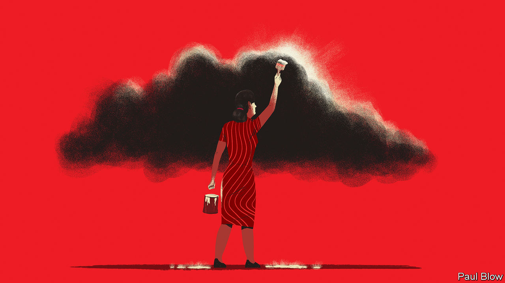

###### Bartleby

# The small consolations of office irritations 

##### The silver linings of interruptions and impostor syndrome 

 

> Mar 9th 2023 

Even people who love their jobs have a few gripes. Even people who excel at their work have their share of worries. The office environment makes it hard to concentrate; their colleagues are annoying beyond belief; their career path within the organisation is not obvious. There are aspects of the workplace, like “reply all” email threads and any kind of role-playing, which are completely beyond redemption. This column is here to administer the balm of consolation for some of work’s recurring irritations. 

Start with a pervasive problem: being interrupted. You have muted notifications on Slack and cleared your calendar; the Prelude from Bach’s Cello Suite No 1 is playing; your fingers are poised above the keyboard and a thought of world-altering profundity is gradually taking shape in your mind. Then there is a knock at the door, and a colleague asks if you have a minute to discuss the air-conditioning. By the time they have gone, so has that momentous thought and any sense of well-being. 

Context-switching of this sort is more than simply annoying. A survey conducted in 2021 found that it takes people nine and a half minutes to resume a focused state of mind after switching between apps. But there is a bright side to being interrupted. A paper by Harshad Puranik of the University of Illinois Chicago and his co-authors asked a sample of employees in America to record how often they were distracted by colleagues and to report their sense of belonging to their organisations. They found that being interrupted involves a social interaction with colleagues that can strengthen a worker’s feelings of connection. The next time a knock comes, remind yourself that at least you are not lonely. 

What about some of the characters who make office life so teeth-grinding? Every company has its share of toadies who specialise in managing up: flattering the bosses and claiming more credit than is their due. Unctuousness is undoubtedly irritating. But it, too, can sometimes have wider benefits. 

Recent research by Wei Cai of Columbia Business School and her co-authors found that teams performed better when they had some crawlers among them. People who got better assessments from their superiors than from their peers in performance-review processes were designated as “upward influencers” in the study. Too many characters of this sort is bad: at some point, team members will expend more effort competing for recognition than getting actual work done. But because these personality types are prepared to invest more time communicating with their managers, the presence of a handful of them ensures that a team does not become invisible to the bosses. A few suck-ups can be good for everyone. 

What of traits that workers find most irritating about themselves, the things that may be holding them back? Impostor syndrome, the belief some people have that they do not deserve to be in positions of influence, is usually thought of as being bad for individuals and organisations alike. But it can have an upside. 

Research by Basima Tewfik of the MIT Sloan School of Management found that people who worry about being an impostor are regarded by others as having better interpersonal skills than those who are untroubled by self-doubt. It may be that a concern about lacking competence leads people to compensate by developing stronger relationships with others. In a world that increasingly prizes collaboration and soft skills, that is not to be sniffed at. 

Weaknesses can turn into advantages in other ways, too. The idealised entrepreneur may drip with confidence and charisma, for example. But not everyone fits that mould. In a recent study, Lauren Howe and Jochen Menges of the University of Zurich asked participants in an investment game who had been asked about their own flaws to allocate funds to startups. They found that entrepreneurs who reveal a personal shortcoming, such as indecisiveness or insecurity, are more likely to attract funding from investors who share these same characteristics. Some weaknesses are not to be admitted: stupidity, say, or narcolepsy. But flaws can sometimes help people get ahead, not hinder them. 

The problem with silver linings is that they are attached to clouds. You are still being interrupted all the time. You are still surrounded by annoying colleagues. Impostor syndrome still causes you unnecessary anxiety. Your weaknesses are still weaknesses. But there are bright sides to most things in office life, and they go beyond the payslip. 


