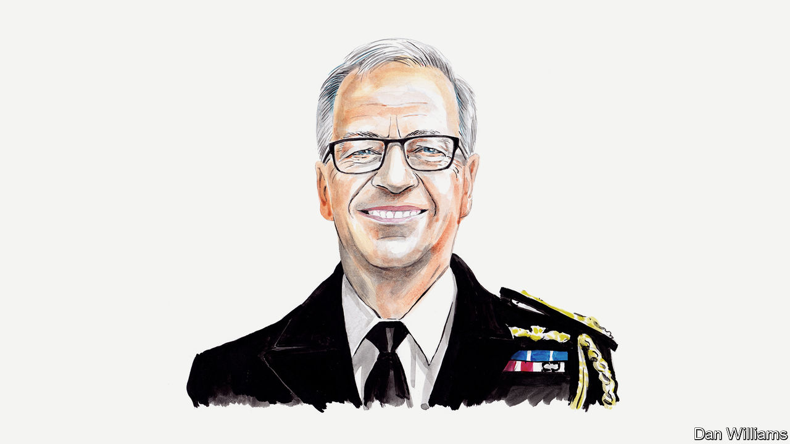

###### Russia and Ukraine

# Britain’s most recent defence attaché in Moscow on the failings of Valery Gerasimov 

##### John Foreman sees Russia’s top general as fit only to face a court 

 

> Mar 5th 2023 

ON FEBRUARY 11TH 2022, as Russia piled up men and armour along Ukraine’s border, I listened as , the Russian chief of the general staff, lied to Admiral Sir Tony Radakin, his British counterpart. General Gerasimov denied planning to , saying Russia didn’t need any more land. He claimed that his modernised armed forces had achieved parity with those of America. Earlier, after rehearsing a litany of false grievances, Sergei Shoigu, Russia’s defence minister, told his British equivalent that Russia had no intention of going outside its borders. But neither could explain the build-up of troops.

The British pair were in  to warn General Gerasimov and Mr Shoigu, regime insiders with direct access to Vladimir Putin, that a Russian invasion of Ukraine would be a catastrophic mistake with tragic consequences. This prescient warning went unheeded. Mr Shoigu and General Gerasimov have subsequently overseen the Ukrainian people’s terrible suffering, the widespread destruction of Ukraine and staggering losses of their own soldiers and equipment. Far from parity with America, their “modern” army has not even achieved parity with Ukraine. The conflict has demonstrated the intellectual, physical and moral weakness of the Russian armed forces—and of General Gerasimov himself.

At the start of the war, General Gerasimov’s braggadocio appeared justified. His armed forces had received billions of dollars to implement a strategy of “active defence” in order to keep war away from Russian soil. He placed emphasis on professionalism and long-range precision weapons, and upgraded Russia’s nuclear and conventional forces. Annual scripted exercises focused on defending Russia from attack before expelling the invader. General Gerasimov planned for swift victory.

In practice, his new-look army, designed for a quick, defensive and simple war of necessity, turned to dust in a slow, offensive and complex war of choice. Blinded by chauvinism, he and the regime ignored the words of Alexander Suvorov, an 18th-century Russian general: “Never despise your enemy, do not consider him stupider and weaker than you.” Arrogance prevented General Gerasimov and his officers from anticipating either Ukrainian readiness to fight or the reaction of the West. His armed forces—just as the Russian state from which they are drawn—proved incompetent, brutal and corrupt.

Russia’s senior military officer since 2012, General Gerasimov is responsible for many of these failings. Far from being the ground-breaking reformer and military theorist of Western imagination, he and his army have displayed intellectual rigidity and unprofessionalism, fragmenting in the face of resolute Ukrainian resistance into a squabbling militia of differing political, ethnic and business interests. If, as reported recently by the , the FSB security service convinced General Gerasimov to broaden his initial offensive along multiple axes, he is guilty of a dereliction of duty. One of his wartime predecessors wrote that the Russian general staff should be the “brain of the army”; General Gerasimov has presided over a lobotomy.

His failings have not gone unnoticed. All the field generals who led the invasion of Ukraine, including those once identified as General Gerasimov’s upcoming protégés, have been sacked, or moved on. After disappearing from view, including missing the annual Victory Day parade, and a close call with a Ukrainian HIMARS missile, he and Mr Shoigu have feuded over the conduct of the war with the pro-war right, including Yevgeny Prigozhin, head of the Wagner mercenary outfit, Chechen satrap Ramzan Kadyrov and with even the general’s own subordinates. Yet General Gerasimov has not only remained in post, but he has been promoted. In an unusual move in January he was appointed in overall war command in addition to his weighty duties of manning, training and equipping the army, and leading further longer-term defence reforms.

Having led the disastrous invasion, the rationale for his new role is opaque. It may be an attempt to bring order to the chaos of the past year, and regain the strategic initiative. General Gerasimov is promised unlimited funds, replacement equipment (possibly from China) and many more soldiers. Despite supply difficulties, his army still enjoys artillery superiority and can inflict heavy Ukrainian casualties before Ukraine can launch its own spring offensive. Western hesitancy on the supply of arms last year provided him with breathing space to regroup after setbacks in Kharkiv and Kherson. American and European commitment may wobble further. Mr Prigozhin is being forced back into line. Time will tell whether General Gerasimov can pull a victory out of the bag, unlikely though this seems.

It is just as probable, however, that Mr Putin has kept General Gerasimov in place because of his obedience. He has pressed on with an ill-prepared offensive in recent weeks without having fixed the qualitative problems seen over the past year. Russia’s minister of war during Napoleon’s invasion in 1812 was described in a poem as a “servant to the Tsar, and a father to soldiers”. Although General Gerasimov has proven the former, he is certainly not the latter judging by his ropey tactics, indifference to expending Russian lives for minimal strategic gains, and the terrible morale of his troops.

But General Gerasimov’s most shocking failing has been moral. The Russian defence ministry claimed last year that its soldiers are motivated by “good, honesty, [and] an uncompromising attitude towards evil”. Rather their deliberate deafness to human suffering has become the monster in Russia’s war machine, to paraphrase the Polish-British mathematician Jacob Bronowski. By planning, initiating and waging a war of aggression, and facilitating war crimes, General Gerasimov has abetted Mr Putin’s belief that the subjugation of Ukraine justifies all means necessary. 

Through political-military education, General Gerasimov has disseminated Mr Putin’s racist, dehumanising narrative that Ukrainians are “Nazis” and “fascists” through the ranks, inexorably leading to the raping, killing, torture and deportation of civilians. On February 18th America determined that members of Russia’s armed forces and Russian officials had committed crimes against humanity in Ukraine. Regrettably Britain has yet to do the same.

General Gerasimov himself is culpable for these appalling atrocities. Although in Moscow he scoffed at the sanctions placed on him, he must, like Generals Jodl and Mladic before him, be held to account with a clear resolve—however long it takes—to try him over his role in the martyrdom of Ukraine. ■


