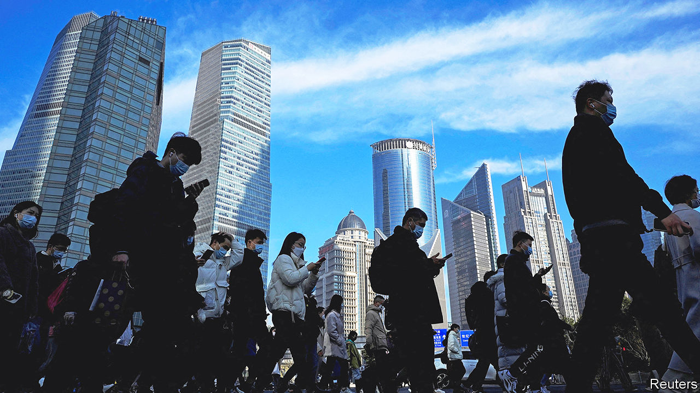
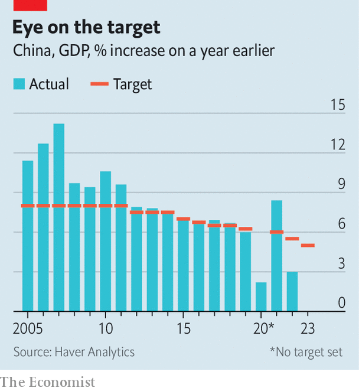

###### Credibility over confidence

# Interpreting China’s unambitious growth target 

##### The government has played it safe with the economy—and its own reputation 

 

> Mar 5th 2023 

WHEN CHINA’S government sets its economic growth target for the year, it often faces a dilemma. A balance must be struck between inspiring confidence and maintaining credibility. A high target could give courage to entrepreneurs, making fast growth easier to achieve. But ambitious targets can also be missed, denting the government’s reputation. (They can also induce reckless stimulus spending to avert any such embarrassment.)

 


Last year the government missed its target by a wide margin (see chart), largely owing to its costly attempt to keep covid-19 at bay. This year it has prized credibility over confidence. On March 5th , China’s outgoing prime minister, opened the National People’s Congress, China’s rubber-stamp parliament, with his annual “work report”. It revealed a growth target of “around 5%” in 2023.

That may seem like a respectable pace, roughly in line with China’s underlying “trend” rate of growth. But the economy would normally be expected to exceed that trend comfortably this year, because it fell so far short of it last year. The target is lower than many external forecasts. Even if it is met, China’s GDP will remain more than 2% below the path it was supposedly on before the Omicron variant arrived last year.

The government reckons that China must create about 12m new urban jobs this year. This target is more demanding than last year’s (12m versus “over 11m”) even though the growth target is less so. The government may be hoping that China will enjoy an unusually “job-full” recovery, as labour-intensive service industries, like retail and catering, bounce back from the pandemic-era restrictions that hit them particularly hard. It also wants employment to keep pace with the record 11.58m students who are expected to graduate from universities and colleges in 2023.

The undemanding growth target removes any pressure to stimulate the economy further. Compared with last year, Mr Li’s report contained fewer exhortations to local governments to keep the economy going. He instead pointed out the need to prevent a build-up of new debts. “The budgetary imbalances of some local governments are substantial,” he noted. This year they will be allowed to issue 3.8trn-yuan ($550bn) worth of “special” bonds (which are supposed to finance revenue-generating infrastructure projects). On paper, that quota is a little higher than last year. But it may not feel like it in practice, because local-government spending last year was bolstered by an unusually large stash of bond proceeds carried over from 2021. 

The report’s conservatism is in keeping with a theme of this year’s congress: China’s rulers tightening their grip over the state. President Xi Jinping’s new economic team will feature trusted aides and acolytes. Li Qiang, the party’s number two, is expected to replace Li Keqiang as prime minister. He Lifeng, who worked with Mr Xi in Fujian (and attended his second wedding), is likely to become a deputy prime minister in charge of economic policy. He may also serve as party chief of the central bank. If so, he will oversee a new governor of the bank, who is likely to be Zhu Hexin, a commercial banker who served as vice-governor of the province of Sichuan. 

Mr Li’s report offered little guidance on what closer control would mean in practice. Like previous editions, the document is a combination of theological boilerplate (“hold high the great banner of socialism with Chinese characteristics”), policy bromides (“we should enhance the intensity and effectiveness of our proactive fiscal policy”) and technocratic factoids (China increased the length of expressways by 30% and drainage pipelines by more than 40% over the past five years). 

The most striking novelty in this year’s report was its nostalgia. Last year’s edition turned from past to present by the eighth page (of the English translation). This year Mr Li did not leave the past behind until the 31st page and then spared only four pages to discuss priorities for 2023. Perhaps he found it hard to talk about the future, given that he will have no role in shaping it. ■


