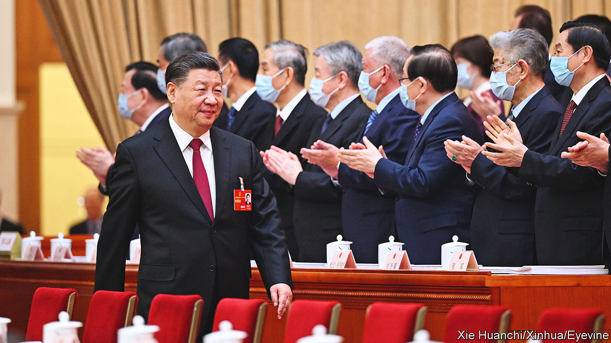

###### Wolf worriers

# Tough language from Xi Jinping belies his anxiety 

##### China’s reopening to the world could be a bumpy one 

 

> Mar 9th 2023 

China’s all-out struggle to crush covid-19 is now over, but its leaders still see a world fraught with peril. During the annual session of the country’s parliament, which began on March 5th, Chinese officials have been airing their worries. President Xi Jinping pointed his finger at America, accusing it of leading Western countries in a campaign of “all-out containment, encirclement and suppression” against China. The outgoing prime minister, Li Keqiang, said such threats were escalating. He set an unexpectedly  for China’s economic growth this year. Their message is clear: China’s post-covid reopening to the world could be a bumpy one. 

Mr Xi is China’s worrier-in-chief. A handy 251-page book, published by the Communist Party in 2020, contains nothing but anxiety-related snippets from his speeches. They cover every topic from terrorism and “colour revolutions” to the “middle-income trap”—that is, stalling growth. The extracts are peppered with metaphors: lurking tigers, boulders on the road, terrifying waves and stormy seas. One bit comes from remarks to domestic security chiefs in 2014, just over a year after Mr Xi became China’s leader. It shows how long-standing his current worries are: “Western countries such as America increasingly feel fishbones in their throats and blade-tips in their backs, so are stepping up their strategy of Westernising and splitting our country.”

Usually Mr Xi avoids explicit criticism of America at public-facing occasions such as meetings of the National People’s Congress (NPC), as the legislature is known. His break from custom this time, at a meeting on March 6th with advisers to the NPC, suggests anxiety levels are growing. He said American-led efforts at containing China had presented “unprecedented severe challenges” to the country’s development. At an NPC-organised news conference, his new foreign minister, Qin Gang (known for his feisty language, no matter the context), was even more forthright: “If the United States does not hit the brake but continues to speed down the wrong path, no amount of guardrails can prevent derailing, and there will surely be conflict and confrontation.” 

For all such rhetoric, however, Chinese officials have avoided using the NPC, and the parallel meeting of its advisory body, to make any explicit threats against America. On Taiwan, the most contentious issue in the bilateral relationship, they have stuck to ambiguous language. In his farewell speech to the NPC, Mr Li said the armed forces should “intensify military training and preparedness across the board”. China’s defence spending is higher than it admits. But a draft budget said it should grow by 7.2% this year. That would leave its share of GDP largely unchanged, once inflation is taken into account. And Mr Li said China should “promote the peaceful development of cross-strait relations”. 

It may be that, for all their disquiet, Chinese leaders do not want to escalate tensions with the West, nor narrow their room for manoeuvre. Mr Xi said officials should “dare to struggle”, but he also called for calm (using the word three times) in the face of “profound and complex changes in the international and domestic environments”. By emphasising threats from the West, such as America’s efforts to limit Chinese access to cutting-edge technologies, it is possible that China hopes to focus attention at home on the need for greater industrial self-reliance. On March 10th the nearly 3,000 delegates are due to vote on (ie, rubber-stamp) a plan for restructuring some government ministries. This is expected to give the party  over vital areas of work, including technological development. A senior official said one reason for the shake-up was “the severe situation of…external containment and suppression”. 

Such a response is typical of Mr Xi. His book of worries, titled “Excerpts from Xi Jinping’s Talks on Guarding Against Risks and Challenges and Responding to Emergencies” (a snip at $7.50), is replete with recommendations that the party tighten its grip. But at the same time, Mr Xi and his officials have been using the NPC, which ends on March 13th, to send reassuring signals to entrepreneurs who have been spooked by the party’s growing muscularity in the economic domain. To revive growth, which was 3% last year, the second-lowest rate since the death of Mao Zedong in 1976, private firms will be crucial. They contribute three-fifths of GDP. 

“In the coming period,” said Mr Xi, echoing the prime minister, “the risks and challenges we face will only increase and become more severe.” He then heaped praise on the private economy, calling it an “important force for long-term rule by our party” and describing entrepreneurs as “our own people”. Businesspeople will be cautious, however. These are phrases he has used before. There may have been a sigh of relief among some company bosses that Mr Li did not mention the term “common prosperity” in his speech to the NPC. The slogan, favoured by Mr Xi, is associated in some people’s minds with heavy-handed treatment by the party of billionaires and their firms. But in his meeting with the NPC’s advisers, Mr Xi used the phrase four times. 

The new guys

Many businesspeople will wonder whether to take solace from several high-level appointments that will be unveiled at the NPC (aside from the inevitable reconfirmation of Mr Xi as president, which will be announced on March 10th). The most important will be the naming of a new prime minister on March 11th. It is almost certain to be Li Qiang, a former party chief of Shanghai and protégé of Mr Xi. 

Mr Li is an intriguing figure. He is disliked by many in Shanghai for overseeing a draconian two-month lockdown of the city last year to stop the spread of covid. Businesspeople tend to have a higher opinion of him. High-level politics in China is a black box. But Reuters, a news agency, said that Mr Li was behind the sudden ending of the “zero-covid” policy in December. As the newly appointed head of a covid task-force, Mr Li “resisted pressure from the president to slow the pace of reopening”, Reuters reported.

Also closely watched will be people chosen to work under Mr Li on economic matters. Many of those slated for top posts have far less experience of the West than their predecessors. But Mr Xi may reckon that matters less now, with the West ganging up against him. ■


