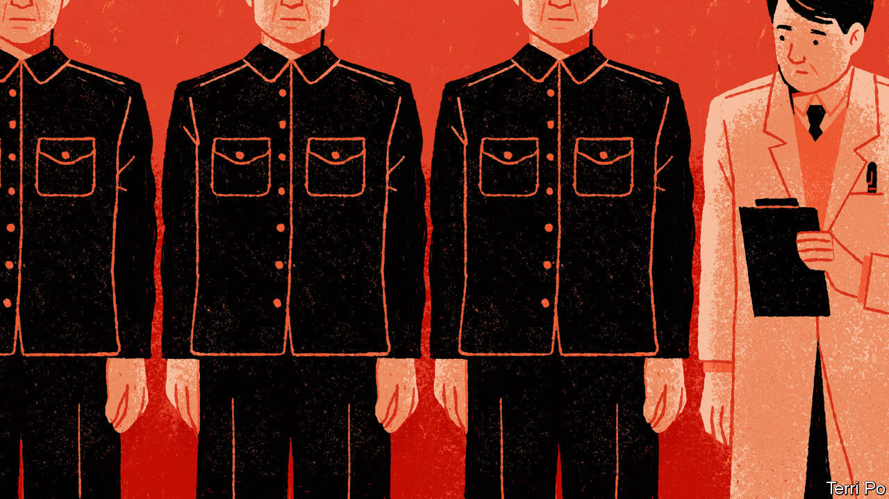

###### Chaguan

# What party control means in China 

##### The Communist Party is grabbing powers from government offices and experts. That is worrying 

 

> Mar 9th 2023 

THE workings of Chinese power are not easy for outsiders to follow. Visitors to some official buildings, for example, are greeted by two vertical signboards, one bearing black characters, the other red. The black-lettered sign denotes a government department. Red characters signal an organ of the Communist Party. In bureaucratic slang this is known as “party and government on one shoulder-pole”. Sometimes the two offices oversee the same policy area, and employ some of the same officials. They are not equally transparent. Especially when meeting foreigners, officials may present name cards bearing government titles but stay quiet about party positions which may or may not outrank their state jobs. Many party branches are not publicly marked at all.

It is a good moment to remember this quirk of Chinese governance. The annual session of the National People’s Congress (NPC), the country’s largely ceremonial legislature, is under way from March 5th to 13th. This year’s NPC meeting comes after a big party congress last October. At that gathering China’s supreme leader, President Xi Jinping, secured a norm-trampling third term and filled his party’s highest ranks with loyal aides. Now Mr Xi’s new team has made headlines with a bureaucratic shake-up that takes powers from several government ministries and agencies, including bodies charged with making China self-reliant in high-technology and with regulating data and financial markets. Many of those powers will now be wielded by party-led commissions. 

NPC delegates applauded the changes in their marble-pillared, crystal-chandeliered simulacrum of a parliament, for they know the drill. Soon they will rubber-stamp Mr Xi’s latest move to impose the party’s will, meaning his own, on China’s vast bureaucracy. When they do, outsiders are entitled to recall those black and red signboards and ask an innocent question: in a country where government and party office-holders may share the same building—and may even be the same people—what does it actually mean for the state to cede power to the party?

In China’s opaque political system, one way to understand a new policy is to study old ideas that it repudiates. Mr Xi’s power grab challenges lessons that his predecessors drew from Chairman Mao Zedong’s chaotic rule, when loyalty to the leader and ideological fervour took precedence over good government. In the years after Mao’s death in 1976, economic reformers moved to separate party and state. They sought to free enterprises from the stifling hand of central planners, and to liberate farmers and factory managers from micromanagement by party committees. They took political cover from the paramount leader, Deng Xiaoping, who—though no liberal politically—gave public warning that “over-concentration of power is liable to give rise to arbitrary rule by individuals.” By the late 1980s, reformers were promoting the notion of a “vanguard party”, a smaller, nimbler party whose role was to set an overall ideological line, not “try to control everything”, recalls Professor Anthony Saich of Harvard University, who interviewed reformist officials in China in those years.

Over time more power was decentralised to local governments, whose officials were rewarded for presiding over rapid growth. In the late 1990s, when entrepreneurs could no longer be ignored, the party moved to co-opt them, admitting businesspeople as members. Then came Mr Xi. Soon after becoming leader in 2012, he declared the Communist Party dangerously corrupted by money and distant from the everyday lives of the masses. He has spent the past decade reasserting the party’s authority over every aspect of public life. This week Mr Xi declared that entrepreneurs need more “theoretical and political guidance” to understand their obligations to the party and country.

Mr Xi talks of the party’s almost 97m members as if they are missionaries in an atheist church, stressing their self-sacrificing “red spirit” and paying homage to “martyrs” who died for the revolution or in the people’s service. That faith-tinged language is usefully clarifying. Most senior officials, whether in a ministry, mayor’s office, state-owned enterprise or university, are party members. One way to think of them is as lay believers, with varying degrees of faith. Then there are party cadres whose careers take them from the party committee of a town, say, to a post as party secretary of a county or other public institution. They are more like priests, with lives dominated by doctrine, discipline and secrecy.

When ideology trumps expertise

Jing Qian of the Asia Society Policy Institute, a think-tank based in New York, describes some important differences between state and party offices. China’s government bodies are subject to (some) institutional and legal constraints. Party bodies are self-policing and their powers are limited only by the party constitution. He contrasts the professionalism of technocrats with the political incentives that guide party cadres. By way of example, he imagines an official with 20 years’ experience at the People’s Bank of China debating policy with a party cadre on a short posting to the central bank. Perhaps the banker urges caution in the name of financial stability. But the party cadre wants to please political superiors and earn a promotion. So the technocrat is overruled.

China’s “zero-covid” campaign offers real-world evidence of professional judgments trumped by politics. Once the Omicron variant arrived in 2022, some prominent scientists called for greatly increased efforts to vaccinate old and vulnerable citizens and stockpile antiviral drugs. But Mr Xi had declared that lockdowns and quarantines could defeat the virus, so suggesting ways to co-exist with covid-19 was heresy. Experts fell silent or were sidelined. As a result, when zero-covid collapsed last December, the country was unprepared. After concealing many covid deaths, China’s rulers now call their pandemic controls “a miracle in human history”. All governments make mistakes. What matters is whether they learn from them. Mr Xi’s record is not reassuring. ■


