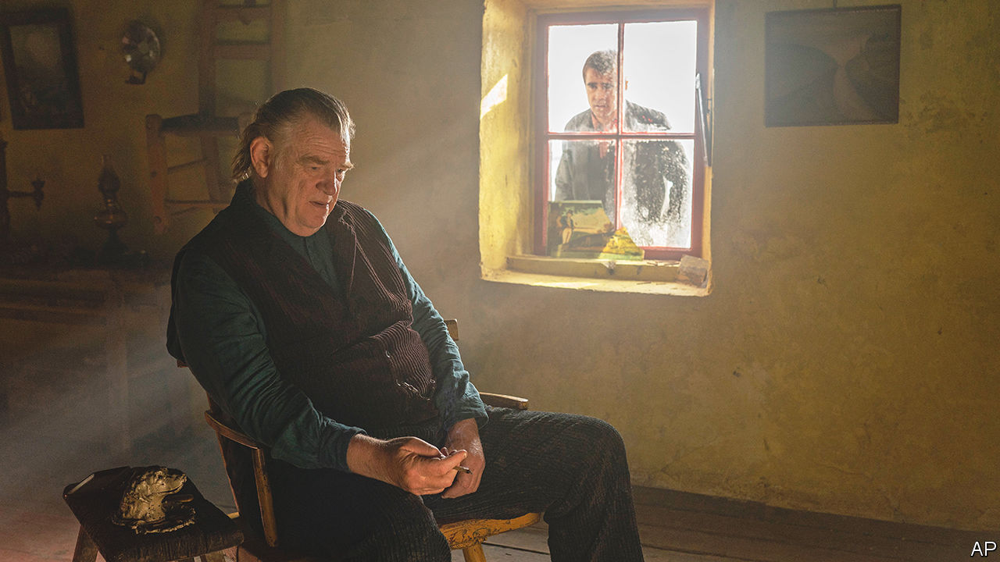

###### Back Story

# It’s war at this year’s Oscars 

##### War rumbles through the nominated films—even some that seem to be about other things 

 

> Mar 8th 2023 

Tomorrow, on the mainland, “the Free State lads are executing a couple of the IRA lads,” says a brutish policeman on Inisherin, a fictional island off Ireland’s west coast. It is 1923 and civil war rages on. “Or is it the other way around?” Whoever is executing whom, he is heading over to lend a hand. “For six bob and a free lunch, I don’t care.”

“The Banshees of Inisherin” (pictured), which is up for nine  at the ceremony on March 12th, is ostensibly the story of a ruptured friendship. But it is also a war film—even though the shooting remains out of sight across the water. It shares that theme with most of the Oscars front-runners. War rumbles through the nominations, on the surface or audibly below it.

On Inisherin, the row between Pádraic (played by Colin Farrell) and Colm (Brendan Gleeson) flares up in a time of war and mimics its rhythms. Life is too short to waste any more of it in nice-but-dull Pádraic’s company, decides Colm, when he could be composing music for his fiddle. Pádraic disagrees about what matters, what lasts and whether the two are the same. Like many a , theirs seems both foolish and profound. Colm is a grouchy crank—or perhaps has seen life for what it is. And like many conflicts, theirs involves misunderstanding, escalation and self-mutilation: Colm resolves to chop off his fingers if Pádraic insists on speaking to him. Their private war makes them different people.

The sense of queasy intimacy with an enemy suffuses the most powerful scene in “All Quiet on the Western Front” (also nominated for nine Oscars). Stuck in a first-world-war shell hole with a French soldier, Paul (Felix Kammerer), the German protagonist, cannot decide whether to kill or embrace him. This is war as an industrial-scale, merciless hell. Surrendering troops are incinerated by flame-throwers, death is agonising and obscene.

The first German-made adaptation of Erich Maria Remarque’s novel of 1928, “All Quiet on the Western Front” is plainly about war. But it is also about food. The soldiers talk and sing about it. They snatch it from dying comrades and pilfer it from locals. While the sybaritic top brass toss meat to their dogs, or query the freshness of their croissants, ordinary soldiers wolf down the rations in the trenches they storm. Their two primitive imperatives are to survive and to find something to eat, even at their peril.

“Top Gun: Maverick” (six nominations) has the outline and kit of a war film. At its daredevil climax, Maverick (Tom Cruise), back in his shades, leather jacket and cockpit after 36 years, must blow up a uranium-enrichment plant in a nameless rogue state. But the real clashes here are among the ego-addled American fighter pilots, and, above all, between Maverick’s analogue heroism and the . “The future is coming,” a commander tells him, “and you’re not in it.” He’ll see about that.

Storytelling, it is true, always runs on conflict. Man versus fate, or nature, or society, or another man (or woman): typologies of it abound online and in creative-writing seminars. As Kurt Vonnegut enjoined, “every character should want something, even if it is only a glass of water.” Someone or something gets in the way, and the ensuing friction forges characters, generates tension and drives the plot. Even so, the martial drumbeat of this year’s Oscars seems loud, chiming with the  and the bellicose timbre of wider politics.

Take the suite of conflicts in “Tár” (also six nominations). At first the film seems to be a dispatch from the , as Lydia Tár (Cate Blanchett), maestro of the Berlin Philharmonic, riles a class of young musicians with her old-school insistence on separating art from the artist. When a student who identifies “as a BIPOC pangender person” has issues with “white, male, cis composers”, she brusquely says people ought not to be “so eager to be offended”.

But the hot-button spats turn out to be camouflage for the film’s more important war: between Tár and her past and conscience. A walking, baton-wielding will to power, she tyrannises her underlings, exploits her rights of patronage, cheats on her wife, drives fast and punches hard. Yet she is haunted, and undone, by uncanny motifs and memories—disembodied screams, the image of a maze, a head of red hair.

In a sequence that hovers between realism and nightmare, Tár descends into a basement and is stalked by a spectral dog. Down there, below the surface, an elementary, eternal conflict is fought and often lost: the one against yourself. 


