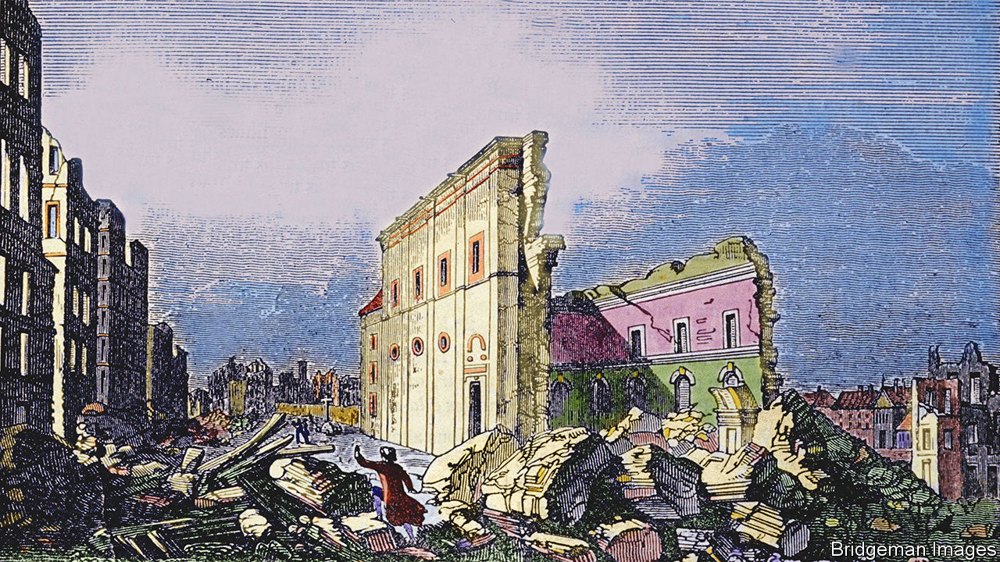

###### Nature and nurture

# Peter Frankopan looks at the past differently in “The Earth Transformed” 

##### How the environment shapes history—and vice versa 

 

> Mar 9th 2023 

By Peter Frankopan. 

People are exercised by three things above all else, wrote Voltaire in the mid-18th century: climate, government and religion. He was ahead of his time in putting climate first. Peter Frankopan opens his new book with Voltaire’s comment and proceeds to show how all manner of natural disasters have shaped human history: not just floods and storms, but earthquakes, volcanic eruptions and crashing meteorites, too. 

Voltaire was fascinated by the earthquake that struck Lisbon in 1755, which he incorporated into his philosophical novel “Candide”. Tremors began on the morning of November 1st, All Saints Day, when most of the locals were at mass. A huge tsunami followed. Soon the Portuguese capital lay in ruins. Tens of thousands of people are thought to have died, a big chunk of the city’s population.

The  and ensuing upheaval epitomise the way natural disasters can change mindsets. It struck as the vogue for scientific observation was beginning to undermine the church’s prerogative in explaining life on Earth. The meaning of the calamity was a matter of dispute between, on one side, modernising rationalists such as Voltaire and, on the other, believers, for whom it was a sign of God’s wrath. 

Professor Frankopan, who teaches global history at Oxford, has long been keen to expand Westerners’ understanding of the past. , his book of 2015, was about Central Asia and early globalisation; it was followed three years later by , modestly subtitled: “The Present and Future of the World”. His latest book is, if anything, even more ambitious. In contrast to the study of history based on war, economics and political power (what some call “chaps and maps”), “The Earth Transformed” aims to put climate in its broadest sense at the centre of the story. 

It canters through the formation of the Earth, with its shifting land masses and pop-up volcanic islands. Then it focuses on how humanity has “exploited, moulded and bent the environment to its will, both for good and for ill”, beginning 12,000 years ago at the start of the , when humans spread across the globe amid favourable conditions. 

In roughly chronological order, and in his characteristically pacey style, Professor Frankopan traces how ice ages alternated with warmer periods; how resources came to be exploited around the globe; how climate influenced food production and the rise of cities; how, in turn, urbanisation promoted the spread of disease; and how, over the past few decades, anxiety about the Earth’s ecology has become entrenched. He shows, in other words, both how the climate shaped modern life and how it increasingly defines the world’s economic and political tensions. 

This is not a new field. In his study of the Mediterranean, published almost 75 years ago, Fernand Braudel, a French historian, identified geography and the environment as the bedrock layers of history. Still, “The Earth Transformed” raises fresh and urgent questions. Which will be the dominant countries of the future? Will access to water be more important than access to mineral resources? How can India, Pakistan and Bangladesh clean up the  their citizens if they fail to co-operate amicably? 

The author does not claim to be able to see into the future. Above all, his work will encourage readers to think differently about the past. He highlights new forms of computer modelling and data analysis that are shedding light on little-known areas—infrared spectroscopy that has allowed researchers to study social change in the 12th century in the area between the Shashi and Limpopo rivers of southern Africa, for example, or the recent identification of the process whereby seeds were preserved in the pits and cesspits of Jerusalem under the Abbasid caliphate. That has offered fresh evidence about the westward spread of crops in the early Islamic period.

In these ways, bygone people and societies that had seemed mute are finding a voice. By the same token, pressure to acknowledge climate-changing sins of the past—and demands for better policies now—are becoming harder to resist. ■


