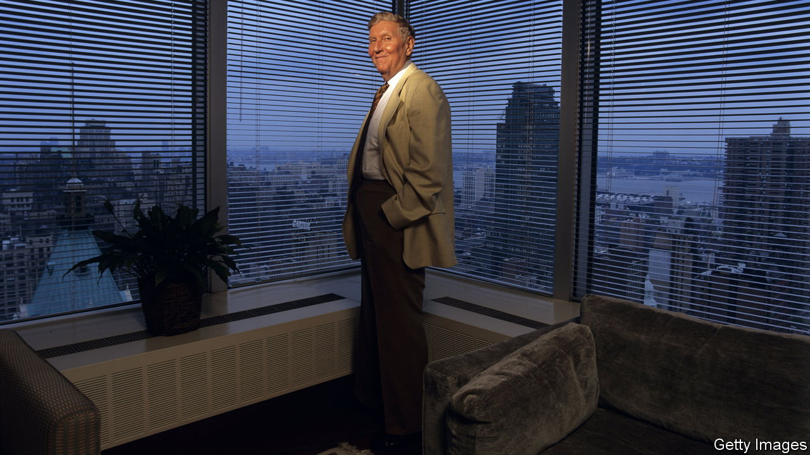

###### Hollywood moguls

# Sumner Redstone and the battle for Paramount 

##### “Unscripted” is an unsparing examination of a media empire and the flawed men who ran it 

 

> Mar 9th 2023 

. By James Stewart and Rachel Abrams. 

“Why are you so mean to people?” asked one of Sumner Redstone’s many girlfriends, after he had summoned a chef to their table just to throw an overcooked steak at him. “I don’t care,” replied the mogul. “I’m going to hell anyway.”

Though he boasted he would live for ever—“I eat and drink every antioxidant known to man”—Redstone died in 2020, aged 97. James Stewart and Rachel Abrams, two  journalists, have put together a deeply reported account of his final years, delving in sometimes excruciating detail into his extraordinary antics in both the boardroom and the bedroom.

After a scholarship to Harvard, where he learned Japanese and later helped crack codes in the second world war, Redstone saw off his brother to inherit control of the Boston-based family business, National Amusements, which ran two drive-in cinemas. He went on to amass one of the world’s largest collections of entertainment assets, with controlling stakes in Viacom and cbs, combined before his death to form what is now Paramount Global.

Though he earned a multi-billion-dollar fortune and a star on the Hollywood Walk of Fame, he was also “banned from every restaurant in LA”, in the words of one long-suffering dining companion. He described Barack Obama using the N-word and faxed his daughter, Shari, to call her the C-word, copying executives at Viacom, where she was on the board. He harassed his female staff, asking an attendant on a company jet if she liked to be spanked.

His exploitation of younger women—and, as he became infirm, their exploitation of him—is the focus of the first half of “Unscripted”. To buy their affection and discretion, Redstone doled out favours, gifts and cash. Favourites got career leg-ups; one, a singer in a band called the Electric Barbarellas, performed on CBS at his insistence. Towards the end of his life, two live-in girlfriends-cum-nurses extracted $150m from him. Finally his family evicted the pair, with the help of private detectives and a lot of lawyers.

The second half of the book concerns the Redstone businesses, where Sumner remained executive chairman even as he had to be carried into annual meetings at which he barely spoke. Later, as his voice deteriorated, he had a laptop programmed to say phrases including “Would you like some fruit salad?” and “Fuck you.” After a legal hearing in which he struggled to recall his birth name (Rothstein, later anglicised by his father), investors began to fret. Eventually, following a cognitive test in which he could not perform basic arithmetic or spelling, he stepped down.

This set the stage for a boardroom battle between the Redstones, now led by , and cbs’s management, principally Leslie Moonves, a former actor who was chairman and chief executive and stood to run both  should they be combined. Mr Moonves, named the fourth-most-powerful person in entertainment by the , was a hit with investors. Yet after  was unmasked as a serial sexual abuser, numerous women accused Mr Moonves of past assaults, which he has always denied.

The mainly elderly, male board of cbs was initially inclined to accept these denials. “We all did that,” said Arnold Kopelson, a director. Even some of those claiming to help the alleged victims appeared to take advantage of them, such as the agent who used his client’s claims to press Mr Moonves to give parts to other actors on his books. Only investigations by the  and  (whose journalists were told by CBS’s communications chief to “have some fucking ethics” and “find a real story”) .

Like a lot of reality tv, “Unscripted” is riveting because its cast is so awful. Shouting matches in Nobu, restraining orders, custody battles (over children and pets), non-disclosure agreements and psychics all feature. One of the few sympathetic characters, Shari Redstone, at least gets a Hollywood ending. After a reconciliation with her father, she sees off Mr Moonves and becomes chairwoman of the newly combined Paramount. The book ends at Sumner Redstone’s funeral, with Shari singing “My Way”. ■


