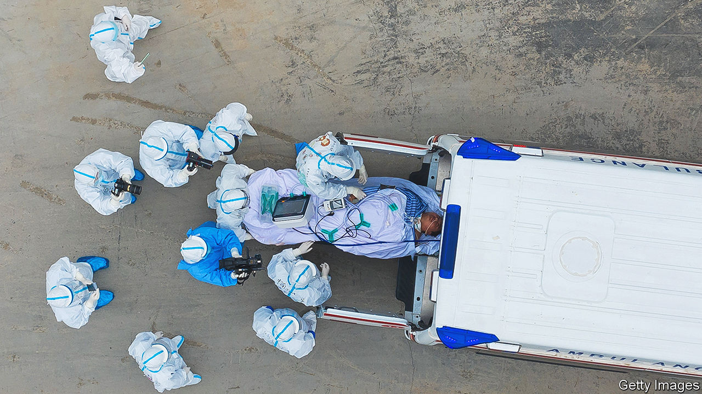

###### Covid-19 in China

# Two brave books tell the story of lockdown in Wuhan 

##### They are a vital counterpoint to the Chinese government’s official narrative 

 

> Mar 9th 2023 

By Murong Xuecun. 

 By Fang Fang. Translated by Michael Berry. 

China’s new mantra is unequivocal. The country has won a “major and decisive victory” over covid-19. The outgoing prime minister, Li Keqiang, repeated this phrase on March 5th in a speech at the opening of the annual session of China’s parliament. He cautioned the nearly 3,000 masked delegates that the pandemic was not over, but he did not suggest the virus needed to be crushed, a feat that China spent nearly three years battling to achieve, until late in 2022. The Communist Party wants to move on from—and wants citizens to forget—the trauma of . 

The party is a master at controlling and confusing memories. Millions died in the famine triggered by ’s Great Leap Forward of the late 1950s. But poor harvests were officially blamed on natural disasters. Without a free flow of information to help them identify the real culprit, most Chinese bought the party line. Likewise, many who have grown up since the Tiananmen Square protests of 1989 are confused about what happened. Some sympathise with the party’s decision to crush what were in fact peaceful demonstrations, believing the official narrative that large riots had broken out.

The story of how covid emerged late in 2019, and of how the Chinese government responded, is another that will be clouded in Chinese minds by disinformation and lies. There will be no public inquiry in China into how officials handled the outbreak or the harsh and protracted lockdowns in city after city. There will be no open investigation into where the virus came from, or whether better safety precautions—say in a lab or a wet  in the central Chinese city of Wuhan—might have prevented a global disaster. Victory will be the only permissible verdict. 

This enhances the value of the few independent accounts that Chinese people have written of how the pandemic unfolded in their country. It has taken much bravery to produce them. Several citizen journalists have suffered the consequences of reporting independently: imprisonment,  to keep them silent, or simply being “disappeared”. 

Yet one author, Murong Xuecun (the pen name of Hao Qun), managed in 2020 to interview people about their experiences of Wuhan’s 76-day lockdown at the start of the pandemic and to write a book, “Deadly Quiet City”. Before its publication—last year in Australia and now elsewhere—he fled abroad. In the preface he says that recalling his efforts, undertaken while dodging the Chinese police, still gives him a “heart-sinking, bitter taste of terror” even though he is now “out of their reach”. 

Mr Murong’s book follows another by a prominent Chinese writer about Wuhan’s shutdown: “Wuhan Diary” by Fang Fang (whose real name is Wang Fang and whose home town is Wuhan). Published in 2020, it is a translation of her posts to Chinese social media in that period. Like Mr Murong’s, it is scathing about the government’s response, including the initial attempts to suppress news of the disease’s spread. She describes how “ultra-leftists”, enraged by her criticisms, bombard her with online tirades. She hints that the trolls may have government backing. 

Ms Fang’s journal was written from home, drawing on information provided by her extensive network of contacts in Wuhan. Mr Murong’s book takes a different approach. Each of his chapters focuses on one of eight protagonists, ranging from a  at a small community hospital to the unlicensed driver of a motorcycle taxi and another citizen journalist, Zhang Zhan, whose daring efforts earned a four-year jail sentence. 

It is a harrowing collection of stories, grippingly narrated. The doctor finds himself in a baffling new world. Dispatched to a busy isolation station, where people with suspected covid are sent, he finds that the results of virus tests are treated as classified. Bizarrely, security guards at the entrance may see the results, but when he asks them about a particular person’s test, the answer is: “That’s secret. Can’t tell you.” Because the doctor’s hospital has to focus on coronavirus cases, its revenue from charges for other kinds of treatment dries up. So for months he has to work unpaid. 

Memory and forgetting

The book is packed with detail of a dysfunctional medical system that cannot cope with the deluge of patients, leaving many to die at home, in hospital corridors or on the streets. At another isolation station a seriously ill patient is ignored. His wife begs neighbourhood officials for help. “Those fuckers just watched Mum kneeling there,” recalls their son. Eventually the officials give in and arrange for the man and his wife to be taken to a hospital, where he dies. 

Ms Zhang’s bravery is astonishing. Even before setting out on her reporting trip to Wuhan, the then 36-year-old lawyer had a record of snubbing authority to a perilous degree. She angered the government with her posts online, including some that attacked corruption in the financial industry. Early in 2019 she staged a protest in Shanghai, where she was living, against police harassment of her: she held up a banner in a subway station saying, “Down with the Communist Party, End Socialism”. Later that year she did it again, walking along a busy street carrying an umbrella adorned with a similar slogan. She was detained both times. The second spell behind bars included being shackled hand and foot for several days to the floor of a cell, in her own excrement. 

Ms Zhang spent 104 days in Wuhan, posting essays and videos about the lockdown. She quixotically protested against the authorities’ efforts to keep everyone indoors by repeatedly pushing down a gate they erected to stop people in her neighbourhood leaving the area. She “fought a battle knowing there was no prospect of victory, yet she still charged onto the battlefield,” writes Mr Murong. 

Even at that time, Ms Fang was worrying about the post-covid future. “What I fear is that once people get back to their normal, happy lives, no one will be willing to revisit this painful moment,” she records in her diary. “If you don’t pursue this and hold people accountable, at the end of the day, the biggest victim will be the nation itself.” The party begs to differ. ■


