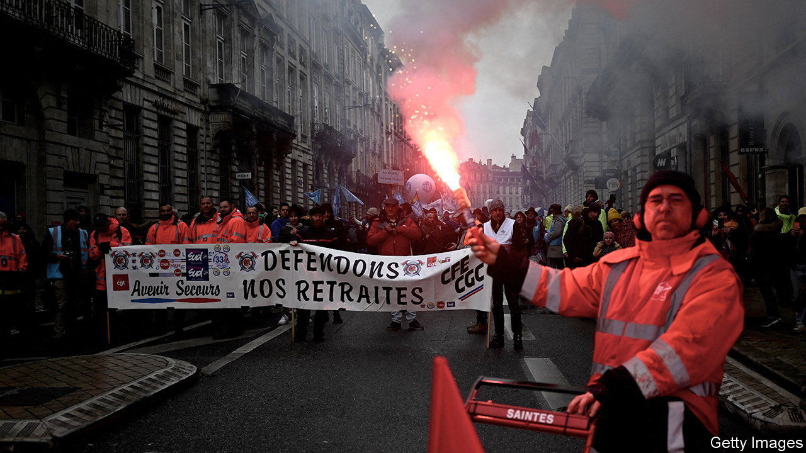

###### The street v the president

# France is in a stand-off against Emmanuel Macron’s pension reform 

##### Strikes and protests are testing the French president’s resolve 

 

> Mar 9th 2023 

A rolling national strike, launched on March 7th and in its third day as  went to press on March 9th, will “bring the economy to its knees”, declared one union leader. With nearly 1.3m protesters on the streets across France on day one, a third of classrooms shut, and sporadic illegal power cuts, the country’s trade unions are engaged in a stand-off with the government over pension reform that is approaching its finale. The deadline set for parliament to examine President Emmanuel Macron’s legislation is March 26th. The unions, which are renewing their strike every day, want him to back down and shelve the plan before that.

The centrepiece of the reform is a rise in the minimum pension age from 62 years to 64, and an accelerated increase in the required number of annual contributions from 41 years to 43 to qualify for a full pension. As every French leader who has ever tried to delay its citizens’ retirement knows, pension reform is a tinderbox. This time, hostility has hardened as the protests go on. Turnout on the streets on March 7th was slightly higher than the previous record, on January 31st. Two-thirds of the French still say that they want the government to shelve its plan, just as they did at the start of the year.

Olivier Dussopt, the pensions minister, who came to Mr Macron’s centrist movement from the Socialist Party, has patiently tried to explain why an ageing population and generous retirement scheme mean that something has to give. By 2030 the annual deficit in the pension regime will reach €14bn ($15bn) unless the rules are changed. He and the prime minister, Elisabeth Borne, have engaged in weeks of discussions, and made various concessions, to try to secure parliamentary support. But Mr Macron lost his majority in the National Assembly last year. The centre-right Republicans, whose votes he needs, have been playing hardball—even though they themselves raised the retirement age when in government in the past. 

In the National Assembly the debate has become toxic. Jean-Luc Mélenchon’s Unsubmissive France, which leads NUPES, a left-wing parliamentary alliance that is the biggest opposition group, has been on a wrecking mission. It originally tabled some 13,000 amendments in order to hold up proceedings and block a first vote in the lower house on the article to increase the pension age. Mr Mélenchon now wants Mr Macron to dissolve parliament or hold a referendum. The president, he says, is imposing an unfair reform “against the will of the people”. 

France’s inability to conduct a serious debate about pension reform does not bode well. Neither side is in any mood to budge. Mr Macron and his government have failed to persuade public opinion of the merits of their reform, even though it keeps in place a generous system, is less radical than the one he originally proposed and shelved due to covid-19, and was in his election manifesto last year.

If the government cannot scrape the votes together in time, it can still resort to a constitutional provision that would force the reform through. This would get the new rules onto the statute books. But such an option would carry risks of its own. Not only would it prompt claims from the opposition that the government is abusing its power; it could also provoke fresh legislative elections. ■

