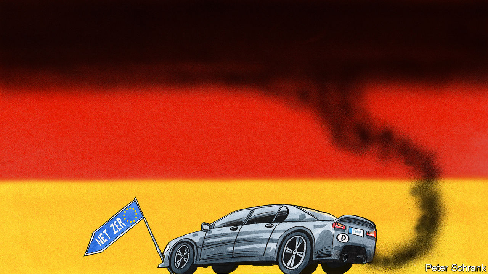

###### Charlemagne

# Germany is letting a domestic squabble pollute Europe’s green ambitions 

##### A fight over cars turns ugly 

 

> Mar 9th 2023 

For an internal-combustion engine to keep chugging along requires hundreds of parts to move in perfect unison: just one component misfiring can blow the whole thing up. Much the same is true of the process to create new EU laws, a human creation whose inner workings rival the complexity of a car motor. Nobody knows this better than Germany, present at the birth of both the automobile and the EU. And yet. A clumsy attempt to scupper new European legislation at the last minute—on scrapping the sale of new internal-combustion cars by 2035, as it happens—has left fellow EU members seething. Not for the first time, the German chancellor, Olaf Scholz, is accused of putting domestic political convenience ahead of the European interest.

This month would have marked something of a public-relations triumph for the EU’s regulatory machine. Seldom do laws agreed in Brussels—by 27 member states, the European Commission and 705 MEPs—draw much interest from anyone beyond lobbyists and a few Twitter obsessives. The banning of the internal-combustion engine was such a case. It points to Europe taking tangible steps towards reaching “net zero” carbon emissions by 2050, including a 55% cut on 1990 emissions by the end of the decade. Forcing change on the powerful car industry was a feature of the law: it gave the EU credibility when it demanded that the rest of the world should also take action to combat climate change. 

The self-congratulations have been delayed—or perhaps cancelled, nobody quite knows. Even Brussels insiders had assumed the internal-combustion rule had been passed months ago. Only the procedural step of ministerial signatures remained, another opportunity for politicians to take plaudits for a job well done. What should have been a mere formality has turned into a giant spanner in the works. Despite German officials having been present at every stage of the law’s passage through the complex Brussels process, and having signed off time after time, Germany is now refusing to approve it. Such behaviour is just about unprecedented. Revisiting agreements once consensus has been achieved is a recipe for wrecking the EU machine, the diplomatic equivalent of pouring a glug of diesel into a petrol car.

To understand the German spanner, look to its domestic politics. Mr Scholz presides over a coalition of his Social Democrats, the Greens and the liberal Free Democrats (FDP), the smallest of the three, who hold the transport ministry. Rather oddly, its conception of liberalism includes mollycoddling incumbent carmakers, some of whom are not keen on having to scrap their polluting technologies. The FDP has been trounced in a spate of regional elections, and needs a cause to rally its base. It wants the EU to introduce an exemption for cars accepting “e-fuels”, which work in petrol cars but are made with renewable energy (in tiny quantities, for now). The FDP says it wants to keep technological options open. But a loophole for e-fuels might allow Porsche, BMW and others to keep making internal-combustion engines—which owners might keep filling with carbon-spewing fuels. 

At this point, European etiquette indicates that Mr Scholz should put the FDP back in its place: Germany had cut a deal with its EU partners, and that should be that. Instead, he has backed the liberals in their campaign, knowing it will cause ructions among his European allies (few in Germany seem to have noticed the spat). Having seen Berlin balk, others have been emboldened. Italy, home of a few zippy carmakers, now says it too wants the law to be revisited: it had been agreed to under the centrist Mario Draghi, but now the hard-right Giorgia Meloni reigns. Poland, also run by populists without much love for EU green rules, has come on board, as have others in central Europe. That lot may not settle for the modest commitments on e-fuels that could satisfy Germany.

The main fear in Brussels is that gauche coalition-management by Mr Scholz has resulted in the derailing of a vital EU green measure. The commission may well pull out some face-saving assurances to help him placate the FDP and still allow the law to pass. Its president, Ursula von der Leyen, is herself a former German minister, and attended a meeting of its federal cabinet last weekend. But anything beyond cosmetic changes would require a wholesale reopening of the law, complete with all those rounds of negotiations. Who knows what the outcome of that might be.

Car-buncle

This is not the first time Mr Scholz has put Germany—and coalition management—ahead of the European interest. In October a package of €200bn ($211bn) in energy bungs to insulate German firms and households from the fallout from the war in Ukraine was poorly received by other EU countries, which could not match such largesse. Central Europeans fume that Berlin has repeatedly dragged its feet when it comes to arming Ukraine. Mr Scholz’s propensity to focus on domestic matters has caused the Franco-German alliance, once the reliable engine of the EU, to sputter.

The war in Ukraine triggered what Mr Scholz called a in Germany, a change in the spirit of the times. The EU’s biggest country would stop being a wallflower when it came to defence, and perhaps beyond. Far from criticising Berlin, its neighbours welcomed promises of new assertiveness. Less so now. The result has not been a dynamic new Germany at the heart of the EU, but rather one that has allowed home-grown spats to metastasise to the continental sphere. Lots of other European leaders have tricky coalitions to deal with. None scuppers important EU legislation for the sake of political expediency at home. 

Grumbles about Germany and the EU are nothing new. For much of the 16 years she was in power, Angela Merkel faced barbs for the manner in which she put off making decisions until the last minute. If anything, those days are remembered fondly now: for when Mrs Merkel agreed to something, no matter how belatedly, at least she stuck to it. ■


