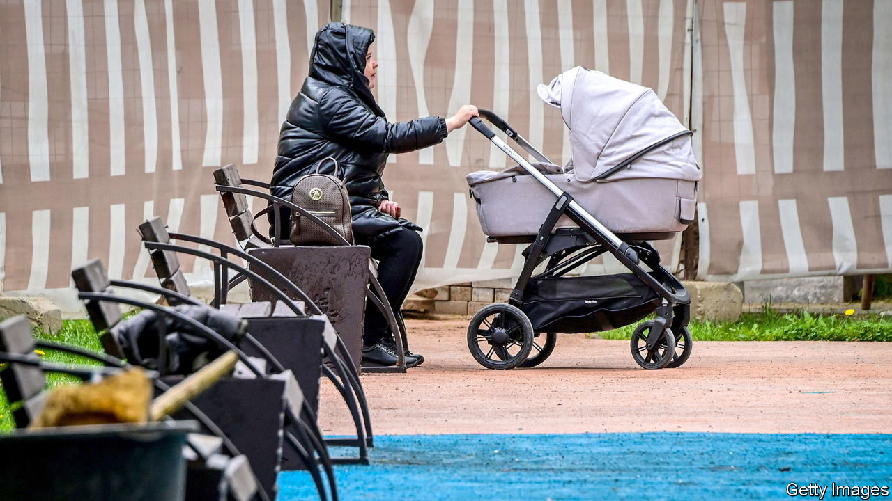
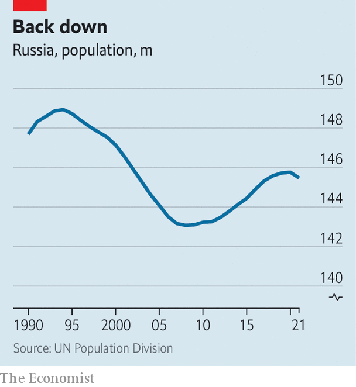
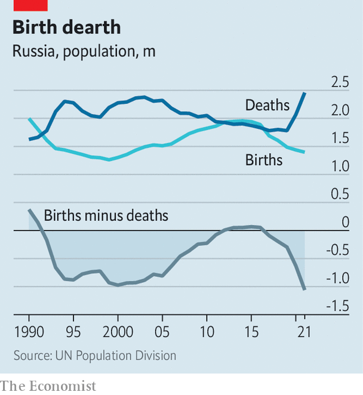

###### Russian demography

# Russia’s population nightmare is going to get even worse 

##### War in Ukraine has aggravated a crisis that long predates the conflict 

 

> Mar 4th 2023 

A DEMOGRAPHIC TRAGEDY is unfolding in . Over the past three years the country has lost around 2m more people than it would ordinarily have done, as a result of war, disease and exodus. The life expectancy of Russian males aged 15 fell by almost five years, to the same level as in Haiti. The number of Russians born in April 2022 was no higher than it had been in the months of Hitler’s occupation. And because so many men of fighting age are dead or in exile, women now outnumber men by at least 10m. 

War is not the sole—or even the main—cause of these troubles, but it has made them all worse. According to Western estimates, 175,000-250,000 Russian soldiers have been killed or wounded in the past year (Russia’s figures are lower). Somewhere between 500,000 and 1m mostly young, educated people have evaded the meat-grinder by . Even if Russia had no other demographic problems, losing so many in such a short time would be painful. As it is, the losses of war are placing more burdens on a shrinking, ailing population. Russia may be entering a doom loop of demographic decline.

 


The roots of Russia’s crisis go back 30 years. The country reached peak population in 1994, with 149m people. The total has since zig-zagged . It was 145m in 2021 (that figure, from the UN, excludes the 2.4m people of Crimea, which Russia seized in 2014 and incorporated into its national accounts). According to UN projections, the total could be just 120m in 50 years, if current patterns persist. That would make Russia the 15th-most-populous country in the world, down from sixth in 1995. According to Alexei Raksha, an independent demographer who used to work for the state statistics service, if you look just at peacetime years, the number of births registered in April 2022 was the lowest since the 18th century. April was a particularly cruel month, but it was a revealing glimpse of a chronic problem.

Population decline is not unique to Russia: most post-communist states have seen dips, though not like this. Their declines have been slow but also manageable. Russia’s population in recent decades has seen a precipitous slump, then a partial recovery (thanks to a period of high immigration from parts of the ex-Soviet Union and more generous child allowances after 2007), followed by a renewed fall. 

According to the state statistics agency, in 2020 and 2021 combined the country’s population declined by 1.3m; deaths outstripped births by 1.7m. (The UN also shows a fall, but it is shallower.) The decline was largest among ethnic Russians, whose number, the census of 2021 said, fell by 5.4m in 2010-21. Their share of the population fell from 78% to 72%. So much for Mr Putin’s boast to be expanding the   (Russian world). 

All this began before the war and reflects Russia’s . The official death toll from the disease was 388,091, which would be relatively low; but estimates total excess deaths in 2020-23 at between 1.2m and 1.6m. That would be comparable to the number in China and the United States, which have much larger populations. Russia may have had the largest covid death toll in the world after India, and the highest mortality rate of all, with 850-1,100 deaths per 100,000 people. 

If you add pandemic mortality to the casualties of war and the flight from mobilisation, Russia lost between 1.9m and 2.8m people in 2020-23 on top of its normal demographic deterioration. That would be even worse than during the disastrous early 2000s, when the population was falling by roughly half a million a year. 

 


What might that mean for Russia’s future? Demography is not always destiny; and Russia did for a while begin to reverse its decline in the mid-2010s. The impact of population change is often complex, as Russia’s military mobilisation shows. The decline in the number of ethnic Russians of call-up age (which is being raised from 18-27 to 21-30) will make it harder for the armed forces to carry out the regular spring draft, which begins in April. 

Such complications notwithstanding, the overall effect of demographic decline will be to change Russia profoundly—and for the worse. Most countries which have suffered population falls have managed to avoid big social upheavals. Russia may be different. Its population is falling unusually fast and may drop to 130m by mid-century. The decline is associated with increased misery: the life expectancy at birth of Russian males plummeted from 68.8 in 2019 to 64.2 in 2021, partly because of covid, partly from alcohol-related disease. Russian men now die six years earlier than men in Bangladesh and 18 years earlier than men in Japan.

And Russia may not achieve what enables other countries to grow richer as they age: high and rising levels of education. Nicholas Eberstadt, a demographer at the American Enterprise Institute in Washington, argues that the country presents a peculiar combination of third-world mortality and first-world education. It has some of the highest rates of educational attainment among over-25s in the world. But the exodus of well-educated young people is eroding this advantage. According to the communications ministry, 10% of IT workers left the country in 2022. Many were young men. Their flight is further skewing Russia’s unbalanced sex ratio, which in 2021 meant there were 121 females older than 18 for every 100 males. 

The demographic doom loop has not, it appears, diminished Mr Putin’s craving for conquest. But it is rapidly making Russia a smaller, worse-educated and poorer country, from which young people flee and where men die in their 60s. The invasion has been a human catastrophe—and not only for Ukrainians. ■

