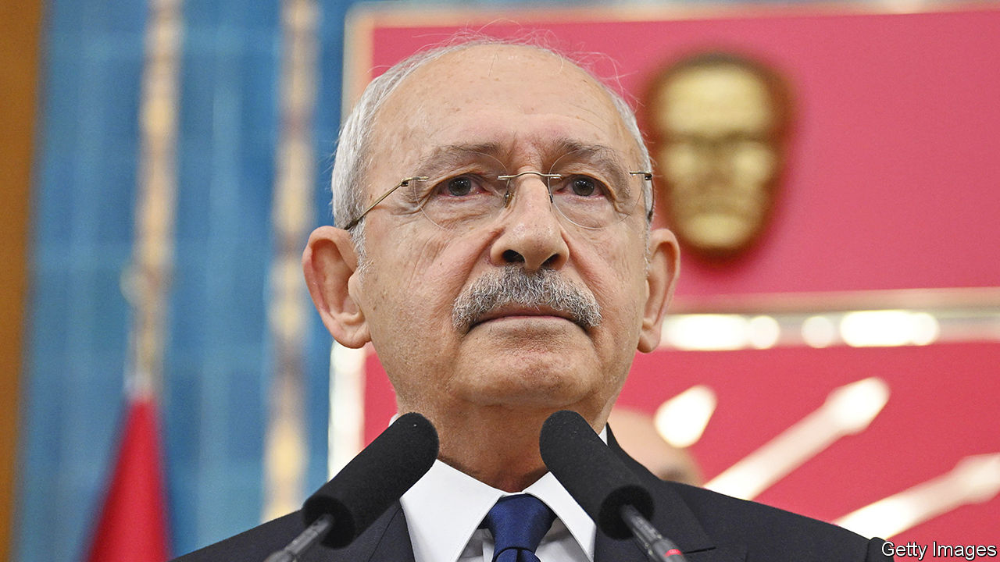

###### Turning the tables

# Turkey’s opposition has picked its man 

##### But some of them are not happy about it 

 

> Mar 9th 2023 

IT TOOK THEM long enough. On March 6th, with fewer than 70 days left before the expected date of Turkey’s presidential and parliamentary elections, a group of six opposition party leaders, known collectively as the Nation Alliance or the Table of Six, unveiled Kemal Kilicdaroglu, the head of the Republican People’s Party (CHP), as their presidential candidate. The atmosphere outside the Ankara headquarters of the Felicity Party, where the meeting took place, was hardly electric. As Mr Kilicdaroglu spoke, his political allies looked on with stony faces. Meral Aksener, the head of the Iyi (“Good”) party, the second-biggest group in the alliance, looked as if she had swallowed a bar of soap. 

Mr Kilicdaroglu’s nomination, expected to be a formality, became a drama. On March 3rd, a day after opposition leaders confirmed they had settled on a candidate, Mrs Aksener suddenly walked away from the Table of Six, said she refused to back Mr Kilicdaroglu, and called on Ekrem Imamoglu and Mansur Yavas, the CHP mayors of Istanbul and Ankara, to throw their hats in the ring. Choosing between Turkey’s current president, Recep Tayyip Erdogan, and Mr Kilicdaroglu was choosing “between death and malaria”, she said. She caved in at the 11th hour, after the CHP leader promised to appoint the two mayors as his vice-presidents. Turkey’s vice-presidency, however, does not count for much.

Mrs Aksener’s misgivings about Mr Kilicdaroglu are not entirely misplaced. For an opposition committed to dismantling Mr Erdogan’s executive presidency, a byword for one-man rule, and to cooling down tensions at home and abroad, the unassuming CHP leader, less rabble-rouser than paper-pusher, may be the best possible president. But he may also be the worst possible candidate. Polls in the past year have suggested that both Mr Yavas and Mr Imamoglu would stand a much better chance of unseating Mr Erdogan in the presidential election run-off. 

Mrs Aksener’s botched power play, however, has damaged not only her own standing with voters but also the opposition’s collective image. Her walkout reminded many Turks of the 1990s, when squabbling politicians brought down one coalition government after another. Mr Erdogan is sure to spend the next two months jogging their memories. 

But he will need to do more than that to beat Mr Kilicdaroglu. Slowing growth and 55% inflation have nibbled away at support for Turkey’s leader and his governing coalition, made up of the Justice and Development (AK) and Nationalist Movement (MHP) parties. The government also came under fire over its slow response to last month’s earthquakes that killed over 52,000 people in southern Turkey and Syria. Rescue teams took days to reach major cities, condemning countless survivors to die under the rubble. Anger also mounted after Turkey’s Red Crescent was revealed to have sold thousands of tents to a charity, instead of distributing them free. Mr Kilicdaroglu seems to have seized the momentum. Turkiye Raporu, a polling company, sees him leading Mr Erdogan by a margin of up to eight points. ■

