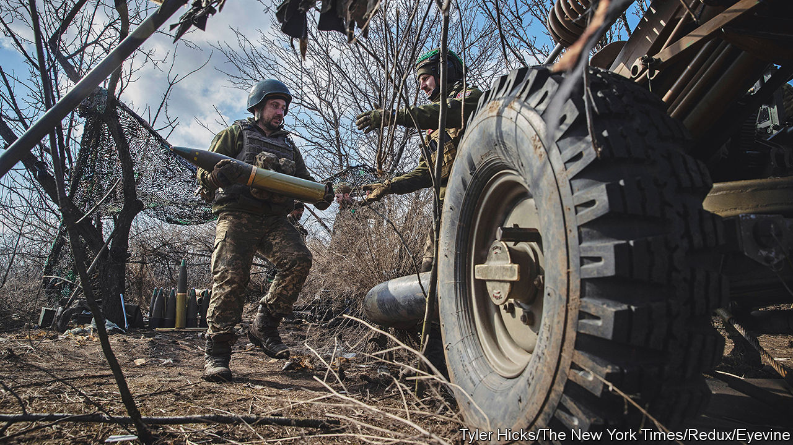
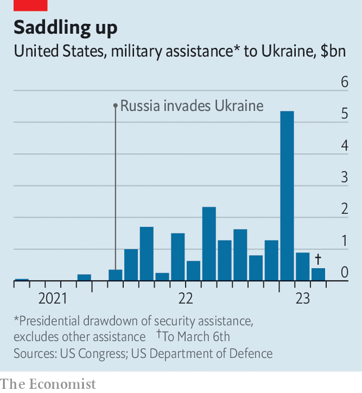
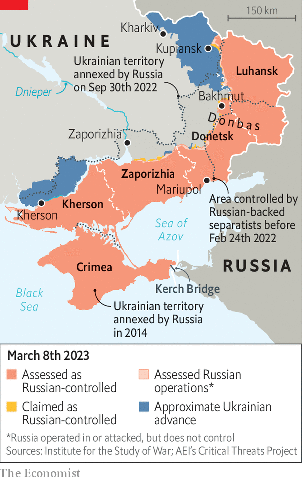

###### Lock and load

# Ukraine is building up its forces for an offensive 

##### It has received a bonanza of Western arms in the past few months 

 

> Mar 6th 2023 


ON SEPTEMBER 22ND 1941 Britain declared “tanks for Russia” week, with factories churning out armour to “repel the savage invaders”. The wife of the Soviet ambassador in London christened the first tank personally: “Stalin”. The first Leopard tank to arrive in Ukraine, a gift from Poland in February, has remained anonymous. But it is the vanguard of a substantial arsenal coming Ukraine’s way. While all eyes are now on the battle for the eastern town of Bakhmut, attention will soon turn to an expected counter-offensive that could start as early as April.

The  has been at the heart of tricky debates among Ukraine’s partners. On January 25th Olaf Scholz, Germany’s chancellor, ended weeks of dithering by promising to send the Leopard 2A6, an advanced variant. Many thought that would unleash a torrent of donations from the dozen other European countries which operate Leopards. It has been more of a trickle. So far, the coalition has pledged just two battalions of the most modern Leopards (a Ukrainian tank battalion is supposed to have 31 tanks). Denmark, Germany and the Netherlands are also purchasing at least 100 older, but refurbished, Leopard 1A5s for Ukraine, making up another three battalions. 

The Leopards are being supplemented with a motley collection of other tanks. Britain is sending a company of 14 Challenger 2s. America has promised 31 M1A2 Abrams, the most advanced tanks in its arsenal, though it looks likely that they will not arrive for months. Poland, which has promised 14 Leopards and has already sent around 250 Soviet-designed T-72 tanks to Ukraine, will send 60 modernised T-72s. A variety of , from the ageing Soviet-era BMP-1 to America’s Stryker and Bradley vehicles, will pad out the armoured brigades.

Yet the fixation on  has distracted from a more important shift in strategy. In December America and Britain realised that a protracted war was not in the West’s interests. Russia, moreover, was even weaker than previously thought. The mood, says one official involved in those discussions, was: “If we want something to change, we need to change something.” The turning-point came on January 20th at the eighth meeting of the Ukraine Defence Contact Group, an American-led meeting of defence ministers held roughly monthly at a big American air base at Ramstein in Germany. There, allies agreed to equip Ukraine with more than a division’s worth of kit, with the aim of having much of it in place by the end of March.

 


The flow of arms has accordingly turned from a trickle to a flood. Of all the military aid pledged by the Pentagon since the war began, 40%—costing over $8bn—has come in the three months since December 9th (see chart). One European defence official says that the infusion of arms agreed on in Germany in January alone amounts to two-thirds of the total sent to Ukraine in all of 2022. Most of the donations are not as sexy as tanks, but are still crucial—the latest American package includes armoured bridge-laying vehicles, for instance, which would be vital for any offensive in the south or east. 

Ukraine’s army is being transformed as a result. The bulk of its hardware is still of Soviet origin. But whereas the ratio of Soviet-standard to Western kit stood at five to one at the end of last year, that is expected to fall to five to two as the aid flows in. In other words, almost a third of Ukraine’s army will soon have NATO-standard equipment. General Valery Zaluzhny, Ukraine’s top officer, hopes that he will eventually have three new army corps at his disposal, each with six brigades, and each comprising more than 20,000 men.

 


A Russian offensive that began in late January was intended, in part, to force Ukraine to commit these reserves, thereby making it much harder to mount a counter-offensive. In recent days, Russian soldiers and mercenaries have advanced deeper into Bakhmut, a town in Donetsk province that has been under Russian assault since last summer. But the battle for the town has resulted in far greater Russian losses than Ukrainian ones. And, more important, General Zaluzhny has avoided the obvious trap.

Instead of throwing sizeable reserves into Bakhmut to save the town, which is of far greater symbolic than military value, he has sent troops abroad to train on the new equipment. Since January America’s 7th Army Training Command has been running a five-week course for Ukrainian units at its Grafenwoehr training area in eastern Bavaria, in Germany. During its offensives last year, Ukraine’s army largely attacked in company-sized formations. The training in Grafenwoehr is intended to bring these together into bigger battalions and brigades capable of waging “combined-arms” warfare, in which infantry, armour, artillery and other combat arms work together rather than just sequentially—as is mostly the case now. 

Western officials are divided on whether all this will be enough to eject Russia from the roughly 18% of Ukraine it controls at present. Only a battalion’s worth of soldiers will pass through Grafenwoehr each month; a large proportion of Ukraine’s army is still made up of mobilised men with limited experience. Ammunition remains a serious problem, because Western allies have been slow to ramp up production. And Ukraine’s lack of air power may become a bigger issue if Russian warplanes prove willing to run bigger risks during any Ukrainian offensive. 

On the other hand, Russia’s army is in . If, after conquering Bakhmut, it decides to plough on deeper into Donetsk, it will have to run down its own meagre reserves even more. It might eventually start pulling units from other parts of the long front line, creating gaps that Ukraine can exploit, suggests Gustav Gressel of the European Council on Foreign Relations, a think-tank. Ukraine’s allies are watching closely for weak points.

On March 2nd, Mark Milley, America’s top general, visited tabletop wargames held by America at a base in Wiesbaden, Germany, to help Ukrainian officers consider different options for an offensive. Few think that Ukraine can restore its pre-war boundaries at a single stroke, let alone take back territory, including Crimea, seized by Russia in 2014. But if Ukraine can tear another significant chunk out of Russian-occupied territory, as it did last year in the north-east around Kharkiv, and in the south around Kherson, it would quash the belief—expressed by General Milley, among others—that the war is doomed to stalemate. ■

