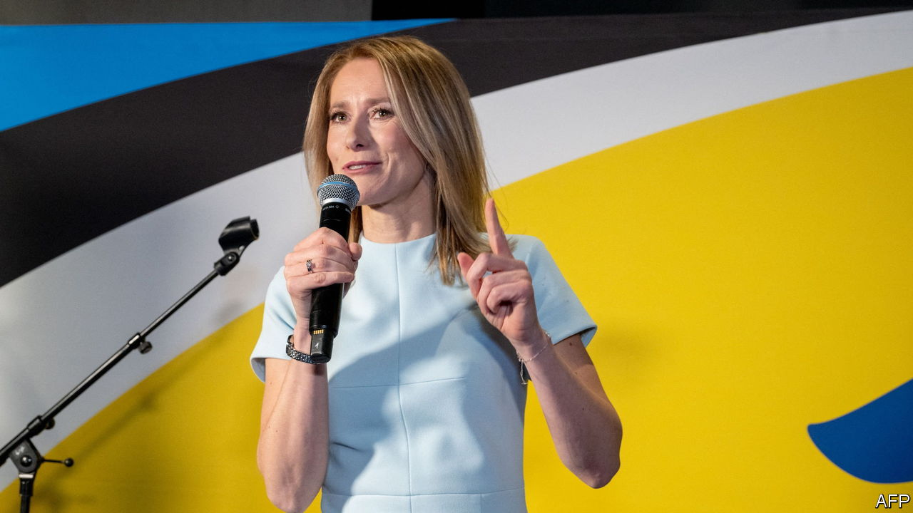

###### The centre can hold

# Ukraine’s most committed backer wins a huge election victory in Estonia 

##### Kaja Kallas, the prime minister, crushes her Eurosceptic populist opponents 

 

> Mar 6th 2023 

ESTONIA’S general election on March 5th was, in large part, a referendum on Estonia’s support for Ukraine. , the prime minister, has become the face of eastern EU members’ resistance to Russian aggression. She began sounding the alarm over the looming invasion of Ukraine in late 2021, when many European leaders doubted it would happen. She has since made tiny Estonia the  to Ukraine measured relative to its GDP, and her proposal for a joint European ammunition fund has been picked up by the EU’s heavyweights. Foreign publications have dubbed her “Europe’s new iron lady”.

Yet that moniker sits oddly on Ms Kallas, an informal and self-deprecating politician who often says the worst advice she ever got was to act more like a man. Until recently she struggled to emerge from the shadow of her father, who was prime minister in 2002-03. The war has changed that: she is now the most popular politician in the country. When the balloting ended, her Reform Party had taken 31% of the vote and 37 seats out of 101 in the Riigikogu, Estonia’s parliament. 

Ms Kallas’s win was a triumph for Estonian liberalism. In the early 2000s, Reform Party governments gave the country a reputation for transparent, technocratic governance. But in recent years the party has faced competition from the populist  party, Estonia’s edition of Europe’s ubiquitous Eurosceptic, anti-immigrant, anti-gay, covid- and climate-denialist outfits. One poll just before the election showed EKRE in first place. That threat seems to have motivated Reform’s supporters: in all, a record 615,009 votes were cast, a turnout of 63.5%. In the end EKRE got just 16% and 17 seats in parliament, two fewer than in the previous election in 2019. The Centre Party, an older populist group supported by most of Estonia’s ethnic Russian voters, finished third with 15% and 16 seats.

The war in Ukraine overshadowed the campaign. Ms Kallas accused EKRE of being wobbly in its support for Kyiv, with some justification. Mart Helme, the party’s former leader (and father of the current leader, Martin Helme) suggested in October that it was “on the side of peace” rather than of one side or the other, echoing Kremlin messaging. In the weeks before the election it emerged that the propaganda organisation headed by Yevgeny Prigozhin, the head of Russia’s paramilitary Wagner group, had tried to mount influence operations to help EKRE. 

Yet the younger Mr Helme insisted the party condemns Russia’s invasion. Instead he fought the campaign mainly on economic grounds. Inflation in Estonia was 19.4% last year, and the economy shrank 0.3% because of high energy costs. EKRE says it would slash electricity prices by government fiat, and increase use of the country’s domestic shale oil for power. Experts say this would not help: high prices for EU carbon-emissions permits make burning oil expensive. Nevertheless, “they are claiming that while all other parties put Ukraine first, EKRE is putting Estonians first,” says Mari-Liis Jakobson, a political scientist at Tallinn University.

Estonia was the first country in the world to introduce , in 2005. This year for the first time e-votes were a majority of those cast. They skew heavily towards liberal voters: early in the evening on March 5th, when only in-person votes were being counted, EKRE was ahead, but when e-votes were tabulated Reform jumped into the lead. Martin Helme promptly followed the populist script and claimed the election had been stolen.

In a post-election interview, Ms Kallas said that she aims to form a government that will last a full four-year term, something no other Estonian government has managed since the Soviet occupation ended in 1991. That suggests that although Reform could mathematically govern with just E200 (a newish pro-European group) or the Centre Party, she will seek a broader coalition. Whatever arrangement she chooses, she is now the dominant figure in Estonian politics. For those wondering whether support for Ukraine can weather economic hardship, the answer is that in the corner of Europe closest to Russia, it is good politics. ■

