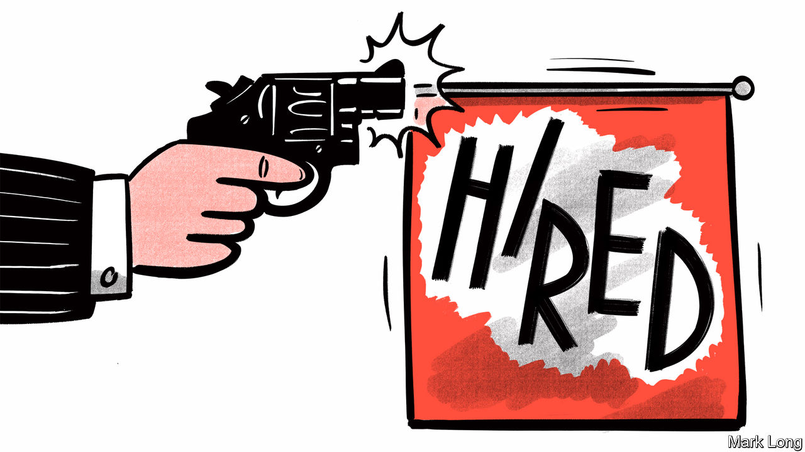
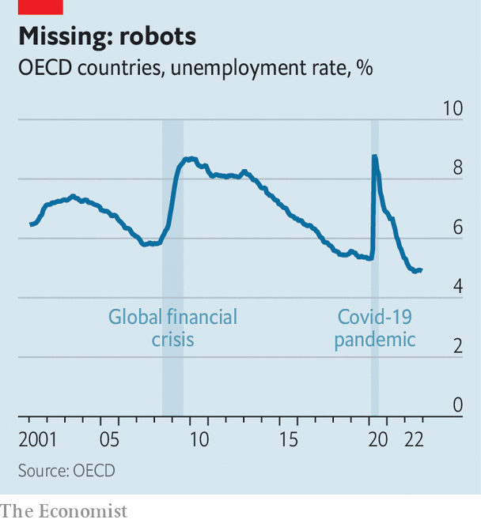
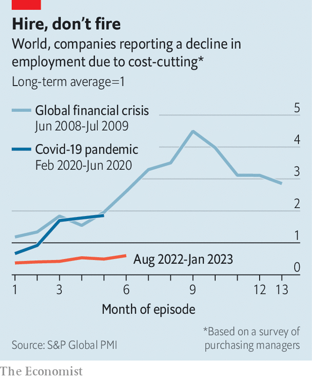

###### Tokyo grift

# Can the West’s perplexing employment miracle continue? 

##### There is little sign of more job losses, which may be bad news for economic vitality 

 

> Mar 5th 2023 

To see what a world swimming in jobs looks like, visit . At airports staff straighten suitcases after they tumble onto the carousel. Men with fluorescent batons stand near construction sites, reminding you not to walk onto the site. In department stores smartly dressed women help you use the lifts. And in one of Tokyo’s best bars, a team of four prepared your correspondent’s gin martini (from the freezer, of course, free-poured, and very dry). 

 


Now the rest of the  is starting to look more Japanese. Since the heady post-lockdown days of 2021 gdp growth across the 38 countries of the oecd has slowed almost to a standstill, and in some countries is negative. Business confidence is below its long-run average. Yet there is not much sign of weakness in the . On March 7th Jerome Powell, chairman of the Federal Reserve, observed that in America, “despite the slowdown in growth, the labour market remains extremely tight.” Across the oecd as a whole the unemployment rate was 4.9% in December—the lowest in many decades. From the third to the fourth quarter of the year, the rich world added about 1m jobs, in line with the long-run average. In half of oecd countries, including Canada, France and Germany, there has never been a higher share of working-age folk in a job. 

Joblessness is rising in a few countries, including Austria and Israel. One of the worst performers is Finland, where the unemployment rate has risen by a percentage point from its post-lockdown low In the face of soaring energy prices and reduced trade with Russia, the country’s gdp fell by 0.6% in the fourth quarter of 2022. But “worst” is relative. At 7.1% in January, Finland’s jobless rate is still well below its long-run average. Meanwhile, most of the places synonymous with the sky-high joblessness of the early 2010s—Greece, Italy, Spain—are doing much better now. 

This employment miracle hints at a change in Western economies. To understand why, return to Japan. Local employers dislike firing workers, even if they have little for them to do. In part because more and more people are retiring, firms struggle for new staff and are reluctant to let people go unless they have no choice. The result is an unemployment rate which barely rises, even in recessions. In the past 30 years Japan’s jobless rate has varied by just 3.5 percentage points, compared with 9.5 points in the average rich country. 

A more Japanese labour market would have disadvantages. If workers do not leave poorly performing firms, they cannot join innovative ones which drive growth. Indeed, the data suggest that rich-world productivity growth is exceptionally weak at present. However, spells of unemployment can exert a terrible human toll. Countries where unemployment is less volatile also tend to have milder recessions, points out Dario Perkins of ts Lombard, a financial-services firm. When the labour market does not crack, people can keep spending even as growth slows. 

 


What explains employers’ Japanese turn? Perhaps, after the pandemic, bosses are kinder to workers. Another, more realistic, possibility is that firms are in a strong financial position. This may allow them to withstand lower revenues today without needing to slash costs. Many received help from governments during the covid era. And in recent years corporate profits have been hefty. Businesses across the rich world are still sitting on cash piles about a third higher than before the pandemic.

A more intriguing possibility concerns the workforce. According to our estimates, the rich world is “missing” 10m workers, or roughly 1.5% of the labour force, relative to pre-pandemic trends. In Britain and Italy the workforce has actually shrunk. Early retirements and an ageing population explain part of the deficit. Covid may have pushed people to reassess their priorities, prompting them to drop out. Some even think long covid is forcing people to stay on the sidelines. Whatever the explanation, falling participation has wreaked havoc with plans. Many firms fired staff when the pandemic hit, only to struggle to rehire them in 2021. That year vacancies in the oecd hit an all-time high of 30m.

 


Employers may now want to avoid making the same mistake. A recent report by s&amp;p Global Market Intelligence, a consultancy, identifies “a reluctance among companies to sanction job cuts due to the immense challenges they faced in rehiring post-pandemic”. In America gross job losses have so far been smaller than is normal at the start of the year. Daniel Silver of JPMorgan Chase, a bank, speculates that this is because “firms are reluctant to let go of workers given perceived difficulties in eventual rehiring.” 

Labour-market pain may end up being merely delayed. In some past recessions unemployment only started to rise decisively some time after gdp started to fall. But “real-time” data show little sign that joblessness is about to surge. A recent survey by ManpowerGroup, a staffing firm, suggests employers in most countries still have ambitious hiring plans. In America the National Federation of Independent Business, a lobby group, finds an unusually large share of small firms plan to create new jobs in the next three months. 

Confronted with labour-market resilience even in the face of rising interest rates, central banks may be tempted to tighten monetary policy faster still. Further increases in rates, or another energy shock, may push employers over the edge, forcing them to cut staff. The pressure to retain staff could, however, become a structural issue. Over the next decade rich-world populations will age rapidly, dragging further on labour supply. Good workers are likely to become harder to find. Next time there may only be three people making your correspondent’s martini. ■


