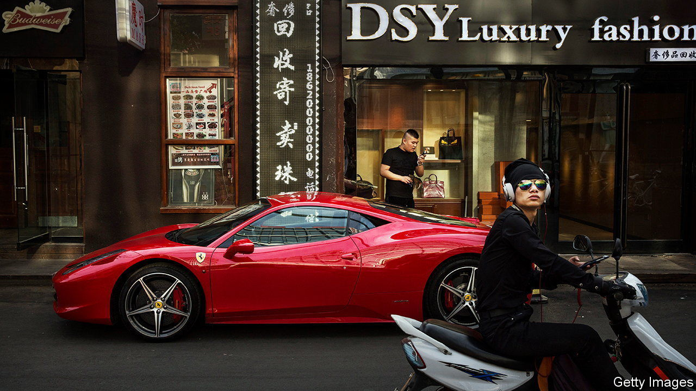

###### An anti-party party

# China’s Communist Party takes aim at hedonistic bankers 

##### Time to forget about luxury cars and Shanghai’s nightlife 

 

> Mar 9th 2023 

Senior staff at China’s largest investment banks have been flying economy, not first class, in recent months. They are cutting back on entertaining clients and drinking less, if at all, at banquets. A banker says he has been warning junior colleagues to avoid ostentatious displays of wealth. It is, he reports, for their own good. 

“Common prosperity”, a campaign for a more equal China, which was launched in 2021 by Xi Jinping, is coming to investment banking. A recent commentary by the official corruption watchdog, published on February 23rd, orders financiers to smash “financial elitism, worship of wealth and reverence for the West”. Meanwhile, the disappearance of Bao Fan, a high-profile banker, reportedly to take part in an investigation, has put the industry on edge.

Just a few years ago a steady stream of Chinese-born, Wall Street-trained bankers was flowing from London and New York to Beijing, Hong Kong and Shanghai. The growing cohort was swapping mostly mid-level (but sometimes senior) jobs at elite Western financial firms for better-paid positions at Chinese investment banks. 

The trend was about more than just pay, however. Many bankers wanted to return to a richer, more vibrant homeland after years spent overseas. Foreign financial firms were, and still are, expanding their local offices. Nightlife, restaurants and luxury-car dealerships exerted a pull all of their own. In short, Chinese cities were ready to cater to a class of young bankers with cash to burn.

Now the party is winding down. Even before the focus on Chinese finance’s culture, the industry had been subject to a years-long corruption crackdown targeting bosses. The country’s zero-covid policy stopped high-flying bankers travelling abroad for several years—forcing those who had recently returned to consider whether their future really did lie in China.

And it is has become clear that the Communist Party has taken an extremely grim view of finance. The watchdog’s critical commentary instructs bankers to cast out any notions they may have of “exceptionalism, distinctiveness and superiority”. At times the document talks about finance as if it were a virus with “hidden variants” that must be battled in an effort which “one cannot grow too tired to fight”.

The detention of Mr Bao, founder of China Renaissance, a boutique investment bank focused on technology, has also shocked local executives. His company has been unable to reach him since he disappeared in mid-February, but has said it has been informed he is co-operating with an investigation. According to the , Mr Bao has been detained by the same corruption watchdog that published the recent attack on the financial industry. 

The Communist Party has already claimed success in avoiding the rise of a “crypto-bro” culture, which it did by banning cryptocurrency trading. Some of the talent that would otherwise have gone into developing related products has been channelled elsewhere. Perhaps Mr Xi thinks he can do the same to a generation of West-loving, hedonistic bankers. ■


