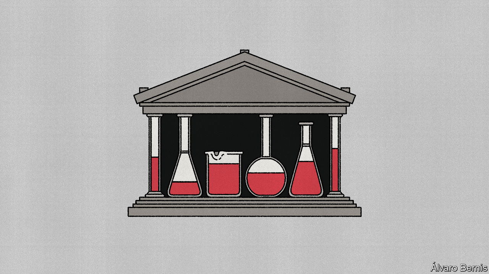

###### Free exchange

# Emerging-market central-bank experiments risk reigniting inflation 

##### New policies could undermine two decades of progress 

 

> Mar 9th 2023 

When prices began to rise unusually quickly two years ago, one group was fastest to react: emerging-market central bankers. They realised inflation had arrived for the long haul well before their peers in rich countries, and kept raising interest rates as prices soared. In policymaking environments as difficult as Brazil and Russia officials have resisted pressure from politicians to cut rates. This follows two decades in which emerging-market central bankers pulled off the impressive feat of bringing down inflation in places where it had seemed intractable. The whole period has been a triumph not just for the officials involved, but for the economists who insisted on the need for independent central banks in emerging economies—and for them to focus on keeping prices stable, just like policymakers in rich countries.

Yet even as the inflation monster remains untamed, emerging-market central banks are engaging in experiments that put this progress at risk. Some of the new measures are in response to changes beyond their control, such as Vladimir Putin’s invasion of Ukraine. Others are attempts to overcome painfully familiar problems, like currency depreciation. All threaten to undermine recent advances, which are ultimately based on central-bank credibility. Over the past few decades, the better policymakers managed to anchor inflation, the more their targets were believed and the more prices were constrained. In 1995 median inflation in emerging economies was 10%; by 2017 it had fallen to 3%. This was the pinnacle of a slow, miraculous transformation. 

The most expensive recent experiments are those which seek to prevent currencies falling in value. Central bankers once used to make their currencies more attractive by ratcheting up interest rates and selling off foreign-exchange reserves. They are now less keen on raising rates to protect exchange rates, preferring to do so only to tackle inflation, and some lack reserves after sales at the start of the covid-19 pandemic. Thus officials are trying new ways to seduce depositors into keeping funds in local currencies, rather than dollars. At the end of 2021, during a months-long collapse in the lira, Turkey’s central bank offered to compensate anyone still willing to deposit the currency for however much they ended up losing against the dollar. Shortly before Sri Lanka’s government defaulted in April, it offered a similar guarantee to citizens overseas. In October Hungary’s central bank opened one-day windows in which depositors could earn bumper interest rates. The problem is not that these measures are ineffective. By mid-2022 the lira had stabilised even though Turkish interest rates stayed ultra-low. But by the end of the year, the Turkish government, which covers the central bank’s expenses, had to find an extra 92bn lira ($5bn, or 0.5% of gdp) to cover the cost of the deposit scheme. 

Russia’s central bank is another enthusiastic experimenter. It had stocked up on gold and currencies from China and other friendly countries, which helped when sanctions cut off $300bn in reserves held by banks in America and Europe. Early in the war, officials also steadied the ship by doubling interest rates, helping to calm the rouble. Since then, however, things have got harder. As the country has run bigger than expected fiscal deficits, an obscure budget rule has forced the central bank to buy back lost reserves with roubles. This has pushed policymakers to experiment with measures that make Russia uncomfortably reliant on China. When officials replenish reserves, they will do so by buying a lot more yuan, with plans for 60% of the country’s total cushion to be issued by Beijing, up from less than 20% before the war. Work on a digital currency has been accelerated; a pilot is scheduled for April. It will be carried out with Chinese banks. 

Other experiments involve playing around with central banks’ balance-sheets. The treasuries of advanced economies rarely run budgets on a hand-to-mouth basis, since they are equipped with plenty of capital and have the option of issuing more debt. By contrast, emerging-market governments, such as those in India and the United Arab Emirates, increasingly plug gaps by dipping into a “ways-and-means” account at the central bank. This is a risky move. If tax revenues do not come in above expectations, to even out the gap, the government ends up in an overdraft. As long as the overdraft is small, and interest rates high enough to encourage politicians to borrow elsewhere when possible, it is hard to go too wrong. But in recent years governments have used these accounts—which are counted as borrowing by the imf and World Bank, though not by the countries involved—to get around debt limits set by domestic lawmakers. Nigeria’s overdraft is now roughly equal to its entire stack of official domestic debt.

Boom!

Central bankers in countries including Ghana and Nigeria have come up with what at first glance appears a clever fix: converting the overdrafts into bonds, which have lower interest rates and are easier to restructure. There is, however, a catch. Emptying the accounts by issuing bonds allows governments to build up their overdrafts once again, in the process relying on central banks for yet another lifeline. Ultimately, this is tantamount to financing government borrowing through the back-door—something that tends to end up with markets pricing in runaway inflation. 

There are already plenty of threats to emerging-market central banks. Chief among them is the fact it will be harder to get policy right as inflation falls than it was while it rose. As emerging-market central bankers quickly spotted, global shocks sent prices soaring everywhere. But economies cool in very different ways, based on the reactions of consumers, industries and politicians. Central bankers in emerging economies lack the granular data at the disposal of those in advanced economies to track these changes. They would be well-advised to spend their time scrutinising the limited information available to them rather than dreaming up innovations that may undermine hard-won credibility. ■


