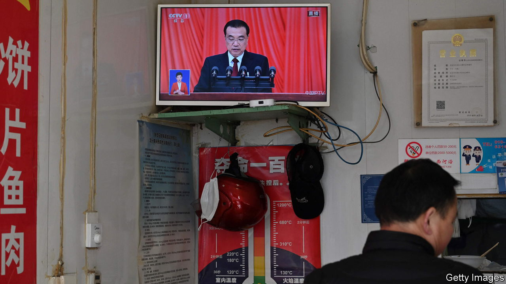
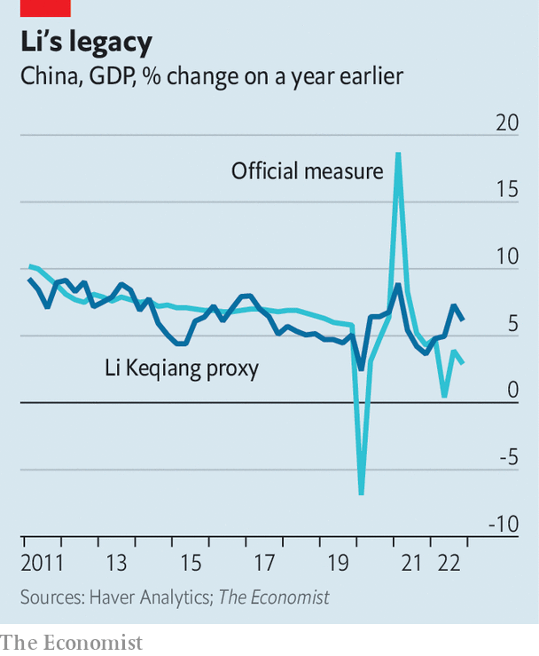

###### Qiang Ker-ching

# How to measure China’s true economic growth 

##### In search of a successor to the Li Keqiang Index 

 

> Mar 9th 2023 

When Li Keqiang, China’s prime minister, gave his final speech at the National People’s Congress on March 5th, it was already clear who would succeed him. But a successor has yet to be found for the “Li Keqiang index”. This unofficial proxy for China’s economic growth was inspired by a leaked conversation between Mr Li, when he was party secretary for the province of Liaoning, and an American diplomat. Mr Li confessed that the province’s gdp figures were “unreliable”. Instead, he focused on electricity consumption, rail cargo and bank lending. Taking our cue from Mr Li, this newspaper thought it would be fun to see what the three indicators, bundled into a single index, revealed about China’s economy at a national level.

The index has had a good run since its introduction in 2010. A version has its own “ticker” on Bloomberg. It inspired a similar index for India. Teams of researchers at the Federal Reserve Bank of San Francisco and separately at the New York Fed have tested the usefulness of Mr Li’s preferred indicators. A paper published in 2017 by Hunter Clark and Maxim Pinkovskiy of the New York Fed, together with Xavier Sala-i-Martin of Columbia University, calculated that the best combination of the three indicators gave roughly 60% weight to loans, 30% to electricity and 10% to rail cargo. In a subsequent paper, Mr Clark, Mr Pinkovskiy and Jeff Dawson of the New York Fed suggested replacing lending with m2, a measure of the money supply, because bank-credit figures failed to capture a government crackdown on shadow lending.

 


Critics argue that the declining energy intensity of China’s economy undermines the index. But that is not quite true. As long as electricity follows an identifiable trend, deviations from the trend are revealing about economic upturns and downturns. What really broke the Li Keqiang index was the covid-19 pandemic. The decline in retail sales, air travel and the property market was far more dramatic than the slowdown in industry, electricity use or rail freight. Meanwhile, m2 grew quickly at the end of last year as people hoarded cash. 

What are the alternatives? Those sceptical of China’s data yearn to escape its statistical system altogether. Perhaps the brightness of lights at night, recorded by satellites, could offer a truly independent guide to growth? But this measure has its own problems. The newer satellites do not have a long track record and the older ones struggled to distinguish between the bright and very bright lights of cities. Coverage is also patchy from month to month.

Mr Pinkovskiy and his co-authors have instead used night-time lights not as a direct measure of growth, but as a way to adjudicate between other potential proxies. If the contenders are good at tracking night-time lights, they should be good at tracking growth, too. The authors’ investigations suggest that in addition to lending (or m2), electricity and (to a lesser degree) rail freight, retail sales are a useful indicator. Adding them would certainly have made a difference during the pandemic.

No diplomatic cable has yet come to light revealing the indicators favoured by China’s probable new prime minister, Li Qiang. He was previously party chief of Shanghai, where services account for about three-quarters of gdp. The equivalent figure in rust-belt Liaoning was only 40% when Li Keqiang first revealed the ingredients of the index named after him. Safe to say, then, any “Li Qiang index” will not neglect the services sector of China’s vastly altered economy. ■


