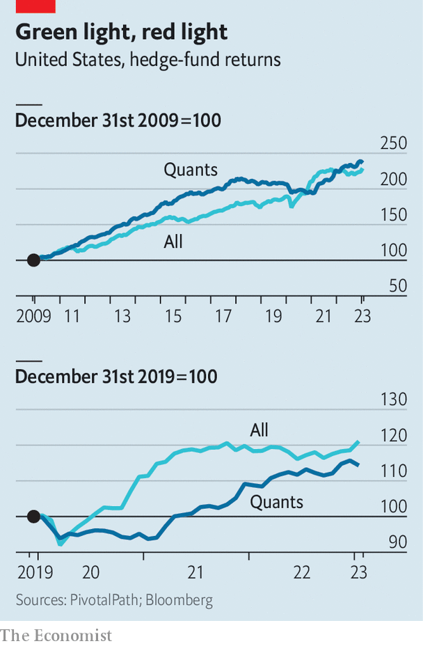

###### A techy tug-of-war

# Lessons from finance’s experience with artificial intelligence 

##### Humans can take on the machines 

 

> Mar 9th 2023 

Who are the earliest adopters of new technologies? Cutting-edge stuff tends to be expensive, meaning the answer is often the extremely rich. Early adopters also tend to be incentivised by cut-throat competition to look beyond the status quo. As such, there may be no group more likely to pick up new tools than the uber-rich and hyper-competitive hedge-fund industry.

This rule appears to hold for artificial intelligence (ai) and machine learning, which were first employed by hedge funds decades ago, well before the recent hype. First came the “quants”, or quantitative investors, who use data and algorithms to pick stocks and place short-term bets on which assets will rise and fall. Two Sigma, a quant fund in New York, has been experimenting with these techniques since its founding in 2001. Man Group, a British outfit with a big quant arm, launched its first machine-learning fund in 2014. aqr Capital Management, from Greenwich, Connecticut, began using ai at around the same time. Then came the rest of the industry. The hedge funds’ experience demonstrates ai’s ability to revolutionise business—but also shows that it takes time to do so, and that progress can be interrupted.

Ai and machine-learning funds seemed like the final step in the march of the robots. Cheap index funds, with stocks picked by algorithms, had already swelled in size, with assets under management eclipsing those of traditional active funds in 2019. Exchange-traded funds offered cheap exposure to basic strategies, such as picking growth stocks, with little need for human involvement. The flagship fund of Renaissance Technologies, the first ever quant outfit, established in 1982, earned average annual returns of 66% for decades. In the 2000s fast cables gave rise to high-frequency marketmakers, including Citadel Securities and Virtu, which were able to trade shares by the nanosecond. Newer quant outfits, like aqr and Two Sigma, beat humans’ returns and gobbled up assets. 

By the end of 2019, automated algorithms took both sides of trades; more often than not high-frequency traders faced off against quant investors, who had automated their investment processes; algorithms managed a majority of investors’ assets in passive index funds; and all of the biggest, most successful hedge funds used quantitative methods, at least to some degree. The traditional types were throwing in the towel. Philippe Jabre, a star investor, blamed computerised models that had “imperceptibly replaced” traditional actors when he closed his fund in 2018. As a result of all this automation, the stockmarket was more efficient than ever before. Execution was lightning fast and cost next to nothing. Individuals could invest savings for a fraction of a penny on the dollar.

Machine learning held the promise of still greater fruits. The way one investor described it was that quantitative investing started with a hypothesis: that of momentum, or the idea that stocks which have risen faster than the rest of the index would continue to do so. This hypothesis allows individual stocks to be tested against historical data to assess if their value will continue to rise. By contrast, with machine learning, investors could “start with the data and look for a hypothesis”. In other words, the algorithms could decide both what to pick and why to pick it.

 


Yet automation’s great march forward has not continued unabated—humans have fought back. Towards the end of 2019 all the major retail brokers, including Charles Schwab, e*trade and td Ameritrade, slashed commissions to zero in the face of competition from a new entrant, Robinhood. A few months later, spurred by pandemic boredom and stimulus cheques, retail trading began to spike. It reached a peak in the frenzied early months of 2021 when day traders, co-ordinating on social media, piled into unloved stocks, causing their prices to spiral higher. At the same time, many quantitative strategies seemed to stall. Most quants underperformed the markets, as well as human hedge funds, in 2020 and early 2021. aqr closed a handful of funds after persistent outflows.

When markets reversed in 2022, many of these trends flipped. Retail’s share of trading fell back as losses piled up. The quants came back with a vengeance. aqr’s longest-running fund returned a whopping 44%, even as markets shed 20%.

This zigzag, and robots’ growing role, holds lessons for other industries. The first is that humans can react in unexpected ways to new technology. The falling cost of trade execution seemed to empower investing machines—until costs went to zero, at which point it fuelled a retail renaissance. Even if retail’s share of trading is not at its peak, it remains elevated compared with before 2019. Retail trades now make up a third of trading volumes in stocks (excluding marketmakers). Their dominance of stock options, a type of derivative bet on shares, is .

The second is that not all technologies make markets more efficient. One of the explanations for aqr’s period of underperformance, argues Cliff Asness, the firm’s co-founder, is how extreme valuations became and how long a “bubble in everything” persisted. In part this might be the result of overexuberance among retail investors. “Getting information and getting it quickly does not mean processing it well,” reckons Mr Asness. “I tend to think things like social media make the market less, not more, efficient...People don’t hear counter-opinions, they hear their own, and in politics that can lead to some dangerous craziness and in markets that can lead to some really weird price action.”

The third is that robots take time to find their place. Machine-learning funds have been around for a while and appear to outperform human competitors, at least a little. But they have not amassed vast assets, in part because they are a hard sell. After all, few people understand the risks involved. Those who have devoted their careers to machine learning are acutely aware of this. In order to build confidence, “we have invested a lot more in explaining to clients why we think the machine-learning strategies are doing what they are doing,” reports Greg Bond of Man Numeric, Man Group’s quantitative arm.

There was a time when everyone thought the quants had figured it out. That is not the perception today. When it comes to the stockmarket, at least, automation has not been the winner-takes-all event that many fear elsewhere. It is more like a tug-of-war between humans and machines. And though the machines are winning, humans have not let go just yet. ■


