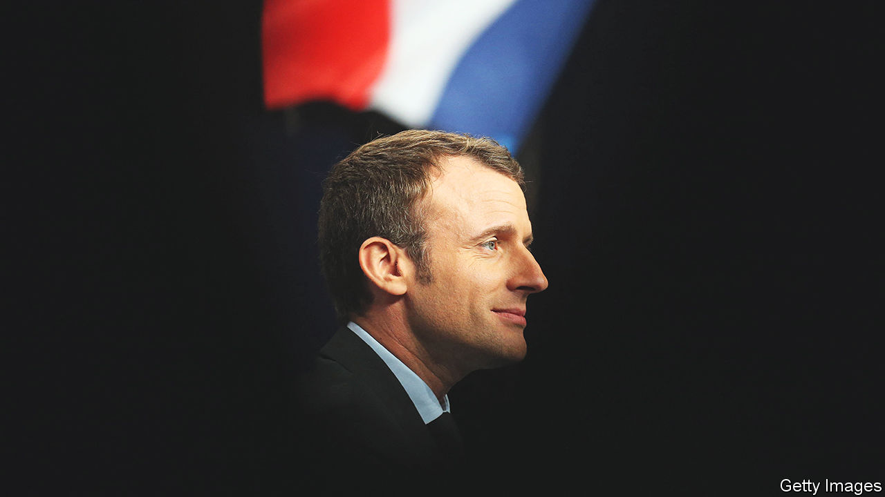
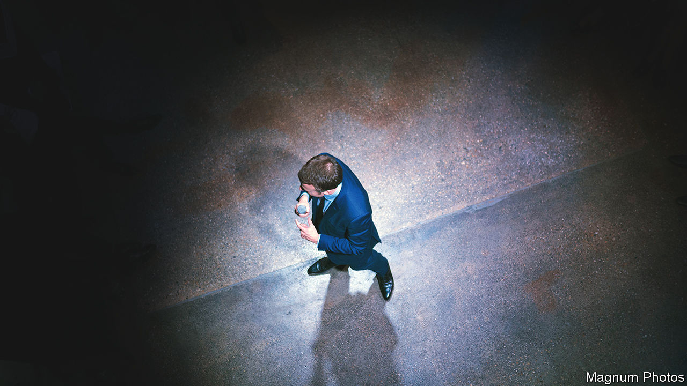

###### French diplomacy

# Emmanuel Macron’s vision of a more muscular Europe is coming true 

##### But his allies disagree on its strategies and goals 

 

> Mar 8th 2023 

It was a cautious but hopeful French president who took his seat in the beige-trimmed aircraft office, bound from Moscow to Kyiv on February 8th 2022. The previous night Emmanuel Macron had spent over five strikingly socially distanced hours seated opposite Vladimir Putin at a table the length of a shipping container. 

Their exchange was tense, he recounted, but Mr Putin had vowed that Russia would “not be the cause of escalation”. Two weeks later, Russian tanks rolled into Ukraine, sparking the biggest conflict in Europe since the second world war, and  of Mr Macron’s venture. 

Across Europe, leaders are grappling with the fallout from Russia’s war. In France, the conflict has shone a light on  to keep his mid-sized country seated among the giants at the top diplomatic table—and the frustrations of trying to do so. In many ways Europe has come round to the French president’s way of thinking. The continent is rearming, asserting itself and learning to speak the language of power. Yet on crucial questions, notably its future security, it is still not persuaded by Mr Macron’s ideas.

No one could fault Mr Macron’s work ethic. Constantly tapping out text messages to his peers, Mr Macron has this year already hosted 16 different world leaders in Paris. In April he is heading to China to see Xi Jinping. That will make him the first G7 leader to meet him this year (he is expected to urge Mr Xi to put pressure on Mr Putin over the Ukraine war). Last week he completed a four-country tour of Africa. On March 10th he will welcome Britain’s government, and then its king on his first overseas visit as monarch. 

He has levers of hard power possessed by no other member of the eu. Nuclear-armed, with a permanent seat at the United Nations Security Council, France maintains a big army with a global reach. Its military bases and overseas territories stretch from the Caribbean to the Pacific. With 264 embassies and missions, France runs the world’s third-biggest diplomatic network after China (275) and America (267). 

And he has a grand theory of the world to underpin it all. Mr Macron likes to speak of the  (great upheaval). By this he means the end of the unipolar, American-dominated global system that emerged after the cold war, and its replacement with a more fragmented world and a new round of great-power rivalry. To Mr Macron’s mind, the best response to that shift is more “sovereignty”, says one of his advisers, meaning “reinforcing the capacity to decide for ourselves, and continuing to be able to do so”. 

Mr Macron and his advisers think Russia’s invasion has vindicated their worldview. When he set out his ideas in 2017, in a speech at the Sorbonne, his calls for “European sovereignty” sounded like high-minded abstractions. They are more concrete in a world in which Europe no longer talks only of rules, trade and peace, but also of guns, autonomy and power. In the aftermath of the invasion Germany has promised a huge boost in military spending. The EU is exporting arms to Ukraine and trying to reduce its dependence on Russian gas and promote self-sufficiency in energy. It is displaying a new-found liking for industrial policy. “The European conversation has rarely sounded so French,” says Georgina Wright, of the Institut Montaigne, a think-tank in Paris. 

Yet if Mr Macron’s diagnosis has become popular, his practical prescriptions are proving less so. At the Munich Security Conference on February 17th he called for talks in Paris on the future of the continent’s air defences, and offered to discuss the “European dimension” of France’s nuclear deterrent. Yet countries nearer the sharp end of the Ukraine war are concluding that only NATO—and specifically America, which provides the lion’s share of the alliance’s muscle—can guarantee their security. Even Germany, despite its talk of a historic  (turning point), has been reluctant to take big decisions without American cover, and is as keen as ever to buy American weaponry.

Semi-detached?

Mr Macron himself, who in 2019  that NATO was experiencing “brain death”, has shifted his tone on the alliance. He has helped to reinforce NATO’s eastern flank with French troops, and talks more about a “European component of NATO” than full-blown “strategic autonomy”. He has increased France’s planned defence spending for 2024-30 by over a third, to €413bn ($437bn), compared with 2019-25. “I think he has finally understood NATO…and why it matters,” says François Heisbourg of the International Institute for Strategic Studies.

Yet old assumptions die hard. In 1966 France removed its troops from NATO’s integrated command structure, returning to it only in 2009. Despite the warm words and the extra money, many of the alliance’s other members suspect that France will always keep a certain distance. “We still talk about NATO as if it is ‘them’ and not ‘us’,” says Camille Grand, a (French) former NATO official now at the European Council on Foreign Relations, another think-tank.

A further strain arises from French ambitions to build up European sovereignty on the one hand, while still asserting French national interests on the other. It is a decades-old tension. Charles de Gaulle, France’s first post-war leader, sought to rebuild Europe as a powerful assembly of nations, while keeping France’s “hands free” to conduct a diplomacy of geopolitical “balance”. Today, Mr Macron likes to talk about France as a  (balancing power), that is independent and open to speaking to all. 

Even today, that approach can annoy allies. For Mr Macron, the attempt to dissuade Mr Putin from war showed that Europeans could take the lead. The French president co-ordinated his 2022 trip to Moscow with Olaf Scholz, the German chancellor, and Volodymyr Zelensky, Ukraine’s president. For Poland and the Baltic states, by contrast, long fearful of Mr Putin’s expansionism, the visit underlined that the French president does not speak for them. These countries “will never back Macron’s conception of strategic autonomy if he persists in thinking he can one day work with Putin,” says Michel Duclos, a French former ambassador. 

This tension is “almost insurmountable”, says Benjamin Haddad, one of Mr Macron’s parliamentarians: “It’s very difficult both to have a special dialogue with countries like Russia or China, and to act as the pivot in Europe, building consensus and leveraging Europe to project power.” Trying to have things both ways can lead to maddening ambiguity. Mr Macron has hardened his tone on Russia, declaring that it should be “defeated” and  “all the way to victory”. But he also says Russia should not be “crushed”, and keeps a line open to Mr Putin, to whom he last spoke in September.

In reality Mr Macron’s views are close to Joe Biden’s, though America’s president is more judicious about expressing them out loud. The French president wants to help Ukraine secure territorial advantage on the battlefield in order for it to dictate the terms of peace. Many fellow Europeans, though, conclude that Mr Macron is too accommodating to Russia. When talks come, the French president is keen to make sure that Europe has a seat at the table. Other Europeans are unsure they want that seat to be occupied by Mr Macron.

The third point of tension is between ambitions and means. Mr Macron has helped launch a “European Political Community” that reaches from Britain to Moldova, convened peace talks between Azerbaijan and Armenia, and warmed up ties with gas-rich Algeria. Paris hums with ideas on grand causes: preserving biodiversity, improving food security, ensuring “effective” multilateralism, curbing extremism online. Overstretch beckons. As Michael Shurkin at the Atlantic Council, another think-tank, put it diplomatically, France is a “strong ally stretched thin”. 

 


Mr Macron’s decision last year to close down Operation Barkhane, a French-led counter-terrorism operation in the African Sahel begun in 2014, illustrates the point. Initially France helped beat back a jihadist incursion in Mali. But it could not counter anti-French sentiment, increasingly stoked by Russia. Eventually Mali hired the Wagner Group, a mercenary firm run by one of Mr Putin’s cronies. Having pulled all French troops out of Mali, Mr Macron is now winding down most military bases in the region. Against Russia and China, France is losing the battle for influence.

Another illustration is AUKUS, a defence pact between America, Australia and Britain unveiled in 2021. This sank a French deal worth A$90bn ($60bn) to supply Australia with submarines, torpedoed France’s Indo-Pacific strategy, and enraged its government. If allies can do this to each other, Paris concluded, then France is right to reinforce its independence. Mr Macron has since cultivated ties with other countries in the Indo-Pacific, including India, Japan and Thailand.

The upcoming trip to China will be Mr Macron’s next diplomatic test. The French president believes that Europe should maintain its own dialogue with China, including over Mr Putin’s war, and that keeping talks going can help lower tensions between the West and China. He had originally wanted to go to Beijing last year jointly with Mr Scholz (in the end, the German chancellor went solo). This time Ursula von der Leyen, the head of the European Commission, might join him. Even if she does, many Europeans will not feel that Mr Macron is making the trip for them.

Plus ça change

Some of these points of tension are structural. French ambivalence towards NATO long predates Mr Macron. But the president’s personal manner can make things worse. “His style is to go for it, never give up, push as hard as possible, and take risks,” says an aide. He listens to many, but is beholden to none. Ultimately, says Bruno Tertrais of the Foundation for Strategic Research, a think-tank, “Macron’s chief diplomatic adviser is Macron.” 

For the president’s critics it is exactly this unilateralism, a failure to craft meaningful alliances, and a tendency to say out loud things that might more usefully be kept quiet, that irks others and saps his influence. From Lebanon to Russia, Mr Macron has little to show for his personal outreach. “He has too many ideas, all the time,” says a European diplomat, “so it is hard to make any of them stick.”

But Mr Macron is not about to stop suggesting them. This will keep him both an impressive and tricky partner. “The president will never accept that France is a middling power,” says a presidential aide. “He believes that without an ambition of  (influence), of being open to the world, of speaking to everybody, France would not be itself.”■

