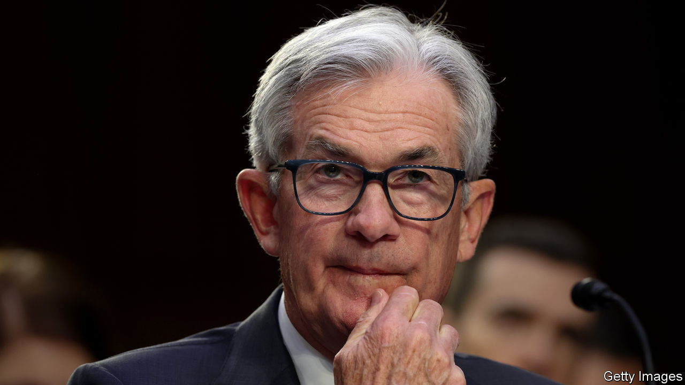
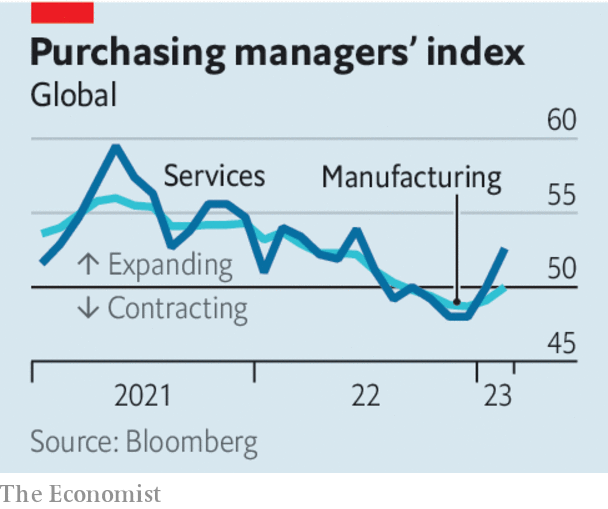

###### Too fast to land

# A stubbornly strong economy complicates the fight against inflation 

##### Higher interest rates are not sufficiently slowing global growth 

 

> Mar 8th 2023 

You mighT have expected the fastest tightening of global monetary policy in 40 years to deal a heavy blow to the world economy. Yet in 2023 it seems to be shrugging off the effects of higher interest rates. Not only is inflation stubbornly high, but economic activity also appears to have quickened. Faster growth may sound good, but it is a headache for policymakers, who are trying to bring about a managed slowdown. And it could mean that a recession, when it eventually strikes, is more painful.

At the end of last year, according to business surveys, manufacturing and services output were both shrinking around the world. Today manufacturing output is flat and services are rebounding. American consumers are spending freely. Both wages and prices continue to grow fast, even in places where they were long stagnant. Japan looks set for a round of bumper wage rises in the spring. In the euro zone the monthly rate of “core” inflation, which excludes food and energy prices, broke records in February. Labour markets are extraordinarily tight. As we  this week, in half of the members of the oecd, a group of mostly rich countries, employment rates are currently at record highs. 

From equities to credit, financial markets are priced for global economic growth that is above trend. Not so long ago, investors were debating whether the world economy would face a “hard landing” involving a recession, or a “soft landing”, in which inflation was conquered without any downturn. Today they are asking whether the world economy is landing at all.

 


There are several reasons for the apparent acceleration. The mini-boom that took hold in the markets late in 2022 stimulated animal spirits. China’s reopening from zero-covid has led to a swift economic recovery which has caused order books in emerging markets to fill up. Falling energy prices in Europe have loosened the screws on its economy. But above all else, consumers and firms in most big economies are in strikingly good financial health. Many households are still flush with savings built up during the covid-19 pandemic; firms managed to lock in low interest rates for long stretches and have yet to suffer much from higher borrowing costs. Only in the most rate-sensitive sectors of the global economy, such as property, is the impact of higher rates clearly visible. In America the economy is so strong that even housing may be recovering slightly.

The acceleration means that recession is not imminent. But it also means that central banks will have to raise interest rates further if they are to succeed in returning inflation to their 2% targets. On March 7th Jerome Powell, the chairman of the Federal Reserve, hinted as much, causing stockmarkets to fall. Policymakers now face two difficult judgments.

The first is the extent to which monetary tightening to date has yet to have its full effect. Economists often talk up the “long and variable lags” with which interest rates work, but research suggests policy may be working faster today. If the effects of last year’s tightening are already exhausted, much more may be needed. A second judgment is over the persistence of the factors that seem to have immunised much of the economy against rate rises. Eventually, consumers will run out of spare cash and firms will feel the pinch from higher borrowing costs. In Sweden, where interest-rate rises rapidly pass through to households, the economy is suffering.

One thing is clear: the ideal path, where inflation falls without growth faltering much, looks narrower than it did even a month ago. Instead, central banks are increasingly likely to have to choose between tolerating higher inflation or slamming on the brakes for a second year running. ■

