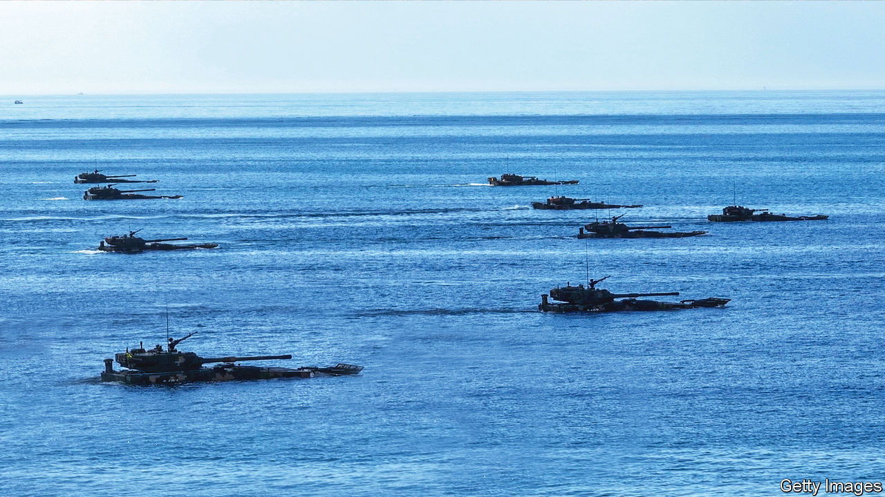

###### America, China and Taiwan

# How to avoid war over Taiwan 

##### A superpower conflict would shake the world 

 

> Mar 9th 2023 

EUROPE is witnessing its bloodiest cross-border war since 1945, but Asia risks something even worse: conflict between America and China over Taiwan. Tensions are high, as American forces pivot to a new doctrine known as “distributed lethality” designed to blunt Chinese missile attacks. Last week dozens of Chinese jets breached Taiwan’s “air defence identification zone”. This week China’s foreign minister condemned what he called America’s strategy of “all-round containment and suppression, a zero-sum game of life and death”. 

As America rearms in Asia and tries to galvanise its allies, two questions loom. Is it willing to risk a direct war with another nuclear power to defend Taiwan, something it has not been prepared to do for Ukraine? And by competing with China militarily in Asia, could it provoke the very war it is trying to prevent?

No one can be sure how an invasion of Taiwan might start. China could use “grey-zone” tactics that are coercive, but not quite acts of war, to blockade the self-governing island and sap its economy and morale. Or it could launch pre-emptive missile strikes on American bases in Guam and Japan, clearing the way for an . Since Taiwan could resist an attack on its own only for days or weeks, any conflict could escalate quickly into a superpower confrontation.

Rather than the trenches and human-wave attacks seen in Ukraine, a war over Taiwan could involve a new generation of arms, such as hypersonic missiles and anti-satellite weapons, causing untold destruction and provoking unpredictable retaliation. The economic fallout would be devastating. Taiwan is the world’s essential supplier of advanced semiconductors. America, China and Japan, the three largest economies, and among the most interconnected, would deploy sanctions, crippling global trade. America would urge Europe and its other friends to impose an embargo on China.

War is no longer a remote possibility, because an unstated bargain has frayed. Since the 1970s America has been careful neither to encourage Taiwan formally to declare independence nor to promise explicitly to defend it. While not ruling out force, China has said it would favour peaceful reunification. But those positions are changing. President Xi Jinping has told the People’s Liberation Army to be ready for an invasion by 2027, says the cia. President Joe Biden has said that America would defend Taiwan if China were to attack (aides say policy is unchanged). The military balance no longer so clearly favours America as it did in the 1990s. And public opinion has shifted in Taiwan, not least because of how China has snuffed out freedoms in Hong Kong. Only 7% of Taiwanese favour reunification.


Both sides are shoring up their positions and trying to signal their resolve, with destabilising consequences. Some acts generate headlines, as when Nancy Pelosi, then speaker of the House of Representatives, visited Taipei last year; others are almost invisible, such as the mysterious severing of undersea internet cables to remote Taiwanese islands. Diplomacy has stalled. Top American and Chinese defence officials have not spoken since November. During the recent spy-balloon incident, a “hotline” failed when China did not pick up. Rhetoric aimed at domestic audiences has grown more martial, whether on the American campaign trail or from China’s . What one side sees as a defensive act to protect its red lines, the other sees as an aggressive attempt to thwart its ambitions. Thus both sides are tempted to keep hardening their positions. 

It is unclear how far America would go to defend Taiwan. The island is not a domino. China has some territorial designs beyond it, but does not want to invade or directly rule all of Asia. And as our special report explains, it is unclear how many Taiwanese see China as a real threat, or have the stomach for a fight.

The Taiwanese, like the Ukrainians, deserve American help. The island is admirably liberal and democratic, and proof that such values are not alien to Chinese culture. It would be a tragedy if its people had to submit to a dictatorship. If America walked away, the credibility of its security umbrella in Asia would be gravely in doubt. Some Asian countries would accommodate China more; South Korea and Japan might seek nuclear weapons. It would boost China’s worldview that the interests of states come before the individual freedoms enshrined in the UN after the second world war. 

But the help Taiwan receives should aim to deter a Chinese attack without provoking one. America needs to consider Mr Xi’s calculus. A blanket American security guarantee might embolden Taiwan to declare formal independence, a red line for him. The promise of a much larger American military presence on Taiwan could lead China to invade now, before it arrives. A botched invasion, however, would cost Mr Xi and the Communist Party dearly. America needs to calibrate its stance: reassure Mr Xi that his red lines remain intact, but convince him that aggression carries unacceptable risks. The goal should not be to solve the Taiwan question, but to defer it.

Taiwan has avoided provocation. Its president, Tsai Ing-wen, has not declared independence. But it needs to do more to deter its neighbour, by boosting defence spending so that it can survive longer without American help, and by preparing its citizens to resist grey-zone tactics, from disinformation to vote-rigging. For its part, America should try harder to reassure China and to deter it. It should avoid symbolic acts that provoke China without strengthening Taiwan’s capacity to defend itself. It should keep modernising its armed forces and . And it should be prepared to break a future blockade, by stockpiling fuel, planning an airlift, providing backup internet links and building an allied consensus on sanctions. 

America and today’s Chinese regime will never agree about Taiwan. But they do share a common interest in avoiding a third world war. The first 15 years of the American-Soviet cold war featured a terrifying mixture of brinkmanship and near-catastrophic mistakes, until the Cuban missile crisis prompted a revival of diplomacy. This is the terrain the world is now on. Unfortunately, the potential common ground between America and China on Taiwan is shrinking. Somehow, the two rival systems must find a way to live together less dangerously. ■


