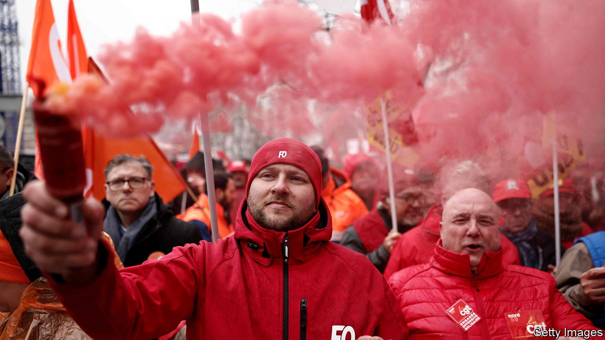

###### Macron’s troubles

# Strikes at home and war in Ukraine test the French president 

##### It is a critical moment for Emmanuel Macron 

 

> Mar 9th 2023 

Emmanuel Macron swept to power in 2017 on the back of a twin promise: to shake up France, and embolden Europe to act as a more muscular power. The French president’s first term had its ups and downs, but France today is broadly a more vigorous place, more enterprising, job-creating and welcoming to investors. The European Union, too, has moved in Mr Macron’s direction. Russia’s savage war on Ukraine has shown that a fractious rules-based club of 27 members can hold together, think geopolitically and export weaponry into a war zone.

Now, though, Mr Macron faces trouble on both fronts. His authority is being tested in the National Assembly and on the streets at home, and his leadership . How he responds will determine whether the leader of the eu’s second-biggest economy and foremost military power can keep modernising France and shaping Europe. 

Mr Macron’s domestic woes concern his plan to raise the minimum pension age from 62 to 64. The French live almost a decade longer than in 1980, and spend longer in their deckchairs than their neighbours. Without reform, the pension system faces an annual deficit of €14bn ($15bn) by 2030. But Mr Macron has failed to persuade the French that his fix is the right one. Last year voters denied him a majority in parliament. Now unions want to defeat his project . 

This pension reform is necessary for France. Mr Macron needs to do a better job of explaining why it is not just an accounting tool, but part of a wider effort to get the French to work more, and more of the French to work. The unemployment rate stood at 7.2% in the most recent quarter, roughly twice the rate in America and Britain. The last time it was as low as 5% was in the 1970s. His government also needs to take on the opposition parties’ claim to have a better solution that entails more taxes on companies and the rich. That is the last thing France needs. Despite Mr Macron’s tax cuts, France is still the most highly taxed economy in the euro zone. Hence, even if painful strikes drag on, the president cannot afford to back down. 

If Mr Macron cannot secure parliamentary support before the deadline of March 26th, he could still force the reform through. But that would be best avoided. Left-wing opposition parties have repeatedly sought to create havoc and derail parliamentary procedure. They would seize any chance to declare the reform illegitimate. The centre-right opposition has behaved dishonourably too, reluctant to back a change that, in 1995 and 2010, it also proposed. It has no excuse for not supporting the reform.

Abroad, Russia’s war on Ukraine has in many ways vindicated Mr Macron’s call for a stronger eu, squeezed between America and China, which can assert itself with hard force, not just trade and rules. Yet Mr Macron is struggling to persuade his allies that his policies, notably on European security, are the best way to achieve this. He is not leading the debate over Ukraine. And in Africa he is losing influence to China, Russia and Turkey. 

If Mr Macron is to revive his eu leadership, he would do well to spend less time musing out loud about the future contours of a post-war settlement, and more crafting closer ties to countries, including Poland and the Baltics, which still suspect him of wanting to press Ukraine prematurely into talks. Having at first focused on its diplomacy with Russia, France has swung firmly behind Ukraine. Its position now is close to America’s. Yet Mr Macron is too often tempted to voice ideas that America may share, but keeps to itself. France could also do more to send heavy weaponry to Kyiv, and fast.

A more robust Europe, faced with the threat from autocratic powers and the risk of excessive reliance on America, needs a strong France. Mr Macron is now one of Europe’s most experienced leaders. He brims with ideas, many of them good, and commands a fine diplomatic machine. This is a critical moment. He cannot afford to get it wrong. ■

