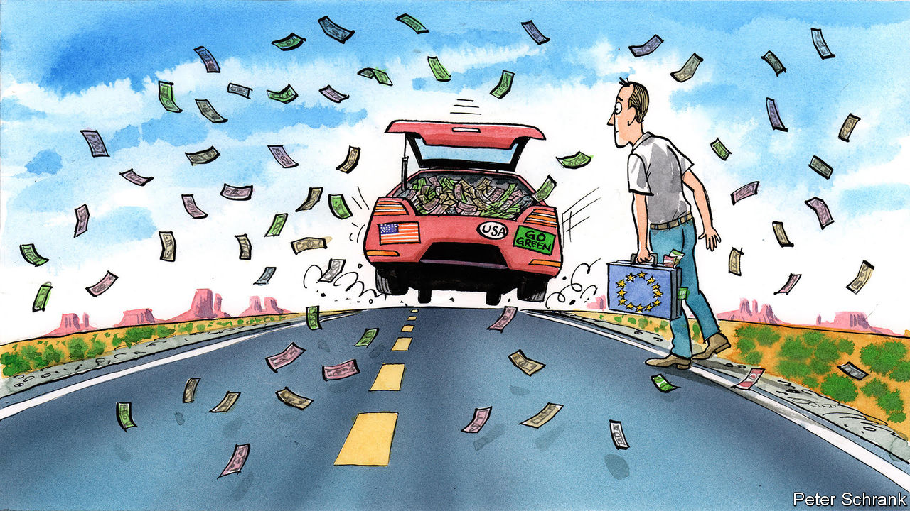

###### On medical research, fertility in the OECD, soldiers’ mental health, energy firms, the car

# Letters to the editor 

##### A selection of correspondence 

 

> Mar 9th 2023 


The integrity of research

You criticised publishers for failing to allocate more resources to rooting out problematic medical-research papers (“”, February 25th). Springer Nature has for years committed significant staffing and investment in technology to tackle issues relating to research integrity. We have a dedicated team of employees with relevant academic expertise focused on investigating papers of concern and preventing problematic submissions from entering the literature. 

We continue to invest heavily to develop new artificial intelligence and other tech-based tools and have numerous checks in place to identify and prevent deliberate manipulation, as well as developing and delivering training for all our editors. Springer Nature is also working to share our knowledge and support the wider publishing community in addressing this through our contributions to the STM Integrity Hub, a holistic centre for all publishers.

Chris Graf

Research integrity director

Springer Nature


When I was editor-in-chief of  we received a submission from a group of statisticians regarding dozens of published studies from a research group in Japan. The statisticians’ analysis showed that at least some of the data in the studies had to be fraudulent. The process of publishing the statisticians’ paper, declined previously by a number of journals, took two years. 

Their paper was read by our own vetted statisticians to validate its methodology. We then alerted the authors of the studies under question, received explanations from those people (who admitted to falsifying data and listing guest authors who had not done the work), alerted other editors who had published work from this group of authors, and finally retracted those papers published in , some of which had already been incorporated into reviews and guidelines. 

The final paper (by Bolland et al in , 2016) was an important corrective to the literature. Retractions at other journals followed. The editorial work involved was arduous but necessary, involving many members of the editorial team. Still, there are other areas of fraud, involving peer review, breaking blinds or participating fraudulently in clinical trials, that require diligence to identify and remedy. All these can reduce the value of published literature and undermine the reader’s confidence in its value. 

Robert Gross

Professor of neurology and of pharmacology and physiology 

University of Rochester


In addition to cross-publisher initiatives, such as the STM Integrity Hub mentioned in your article, individual publishers dedicate significant resources to screening submissions prior to peer review, investigating cases of suspected misconduct, educating researchers and applying the latest technology. It is misleading to suggest that publishers simply “pass the ball to institutions”. There are some cases where we need the support of a researcher’s institution to gather evidence, such as accessing data or resolving authorship disputes, but in many others, thorough investigations are carried out by specialist staff at the publishers, aligned with best practice principles set out by the Committee on Publication Ethics, a non-profit organisation. At Taylor &amp; Francis, the publishing ethics and integrity team doubled last year, the number of cases we actively investigated tripled, and we delivered publishing ethics training to more than 40,000 researchers.

The scale of research misconduct is still unacceptably high and tackling the root causes that encourage and enable it must be a priority for the whole academic community. The increasing time and investment by publishers dedicated to combating the issue demonstrates that we are certainly not going to “look the other way” and are already making significant strides in collaborating across the industry to bring about long-term improvements.

Sabina Alam

Director of publishing ethics and integrity

Taylor &amp; Francis Group, Journals


 


Fertility in the OECD

Your article looking at why there are so few babies in southern Europe did not provide evidence in support of the claim that in the OECD, a club mostly of rich countries, there is now a positive correlation between GDP per head and fertility (“”, February 18th). There is no correlation whatsoever between GDP per head and fertility within the OECD (by the way the data for Ireland are muddied by the fact that Ireland has been for a while a tax haven for tech firms like Google, Facebook and Apple). 

Actually, within each single OECD country there is an inverse correlation between income and fertility (see, for instance, data from the American Census Bureau). A clear-cut negative correlation is also visible when all countries (beyond the OECD club) are included in the analysis. Do not take my word for it, check the data published by the United Nations Population Division, United Nations Statistical Division, Eurostat, World Bank and so on.

There are many factors that influence fertility rates. Some of them were mentioned in the article. Others were not. For example, the article did not take into proper consideration the importance of the ethnic, religious and cultural make-up of the population, also as a function of immigration.

Aldo Badiani

Professor of pharmacology

Sapienza University of Rome

 


Mind the peace

Soldiers on the front lines, in Ukraine or elsewhere, have pressing mental-health needs, but their longer-term reintegration into peaceful communities requires the healing of trauma and stress combined with livelihood-skills training (“”, February 11th). New research shows that strengthening mental health and livelihood skills at the same time, rather than separately, can reduce depression among traumatised people by 64% and anxiety by 60%. It can also increase forgiveness by 71%. Soldiers need both peace of mind and ways to live productively once the guns are silenced, as do the even greater number of civilians in war-torn societies.

Simon Gimson

Vice-president

Interpeace


 


European energy in America

It is indeed puzzling that America’s Inflation Reduction Act has caused such a fuss in Europe, especially pertaining to renewable energy (, February 11th). The fine print of the legislation will probably have little to no impact on the sourcing strategies of wind-turbine manufacturers and will not affect the existing solar-panel industry in the European Union. 

However, it will boost all the big players in the American market, most of which, ironically, are European companies. In wind turbines, only GE is American. The remainder of the American market is dominated by Vestas (Danish), SGRE (German-Spanish) and Nordex (German). The R&amp;D departments of all these companies will remain in the EU.

On the developer, owner and operator side of the business, including transmission networks, European companies are equally if not more dominant. EDF (France), Enel (Italy), EDPR (Portugal), RWE (Germany) and Orsted (Denmark) are some of the largest in America, and this is an inexhaustive list. Iberdrola (Spain) has a mind-boggling number of American subsidiaries ranging from retail energy, transmission, charging networks and power plants. The only thing the EU should do with regards to the IRA is buy shares in Europe’s various energy champions.

Nicolas Bourbonniere


 


Against and for the car

Efforts to tame the use of cars stretch back longer than indicated in your report (“”, February 18th). In 1959 the plan for a partly elevated Embarcadero freeway in San Francisco, designed to connect the Bay and Golden Gate bridges, was cancelled by the board of supervisors following unprecedented opposition from affected residents. In London three concentric ringways, including a hugely destructive inner one called the motorway box, were cancelled in 1973 by an incoming Labour-controlled council. Homes Before Roads, an upstart political party that contested the London election in 1970, helped to damn the huge roads. The OECD held a transport ministers’ conference in 1975 themed “Better Towns with Less Traffic”. And town planners have been arguing against cars for longer than 20 years. Alfred Wood, architect planner for Norwich, persuaded his English city council to pedestrianise London Street as long ago as 1967. 

The convenience of cars has certainly transformed cities, but the car did not create suburbs and the tide against their destructiveness began to turn decades ago.

Terence Bendixson

Former president

Living Streets


Mexico City has some of the worst traffic in the world. Despite the creation and extension of public transport, public bicycle schemes and cycling paths, car traffic and pollution get worse by the day. Removing cars from certain streets and turning them into pedestrianised areas has clear benefits. As an example, Francisco I Madero Avenue, in the heart of the city, was permanently closed to traffic over a decade ago. Today, it is the most visited street in the city and has become an important shopping and sightseeing destination for locals and tourists alike.

Aurelio Ortiz Camacho


 


Walkable cities are great for residents and the laptop class, but banning cars makes those cities less affordable for the working class. If you prohibit cars, how is a tradesman with a 40-pound toolkit going to get to work? Turning parking spots into bike lanes is great for cyclists, but where are the trucks supposed to park when delivering goods to those cosy neighbourhood cafés? 

A city dweller can work from a coffee shop with a laptop, but the coffee neither delivers, brews, nor serves itself. The Uber passenger may relish not needing a car, but the driver doesn’t have that luxury. Congestion pricing keeps traffic down in exclusive neighbourhoods, but it is in effect a tax on people driving into them. The concept of the 15-minute city, where you can walk or cycle to everything you need within 15 minutes, doesn’t seem to give much thought to the help.

Gus Downes


In the 1980s owning a car for a young man was a universally acknowledged requirement by both sexes in the Darwinian struggle to find a mate. Margaret Thatcher once said that a man who has gone beyond 26 and remains without a car is a bit of “a failure”. 

Paul D’Eath


