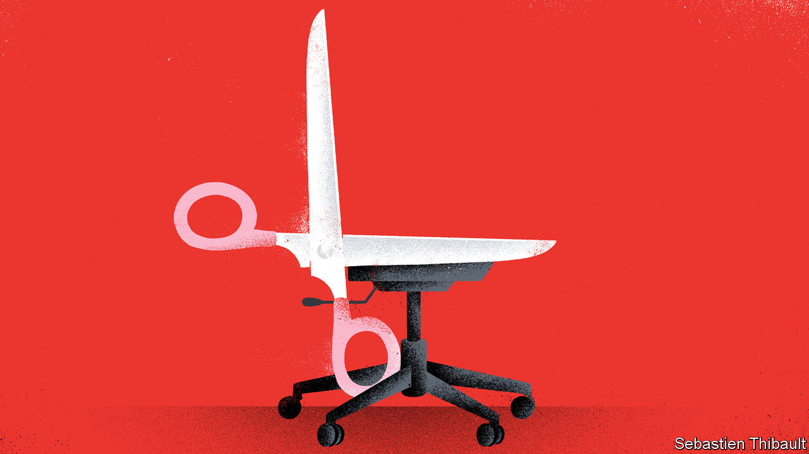
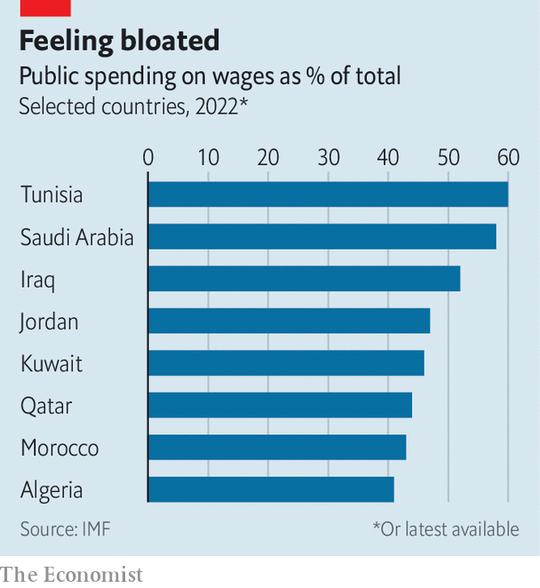

###### The incredible shrinking state

# As they cut back on hiring, Arab bureaucracies are spending more to get less 

##### Civil-service jobs are hard to find and often poorly paid, yet still in high demand 

 

> Mar 9th 2023 

DRIVING an uber was never part of Karim’s plan. His father had a comfortable job at Egypt’s national-statistics agency. His grandfather was a civil servant too, hired during the large expansion of the public sector in the era of Gamal Abdel Nasser. Five years ago, armed with his accounting degree from Cairo University, Karim set out in search of his own sinecure doing sums for the state.

He never found it. Public hiring has slowed, especially for graduates. “I could have been a cleaner with an accounting degree, but not an accountant,” he quips. Nor is there much work in the private sector, which has shrunk almost every month since he left university. That leaves odd jobs: ride-hailing apps and shifts at a café.

His story is becoming a common one across a region once characterised by enormous public sectors. Many citizens saw make-work jobs in the civil service as a birthright. Sluggish state-run firms, which often ran at a loss, added more fat to the public payroll. Wage bills consumed a big chunk of revenue, leaving little to spend on health, education or capital investments.

This is starting to change. As a percentage of total employment, the public sector is shrinking in many Arab countries. About 20% of working Egyptians were employed by the government in 2021, down from 27% a decade ago, reckons the International Labour Organisation. The absolute number of civil servants has dropped as well. These figures are still high. In the OECD, a club of rich countries, the average share of public employment is 18%. Still, the proportion is falling—not only in Egypt, but in Jordan, Saudi Arabia and other Arab countries.

 


Relatively high wage bills still put pressure on budgets. The IMF estimated in 2016 that the wage bill absorbs around 20% of public spending in rich countries and 30% in poor ones. In most Arab countries it is above 40% (see chart).

The public sector should provide good services to citizens. It can also help expand the middle class and reduce income inequality, as it did in mid-century Egypt, or serve as an effective (if expensive) way to hoover up lots of unemployed young people. In much of the Arab world, it does none of these things: states are spending lots of money and getting ever less for it.

For decades the Saudi civil service grew steadily, adding around 20,000 citizens annually. Hiring surged during the mid-2000s’ oil boom: from 2005 to 2015 the state laid on almost half a million workers. Then it stopped. Since 2016 the number of governmental employees has grown by just 2%, according to central-bank data. As more Saudis take private-sector jobs, the share of public employment has fallen from around 70% in 2016 to 52% in 2022.

Less hiring will slow the growth of the wage bill—but not reduce it. Total salaries climbed from 409bn rials ($109bn) in 2016 to an estimated 506bn rials last year, a 24% increase during a period when cumulative inflation was less than 9%. Salaries were budgeted to absorb 58% of public spending in 2022, unchanged from six years earlier.

Even as the number of public employees in Egypt decreased, the wage bill more than doubled from 199bn pounds ($28bn then) in 2014 to 400bn pounds last year. When Abdel-Fattah al-Sisi took power in 2014, after a military coup, the public-sector minimum wage was 1,200 pounds. He has raised it five times. The latest increase, to 3,500 pounds, takes effect on April 1st. 

Honey, I shrunk the state

Mr Sisi’s government, which finalised a $3bn IMF loan in December, insists it is making progress towards shrinking the public-wage bill. Officials point out that salaries have fallen from 27% of expenses in 2014 to 20% last year. But those numbers need a caveat. Egypt loaded up on debt during that time. The annual cost of servicing it has increased by 360%.

Strip out interest payments, and the budget looks less impressive: wages ate up 38% of discretionary public spending last year, compared with 40% in 2014. Egypt devotes a smaller share of spending to welfare and public services today than it did nine years ago. Its citizens rail at the shoddy state of public schools and hospitals. 

Even if governments wanted to fire lots of bureaucrats, civil-service rules make it difficult. And they do not want to—because it would be politically unpopular. Tunisia has offered to freeze state hiring to secure an IMF deal. But it will have to grapple for decades with the consequences of a hiring spree that nearly doubled the size of the public sector after the 2010 revolution against Zine el-Abidine Ben Ali, the country’s former dictator.

In 2017, when hiring slowed, the wage bill was 15% of gdp. By 2020 it was 18%. In 2021 the cash-strapped state started delaying the wages of many employees.

Even when salaries have risen in nominal terms, civil servants often feel hard done by. In Egypt their raises have not kept pace with a devaluing currency: in dollar terms, a civil servant on the new minimum wage next month will take home 34% less than in 2014. And the absolute level of public-sector pay in Arab countries is typically low, sometimes barely enough to live on.

Jobs with the state are harder to find, and harder to live on—yet the public sector remains the employer of choice. In 2020 researchers at the Economic Research Forum (ERF), a think-tank, calculated Egypt’s “reservation wage”, the salary below which a worker will not accept a job. The median result for unemployed men was 2,500 pounds in the public sector, and 3,000 in the private sector. The gap was wider for women: 1,500 pounds for the public sector and 2,500 at a private business.

It is not hard to see why. Many roles still have better job security than in the private sector. Or take benefits. The ERF found that 95% of public-sector employees had paid sick leave and 96% received health insurance. In the private sector, those figures were 40% and 36%.

Governments probably cannot cut their way to a lower public-wage bill. Nor is it obviously the right policy: it would require firing lots of people at a time when many economies are sluggish. If they were more vibrant, they might draw civil servants away from stultifying sinecures. Until then, Arab bureaucracies will call to mind an old Jewish joke: “The food here is terrible—and the portions are too small.” ■

