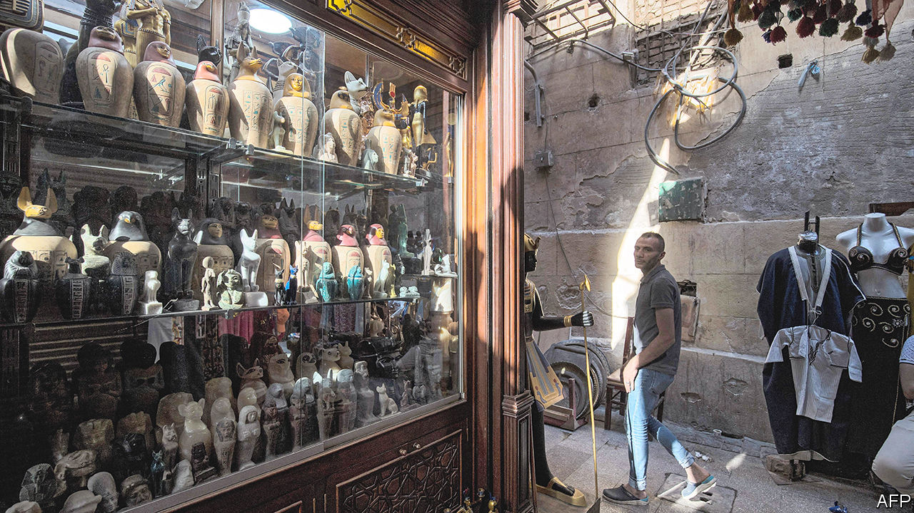

###### Time’s up—whatever the time is

# Fiddling with Egypt’s clocks 

##### Longer daylight hours are unlikely to mend the economy 

 

> Mar 9th 2023 

As winter draws to its dreary end, many Egyptians look forward to spring. But they are less keen on their parliament’s recent approval of a law to bring back daylight saving time (DST) designed to ensure that darkness falls later in the day. It hopes that doing so will curb the country’s electricity usage and free up natural gas for export, since it generates about 60% of Egypt’s power. But Egyptians are rolling their eyes. 

DST was first brought in as a fuel-saving measure in the second world war. Since then, Egypt’s governments have chopped and changed. None has been able to determine definitively the nature of its effects on energy consumption. In 2014 President Abdel-Fattah al-Sisi confused matters still more by announcing that the clocks would change four times that year to ease the burden on those fasting during Ramadan. Egyptians had to resort to social media to ask the time. Some Red Sea hotels ignored the changes in favour of “resort time”, thus creating a rival time zone.

In 2016, three days before clocks were to jump forward, the government abruptly said it would drop dst for good. EgyptAir’s chairman complained that the short notice given would cost his company $2m through delays and missed connections. The International Air Transport Administration reportedly told Egypt’s government to fork out $8m to cover the cost of changing flight schedules. Daylight saving went from being a mild annoyance to a bad national joke.

Under Mr Sisi natural-gas exports have almost quadrupled, but Egypt’s energy needs have soared, too. Even if, as the government hopes, reviving daylight saving time reduces the country’s energy usage and thus boosts gas exports, Egypt’s economic woes are such that it would make little difference. 

And recent studies suggest that in countries where summer days are long and mild an extra hour of daylight reduces energy usage only a tad. In hot countries like Egypt the yen for air-conditioners means that extending summer days may even be counter-productive.

Other energy-saving measures include dimming streetlights, ending the decorative illumination of government buildings, and capping air-conditioning in shopping centres at 25° C (77° Fahrenheit). In 2020 and 2021 the government restricted business opening hours. The motive behind this was variously cited as an attempt to reduce noise, to limit late-night crowds, or to slow the spread of covid-19, but it may also have been an attempt to cut energy costs. Whatever the truth, clock-changing edicts will not mend Egypt’s ailing economy.

