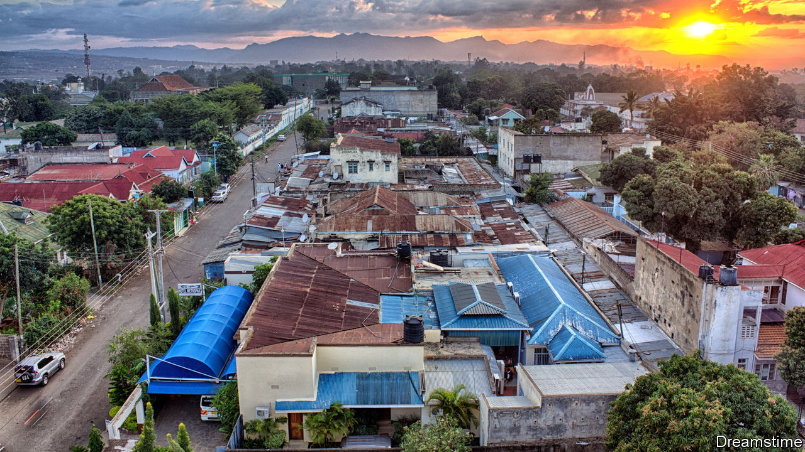
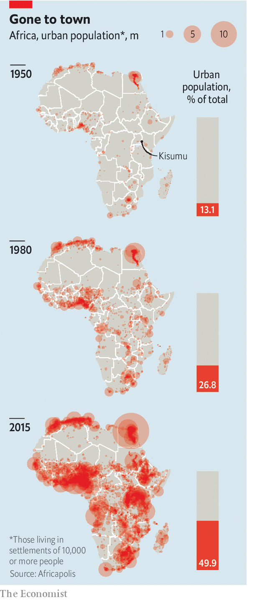
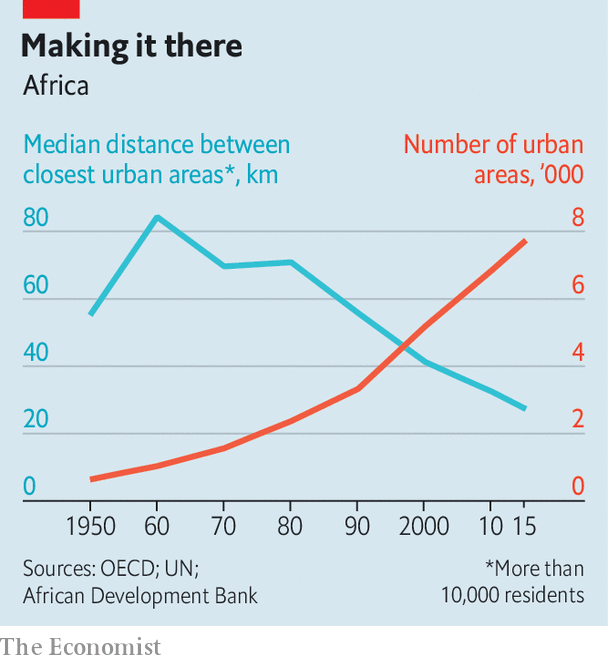

###### Beyond the megacity

# The growth of Africa’s towns and small cities is transforming the continent 

##### Urbanisation is making lives better, but not by as much as it could 

 

> Mar 9th 2023 

In 2012, when Moses Aloo inherited a plot from his grandfather, his neighbourhood in Kisumu, western Kenya, had plenty of farmland. But over the past decade, as Kisumu has grown, Nyamasaria has become part of the city. Mr Aloo is building two houses on his land. He will rent them out, “hopefully to God-fearing people”, for 8,000 Kenyan shillings ($62) each per month, more than twice the going rate five years ago. “Now it is urban,” he says, “this is a prime area.” 

The city’s growth has disrupted traditional ways. Jamlick Onchari, who rents a one-room house behind his small dairy in Nyamasaria, says that Kenyans who have moved from other parts of the country feel increasingly at home in the historic stronghold of the Luo ethnic group. “This mix-up thing,” he says, “with people from different tribes…it speeds up development because when people live together they bring ideas together.” 

Mr Onchari puts his milky finger on why urbanisation matters. By bringing people and firms into close contact, cities make both more productive. Yet, even though urbanisation is enriching Africans, they are not benefiting as much as they could. The growth of African cities is idiosyncratic and inefficient. This is true not just of megacities such as Lagos and Kinshasa, but of towns and smaller cities, like Kisumu, that draw less attention but where most African urbanites live. 

 


When the wave of independence began sweeping the continent in the 1950s, the vast majority of Africans lived in the countryside (see map). Today there are more city dwellers in Kenya than there were in all of Africa in 1950. As recently as 1990 just 31% of Africans lived in urban areas, according to Africapolis, a research project supported by the oecd, a group of mainly rich countries. (Its analysts define “urban” as areas with at least 10,000 people.) By 2015, the latest year for which Africapolis presents continent-wide data, half of Africans were city-dwellers. That share is forecast to rise to more than 70% by 2050.

Though megacities and their slums often get more attention, roughly 60% of the continent’s urban population lived in towns and cities that had fewer than 1m inhabitants in 2015. Of the 20 cities in Africa with the fastest-growing populations from 2000 to 2020, only one is a capital city (Abuja in Nigeria) and just five have populations of more than 1m people, according to David Satterthwaite of the International Institute for Environment and Development, a British think-tank, which looked only at cities with 300,000-plus people. 

Many of the burgeoning places are “second cities”: regional economic and administrative hubs, such as Bunia and Kabinda in Congo, and Kuito in Angola. Others are satellite towns on the outskirts of major cities. Ruiru, home to 400,000 on the fringes of Nairobi, Kenya’s capital, is the sixth-fastest-growing city in Africa. At the top of the list is Gwagwalada, a satellite town for Abuja. 

These small cities have expanded from a combination of natural population growth (more births than deaths) and inflows of migrants from the countryside. Rural folk have been upping sticks for centuries: think of the Lancashire farmhand moving to a Manchester warehouse or the Chinese peasant getting a job in a factory.

But there is another source of African urbanisation, often overlooked. Call it the rise of small-town Africa. As villages expand, usually because of rural population growth, they turn into towns. The total number of towns and cities in Africa more than doubled from 3,319 in 1990 to 7,721 in 2015, according to Africapolis. In large part this reflects the emergence of small towns: the average population of these new urban areas was 22,000. 

All parts of the world have cities of different shapes and sizes. But the rise of Africa’s small towns is a reminder that African urbanisation is often subtly different. In Africa, rural-urban migration is important. But so too is the impact of natural population growth in urban and rural parts, causing cities to absorb villages and villages to turn into towns. 

 


As towns and cities have become bigger and more numerous, urban areas have encroached on one another, forming what planners call “urban clusters”. These often span more than one country. In 1960 the median distance between African cities was 84.3km; in 1990 it was 55.7km. By 2015 this had fallen to 27.3km (see chart). The largest cluster in sub-Saharan Africa encompasses the Nigerian cities of Lagos and Ibadan, as well as Cotonou, the commercial capital of neighbouring Benin—and dozens of other small towns and cities. In total, Africapolis has identified 31 clusters in sub-Saharan Africa each of which has more than 2.5m city dwellers who live within 100km of each other.

We built this city

The rise of Africa’s cities has generally been good for people. Wages in cities are about twice as high as they are in the countryside, reckons the OECD. And urbanites work 30% more hours per week than their country cousins. Small towns offer inhabitants some of the biggest potential gains. For a range of outcomes measured by the OECD, the benefits of moving from a village to an area of 50,000 people are more than those from going from a town of that size to a city of at least 1m. 

And Africans need not even live in a city to enjoy the benefits of one. Today some 50% of rural Africans live within 14km of a city. This proximity means they can more easily gain access to the public and private services that cities offer. For instance, rural households living within 5km of a city are twice as likely to have a bank account as those 30km away. 

The rise of small towns is blurring the distinction between rural and urban Africa. It is generally cheaper to live in small towns than large cities, which allows families to rent a house in town while still being able to afford to keep a home in the countryside, where they can grow food. This is a form of insurance that reduces the risks of moving. Now that urban areas are closer by, with cheaper transport options (such as imported Chinese and Indian motor-cycles), more Africans can commute from villages, too. The daytime population of Kisumu is around 800,000; at night, that shrinks to 500,000, notes Peter Anyang’ Nyong’o, its governor.

Urbanisation is good for Africa—but it could be so much better. Economists talk a great deal about the magic of agglomeration: how, as cities get bigger, the economies of scale and the spillover effects can lead to higher productivity. Yet, as the World Bank puts it, African cities are “too crowded, too disconnected and too costly” to make the most of this magic. 

In a tired old street

About half of urban residents in sub-Saharan Africa live in slums. These settlements are often dense patches in otherwise sprawling cities. Whereas many cities in other parts of the world grow upwards, becoming denser over time, African ones tend to grow outwards. That is a problem because it is generally cheaper to provide water, power, transport and other infrastructure to compact cities than to sprawling ones. Denser cities and those with good transport links let more workers reach potential jobs, making labour markets more efficient by allowing better matching of skills and opportunities. 

A World Bank report published in 2017 analysed the growth of 21 African cities in the first decade of the century. It found that between 46% and 77% of their growth came from expansion, rather than infilling existing areas. A related problem is “leapfrogging”, whereby patches of land are left undeveloped and construction happens farther out. Another study, from 2016, looked at 265 cities in 70 countries and found that, after controlling for population size and GDP per person, African cities were more fragmented and their residents less likely to interact with each other. 

The inefficiency of African cities compounds another problem: they are expensive. The World Bank reckons that living costs (food, housing, transport and so on) are about a fifth to a third higher in African cities than those in other developing countries. So long as firms must pay steep wages to cover steep living costs, that can make them less internationally competitive. In other parts of the world manufacturing has tended to rise sharply as a share of GDP as the rate of urbanisation approached 60%; in Africa it has broadly remained flat. The dominant “industries” in African cities are typically those that involve “non-tradable” services or construction, rather than export-oriented sectors. In Kisumu, Mr Nyong’o worries about the lack of formal jobs for young Kenyans. He says that many youngsters end up working informally. “They are moving to cities for jobs that don’t exist,” he says. 

There are many reasons for Africa’s suboptimal urbanisation that have little to do with cities themselves. A low adult literacy rate impedes the transition to a more productive, industrialised economy. Low agricultural productivity keeps food prices in the cities high, which makes it harder for economies to shift from growing things to making them. The “resource curse” distorts both politics and economies. 

But some of the reasons relate directly to urban policy. Planning regulations, especially in former British territories, are outdated (the French were keener to impose compact cities). The minimum plot size in Dar es Salaam, Tanzania’s commercial capital, is more than ten times that in Philadelphia, making it harder to get a cheap proper house. Restrictive zoning helps push people into informal areas on the outskirts. Few city governments tax land, leaving them short of revenue and with no way of benefiting from increased land values when they invest in infrastructure. Property taxes are just 0.5% of GDP in sub-Saharan Africa, versus 2% for OECD countries. Many countries have not updated property rolls for several decades. 

In addition, the boundaries of local governments rarely match those of contemporary cities, making it hard for officials to plan. Accra, Ghana’s capital, is spread across 30 districts. Far less spending is devolved to local governments in Africa than elsewhere. They are responsible for an average of 11% of investment by African governments. That is about half the global average and is lower than in other developing countries. Local bureaucrats toil in tough conditions. Just 6% of Nigerian local government employees have access to a computer.

But the main factor distorting African cities is that land and property markets are broken. The nub of this problem is a lack of clear property rights. Instead there is a patchwork of overlapping forms of land ownership—modern title deeds, traditional communal land, and informal “grey” claims. In Durban, South Africa’s third-largest city, more than a third of land is jointly administered by a trust overseen by the Zulu royal family. In Ghana’s Ashanti region the king operates a land registry parallel to the official registry office. In Kampala, Uganda’s capital, where there are at least four different types of property rights, the productivity of a given area is linked to its type of tenure. As cities expand into rural areas, all of this becomes more complicated. 

Many African countries have tried reforms. Hargeisa, the capital of Somaliland, an autonomous territory that wants to become an independent country, has a sophisticated property tax that allows the region to make up for a lack of funding from Mogadishu, Somalia’s capital. Botswana regularised customary land rights in 2008. In 2019 Togo redrew the boundaries of Lomé, the capital, to recognise its expansion and that of satellite towns. Ghana, Morocco, Rwanda, Senegal and Uganda all have dedicated plans to develop second cities. 

Yet not all are thought through. African politicians sometimes prefer to build flashy new—sometimes “smart”—cities, rather than fix old ones. Many projects do not survive a change of leader. Witness Yamoussoukro, Ivory Coast’s neglected capital, home to one of the world’s largest churches, a monument to God and the ego of Félix Houphouët-Boigny, the country’s first president.

Someone stole the stage

The danger for Africa is path dependency: once cities grow in a certain, inefficient way, they can be hard to rebuild. Cheap materials and weak foundations mean it is impossible to add lots of floors to buildings in slums. Once informal settlements develop, they accrue vested interests that block their redevelopment. 

Many cities that keep growing will eventually reach a point where the costs of growth outweigh the benefits. The risk in African cities is that, in the words of an OECD report published in 2022, “many cities appear to be arriving prematurely at this point.” 

“We are only waking up now to how Africa is not a rural continent any more,” argues Astrid Haas, a Uganda-based urban scholar. She says that, as smaller cities grow, policymakers must learn from the mistakes made in metropolises. If they do not, they risk wasting the benefits of urbanisation that have driven growth in other parts of the world. “We only have a generation to get this right,” she warns. ■

