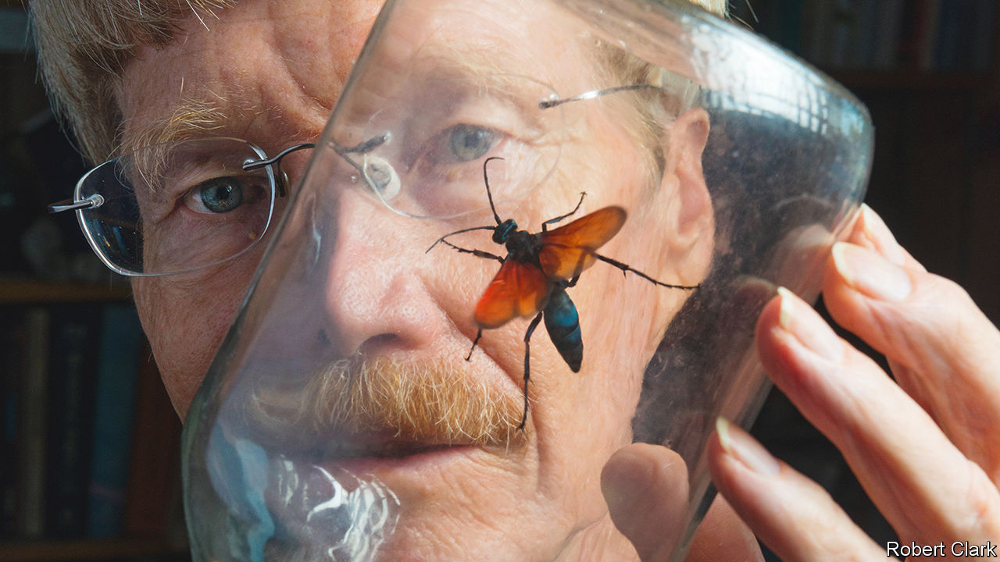

###### The King of Sting

# Justin Schmidt made a lifetime study of insects that attack us 

##### The intrepid entomologist, stung hundreds of times, died on February 18th, aged 75 

 

> Mar 9th 2023 

To be stung by a wasp, an ant or a bee raises—beyond the “Ow!”—immediate questions. How can a creature so tiny inflict such remarkable pain? And why, when all you have done is to make a jam sandwich or dare to eat a peach, does it launch such a vicious and unprovoked attack? 

Justin Schmidt wondered too, and spent his life trying to find out. Hence his nickname, “The King of Sting”. To further human knowledge he thrust his bare arms into hives of honey bees, dug up in Brazil a boiling swarm of bullet ants (which reduced him to a shaking wreck, held together by ice and beer), teetered in trees to cut down hornets’ nests, and filled his home-cum-lab west of Tucson with tanks of irritated wasps. He harvested the venom of hundreds of ants to compare it with the venom of other ants, at 200 ants for one-thousandth of a teaspoon. Over 35 years 150 different species of insect jabbed him but, to his regret, his pain threshold never rose. If they would not voluntarily perform (most were eager) he gritted his teeth, placed them on his arm and enticed them, in the name of science. Then, after cursing just a little, he took out his notebook and stopwatch and wrote it up. 

Most famously, in 1983, he compiled the Schmidt Index, ranking the stings of 78 insects from one to four according to their pain. Most he had endured himself—felt he had to endure, because of his list—though colleagues chipped in. The honey bee was his anchoring value, since most people knew what a bee sting felt like, and was rated a two. He also provided a line or so, trembling on the edge of poetry, to describe each pain precisely. Thus the sweat bee sting (1), was “light and ephemeral, almost fruity. A tiny spark has singed a single hair on your arm.” The honey wasp’s (2) was “Spicy, blistering. A cotton swab dipped in habanero sauce has been pushed up your nose.” The unstable paper wasp’s (2) was “like a dinner guest who stays much too long.” As for the red-headed paper wasp’s (3), this was “irrationally intense...the closest you will come to seeing the blue of a flame from within the fire.” 

 This sounded like pure masochism, from a man who relished pain and had been stung so often by honey bees that he found it boring. (“Like a burning matchhead that lands on your skin.”) The sting of the club-horned wasp (0.5) was actually rated “disappointing”. But he strongly denied that he was either a masochist, or crazy. His list was a tool to explore why inflicting pain was more necessary for some insects than others. 

Solitary insects, he found, tended to have a much milder sting than those organised into complex colonies. From this he deduced that stings allowed insects to get more food, hence build social structures, hence need to defend the nest, the workers, the immobile larvae and the whole teeming enterprise. The greater the danger, the higher the venom’s potency—even, in the case of a colony of paper wasps he was annoying once, blinding him when it was sprayed in microdroplets through the air. All that defending, incidentally, was left to the females; male insects did not sting, but hid, or fled. When he wanted to appal people he would pick up a male of a hyper-stinging species, like his favourite tarantula hawk wasp (pictured), and put on a brave grin. 

Most stings were highly effective. Buzzing, bright colours and a hard shell helped; but predators thousands of times larger remembered stings keenly, and kept their distance. Only bears, skunks and honey badgers thought the pain worth the reward. He himself had never forgotten his first encounter with a bumble bee, which stung him on the neck when he was five and running wild in the woods of Appalachian Pennsylvania. That did not put him off, though. He was well adapted for entomology, a small, skinny kid with tiny fingers and a delicate way of picking honey bees off clover flowers. Insects enchanted him, especially flashy yellowjackets and tiger swallowtail butterflies; he fell in a swamp once, filthy and smelly, as he tried to catch a green darner dragonfly. As a teenager, he had his own beehives. In his early 20s, after an unsatisfying flirtation with chemistry (which did not creep and crawl enough), he was on the road in a car crammed with buckets and shovels to dig up and study harvester ants in Georgia. Their stings were curiously lasting. That curiosity shaped his life. 

In general, he thought insects got a raw deal. Government research funding went to bigger creatures; no one seemed to care about wasps, or even ants. So although he held a senior post for 25 years at the Carl Hayden Bee Research Centre in Tucson, part of the federal Department of Agriculture, he worked on his own self-funded projects much of the time. They included looking for insects whose stings he might not have experienced yet.

For him, stings were not only interesting chemically and socially. They were also philosophically intriguing. The purpose of pain was to tell the body that damage was occurring, or about to occur. Many stings on his list, including those of the tarantula hawk, packed a punch but did no harm beyond a prick and a welt. By contrast, others, including the sting of the honey bee, seemed milder but were much more toxic; they could close down the body and, if delivered en masse, stop the heart. Stings seemed to be a sharp statement of truth, insect to human. But pain was often a lie. Only toxicity counted. It was all part of an awkward web of miscommunication and non-understanding which he hoped to unravel, given patience and time. 

Meanwhile he had installed himself in south-eastern Arizona, on the edge of the Sonoran desert. He had already found Maricopa harvester ants there, the most savage variety. (“After eight unrelenting hours of drilling into that ingrown toenail, you find the drill is wedged in the toe.”) For the worst stingers, though, he would have to go farther south, as he often had, to the tropical and semi-tropical Americas. There he would encounter again the bullet ant (4+) with its “pure, intense, brilliant pain. Like walking over flaming charcoal with a three-inch nail in your heel.” Or, possibly, another 4, the warrior wasp: “Torture. You are chained in the flow of an active volcano. Why did I start this list?”■

