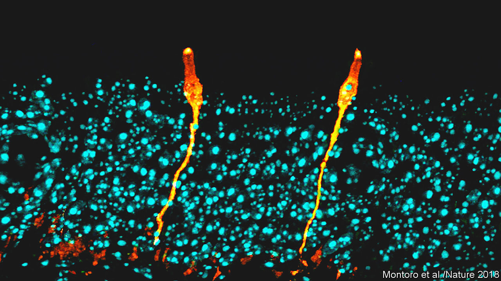
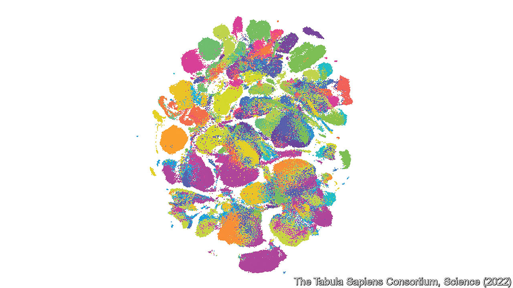
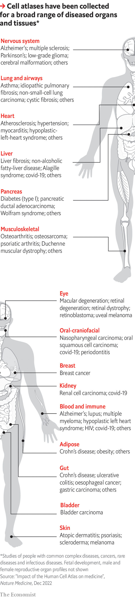
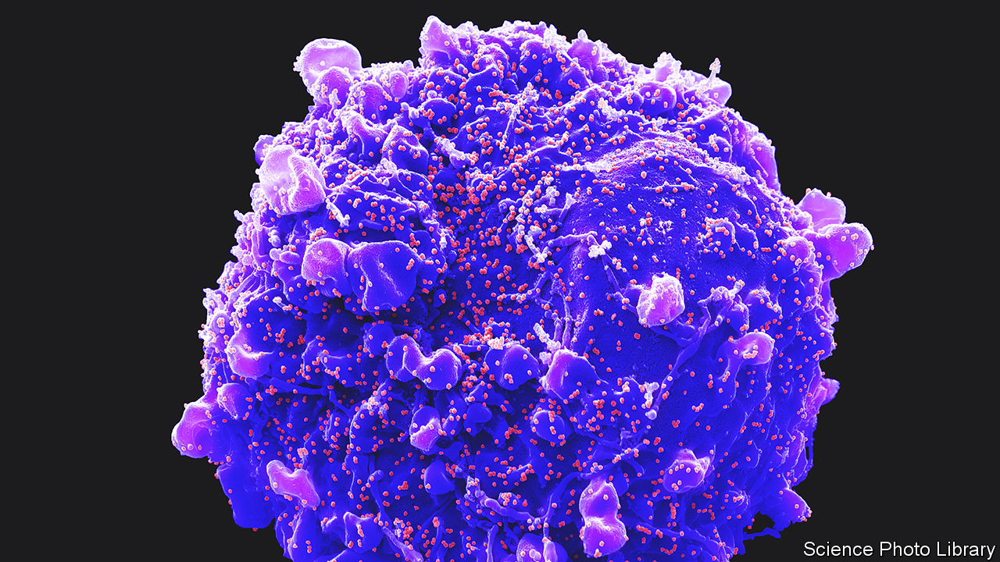

###### The Human Cell Atlas

# A cartography of human histology is in the making 

##### It will identify and locate every type of cell in the human body 

 

> Mar 8th 2023 

What gets hyped, and what remains neglected, often depends on good storytelling. When the Human Genome Project began, in 1990, it had a simple story, well told. From a standing start, American taxpayers would pay for an exhaustive map of the DNA that makes up the 24 sorts of chromosomes found in the human genome (women have 23; men possess an extra tiddler that carries the genetic switch for maleness). Others were welcome to join in (and did; a third of the work was done in Britain, paid for by the Wellcome Trust), and there would be international co-ordination, to stop duplication of effort. But the moving spirit was the American government. And the budget was measured in billions.

It was a brilliant success, both scientifically and as a public-relations exercise for American science. By the time it was done, most people who would consider themselves well-informed had heard of it. Indeed, in a rare shift in public consciousness about scientific jargon, journalists no longer found themselves required by their editors to explain what DNA actually was every single time it was mentioned. 

Who, however, has heard of the Human Cell Atlas? Precious few. Yet its goal resembles the genome project’s. It is to do for histology what was done for genetics by making an exhaustive map of a set of components of the human body—in this case, its cells, rather than its DNA. That, as this year’s meeting of the American Association for the Advancement of Science (AAAS), held in Washington, DC, heard, is a goal with as much medical importance as the genome project had. But the Human Cell Atlas’s modest beginnings, decentralised organisation and unpushy leaders, mean it has remained almost invisible. 

The genome project was led by men (and they were all men) of boundless ego and public presence. Contrariwise, the Cell Atlas project was founded and is run by a pair of quietly determined women: Sarah Teichmann and Aviv Regev. Their day jobs are, respectively, at the Wellcome Sanger Institute, near Cambridge, England, and Genentech, a biopharma firm near San Francisco. But they also manage to find time to run the steering committee which keeps the atlas show on the road. Together with Stephen Quake, organiser of a parallel and co-ordinated project called Tabula Sapiens, which was carried out at the Chan-Zuckerberg Biohub in California, they apprised those attending the meeting of the project’s progress to date.

I contain multitudes

An average adult human body is composed of 37.2trn cells. Clearly, no currently imaginable technology is going to be able to locate them all individually. But, just as a real atlas does not show every building, a cell atlas need not show every cell. It should, however, identify and characterise every type of cell, and also where that cell type is found in the body—not only which organ, or even which tissue within an organ, but whereabouts within a tissue. 

As of March 3rd, the date of the session addressed by Drs Regev, Teichmann and Quake, the Cell Atlas project, which began in October 2016, had signed up 2,704 researchers from 1,483 institutes in 86 countries. Together, those scientists had examined 14,635 samples from 9,554 donors, and logged data from 120m cells—a number that is doubling every 180 days or so.

Importantly for the organisers’ goals (and also in contradistinction to the genome project), institutes on every inhabited continent are helping to create the atlas. Since they draw their material from local samples, this means that from the start, even though the richer parts of the planet are inevitably over-represented, data from a wide variety of ethnic backgrounds have been included.

Unlike the genome project, which had a clear end point, known in advance (the number of genetic “letters” in the human genome could be calculated by measuring how much DNA it contained), the Cell Atlas project’s goal is fuzzy. When it began, no one knew how many types of cell there were. The answer turns out to be, “a lot more than people once thought”. 

A textbook printed in 2016 would probably have given a figure of about 300, while acknowledging that was surely an underestimate. So far, researchers for the atlas have identified thousands—the precise number depending on how finicky you are about the amount of difference there needs to be between two cells for them to count as different types.

No tabula rasa

That difference is determined by which of the 20,000 protein-coding genes identified by the genome project are active within a cell—for this mix of proteins determines both a cell’s structure and what it does. It is that variability of protein composition which permits the division of labour and specialisation of function that have allowed complex multicellular organisms such as human beings to evolve. 

Rather than hunt proteins directly, the atlas’s cartographers are hunting RNA. Proteins are made by translating edited transcripts of genes, known as messenger RNA (mRNA) molecules, into chains of amino acids. Such messengers can thus act as proxies for the proteins they encode. And techniques for counting and characterising RNA molecules are much better established than equivalents for proteins. 

It is thus possible to take a single cell, extract its mRNA, and measure the amount, if any, of each such transcript. This, as Dr Regev explained to the meeting, means the cell thus analysed can be put at a location in a mathematical space that is described not by two axes, as on a standard graph, or even by three, as with a three-dimensional graph, but by 20,000 axes, one for each protein-coding gene. 

Though human brains cannot begin to cope with the idea of a 20,000-dimensional graph, a computer can. It is able to cluster cells according to their positions in such a multidimensional space, and from the way they cluster, it can sort them into baskets corresponding to cell types. 

 


Then, for the benefit of benighted human brains, it can apply a mathematical technique which compresses the whole thing back to two dimensions, for ease of viewing. From this (see picture) it is possible to see cell types emerge.

Different organs have different numbers of cell types. The one with the most (3,000 from an early draft, but undoubtedly more than that) is the brain. This is little surprise considering the complexity of the brain’s job. But even the humble gut has at least 137.

Each organ, though, whether rich or poor in cell types, is the subject of its own sub-atlas in the project. And all data collected by participant organisations are made available to the world as soon as they have been collected and verified, so that other researchers may benefit from them.

After a year or so of preliminaries, the Cell Atlas project was launched at an event in London, organised by Dr Regev (then at the Broad Institute, in Cambridge, Massachusetts) and Dr Teichmann. This was attended by about 100 researchers. In 2017, the Chan-Zuckerberg Initiative came on board. So far, this organisation has donated $254m towards the project, as well as sponsoring Tabula Sapiens. That enterprise collected its first samples in 2019, building on the back of an earlier project on mice. The idea is to produce a first draft of the full atlas in 2025.

 


Besides posting data immediately, each group involved puts out its own papers. The Tabula Sapiens team, for example, published a manuscript in 2022, describing what they had done. They had focused on obtaining samples of multiple different organs from the same individuals. To do so, they had harvested material from people who had volunteered as organ donors, and had then met an untimely end.

In collaboration with a local organ-donation charity, and having obtained family consent, the project’s “crash team” removed from these donors tissues not required for transplant, and did so within an hour of the withdrawal of life support. Not all donors offered were deemed suitable. In particular, in order to draw the widest-ranging possible set of conclusions, the team needed a balance of both sexes and a range of ethnicities. In the end, they obtained multiple samples of 24 types of tissue and organ from 15 donors.

Most other research groups are not as focused as this. They will use material from biopsies collected for medical reasons, when such are available. But they often study post-mortem samples, which have frequently been frozen, and may thus have had their structure changed in subtle ways. Whatever a sample’s source, however, it must then be processed. 

The genome project relied on two main technologies. One was DNA sequencing, which provided the genetic letters, in order, of short bits of DNA chopped at random from a chromosome. The other was computers, which spotted overlaps between those sequences, and so patched the whole chromosome together. Cell atlases, however, require many approaches. Indeed, many times many of them. 

Ways and means

A paper Dr Teichmann and Dr Regev published in December 2022 describes six classes of technological methods involved in the Cell Atlas project. They range from tissue imaging and histology via transcriptomics to “genome and epigenomics”. These classes further subdivide into 100 categories, ranging from techniques like magnetic-resonance imaging which can be applied to entire bodies, to nucleosome occupancy and methylome sequencing, which concerns itself with individual nodes of DNA wrapped around protein clusters inside chromosomes.

Top of the list of techniques, though, are the ability to handle individual cells, in order to study their mRNA patterns, and the ability to do what is called spatial sequencing, which permits identification of the types of individual cell in thin sections of tissue mounted on microscope slides. 

Cell-handling is Dr Quake’s particular area of expertise. In 2012 he commercialised a microfluidic device which could break cells open to release their mRNA and analyse the resulting transcript patterns 96 cells at a time. Just a decade later, it is now possible to handle hundreds of thousands of cells at a time—the trick being to suspend each of them in a drop of fluid floating in a medium of oil and accompanied by a bead that has been tagged with molecules which act like a bar code to identify it.

Having characterised cell types in this way, the next stage is to seek them out in actual tissue. This is where the spatial sequencing comes in. As still happens in undergraduate histology labs, the tissue to be studied is embedded in a block of wax and that block is cut into thin slices with a sharp knife. Each of these slices is then laid on a microscope slide. 

The next stage in classical histology would be to use a chemical stain to show up the individual cells. In this case the stain is made of single-stranded DNA molecules that have had fluorescent tags attached to them. These will stick only to complementary RNA molecules in the slice, thus marking only cells containing RNA relevant to the cell type under study.

The slides so mapped are, in essence, the pages of the atlas—or, more accurately, pages in one of the various volumes of the atlas that are being created, for each organ has its own volume, and there are volumes, too, for various stages of life, particularly pre-partum, and for diseased tissues as well as healthy ones.

That last is especially important, for the ultimate purpose of the exercise is to improve human health. As the diagram shows, separate atlas volumes have so far been created of diseased tissue in 15 organ systems that are common to both sexes. They are also available for the male and female reproductive systems, and for developing fetuses. Dr Regev outlined to the meeting four examples of where this approach has already made a difference.

The first is in transforming understanding of cystic fibrosis, an illness caused by a person inheriting two broken versions of a gene called , one from each parent. Lack of a working  gene results in the mucus produced by cells lining the airways of the lungs being too thick. That makes breathing difficult and encourages infections, shortening the lives of sufferers.

Those who study cystic fibrosis had known all this for a long time. What they had not known (though they thought they did) was which of the lungs’ cells were expressing . By studying transcript patterns, cell-atlas researchers discovered that those which do this are a rare and hitherto unknown type that they have dubbed ionocytes (some of which are pictured at the beginning of the story). This discovery is now changing the direction of cystic-fibrosis research. 

Gut-cell atlas researchers have similarly discovered entirely new cell types—which might thus become targets for drug treatment—involved in inflammatory bowel disease. And those working on the cancer-cell atlas can predict from mRNA profiles whether or not a case of melanoma will respond to immunotherapy.

 


Dr Regev and Dr Teichmann are particularly proud, though, of the atlas’s role in the response to covid-19. As is the case with all viruses, SARS-CoV-2, the causative agent of covid, gains entry to cells by latching onto particular molecules, usually proteins, sitting in their surface membranes. Once the relevant proteins for SARS-CoV-2’s cell entry were identified, researchers around the world were able to go through the atlas looking for cell types that express ACE2 and TMPRSS2, the proteins in question. That enabled them to pinpoint tissues beyond the respiratory tract which would also probably be harmed by the infection, such as the liver, heart and kidneys (a cell from which is pictured, with SARS-CoV-2 particles budding from its surface membrane).

Other medical uses to which cell atlases may be put include identifying the best candidates for cell engineering (the employment of genetically modified cells as therapies), the mass screening of potential drugs to see their separate effects on particular cell types, and the design of organoids, which are small simulacra of actual organs, using which experiments can be carried out that would not be possible on people. The Human Cell Atlas will, in short, turn the human body into  far less  than it previously was, and make it much easier to mend when it goes wrong. It will, in other words, carry on where the Human Genome Project left off. And now, at last, you have heard of it. ■


