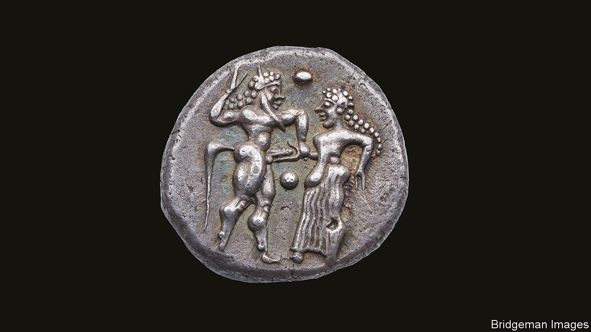

###### Silver and democracy

# Newfangled coins and mercenaries may have brought about democracy 

##### In ancient Greece, the old order could not stand against them 

 

> Mar 8th 2023 

In the view of many, money corrupts democracy. In the view of Francis Albarède, however, it was money, in the form of coined silver, which created democracy in the first place. 

Dr Albarède is a geochemist at the École Normale Supérieure in Lyon, France. His definition of “geochemistry” stretches, however, well beyond many people’s, into political and economic history. In particular, he has just finished running the European Research Council’s SILVER (Silver Isotopes and the Rise of Money) project. This, by studying the isotopic composition of ancient silver coins, has tried to draw conclusions about where the metal in a coin was mined, and thus about patterns of trade. 

Dr Albarède explained to the AAAS meeting how, in his opinion, the trick of turning silver into small discs of more or less constant weight and purity, certified by authority, had catalysed the overthrow of the oligarchies of dozens of Greek city states, most notably Athens, in the sixth and fifth centuries BC, and their replacement with versions of the idea that all free men should share in governing the polity they live in.

Both the silver and the free men came, in his interpretation of events, from the contemporary Persian empire’s habit of hiring Greeks as mercenary soldiers. Hoplites, the heavily armed infantrymen who formed the core of Greek armies of this period, were much in demand as soldiers of fortune, and many found employment in non-Greek armies—not infrequently fighting their fellow Greeks. 

Persia was a particularly large customer during its wars of expansion around the end of the sixth century, and frequently paid its hoplite recruits in the newfangled medium of silver coins. These were a form of easily portable and exchangeable wealth invented in the kingdom of Lydia, one of Persia’s conquests, and adopted by Cyrus, the Persian empire’s founder. Though many Greek city states had begun to take up Lydia’s invention, too, meaning coins were a familiar idea, when these men returned home, as rich, metaphorically, as Croesus, the Lydian king whom Cyrus had overthrown, they upset the political applecart by forming the ambitious middle class that is the  of all successful revolutions. 

Elsewhere, though the advantages of coinage were quickly appreciated throughout the Mediterranean and near-eastern world, this sudden influx of money and men did not happen, so the powers-that-were, were able to adjust. But in many Greek cities the local oligarchs could not resist the tide of mercenary silver, and the rule of free men (though not of women or slaves, obviously—for nobody was yet that radical) took over.


