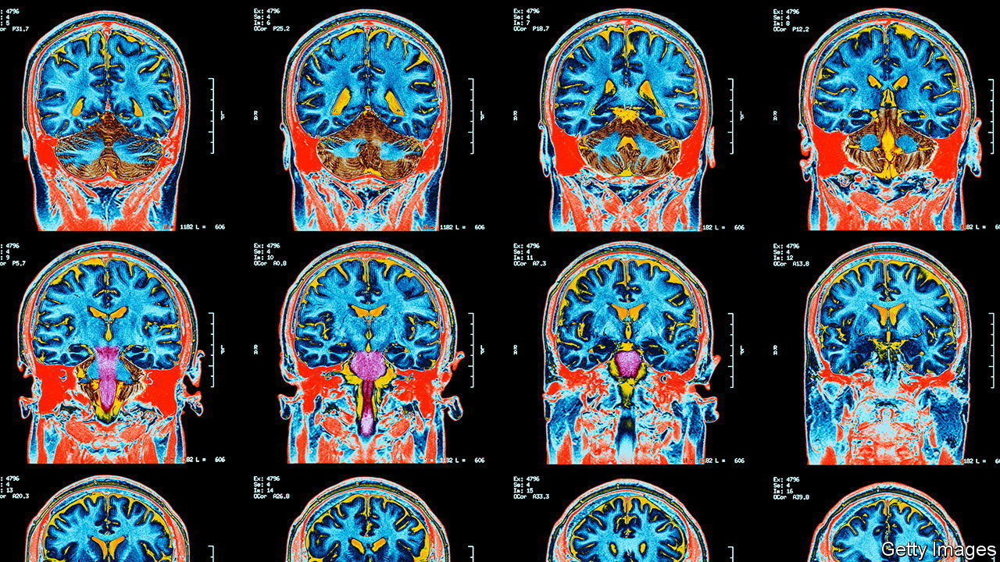

###### Chromosomal deletions and neurology

# Studying broken chromosomes can illuminate neuroscience 

##### Losing genes and getting extra ones have opposite effects 

 

> Mar 8th 2023 

It is sad, but true, that much of what is known about how human brains work has been learned by studying brains that are broken. Injuries caused by disease or accident show, from the list of functions thus disabled, the jobs of the part of the brain that has been damaged. Similarly, “injuries” to the genome, resulting in the deletion or duplication of stretches of DNA, sometimes have clear effects which can illuminate the functioning of healthy brains. At the AAAS meeting Karen Berman of America’s National Institute of Mental Health and Carrie Bearden of the University of California, Los Angeles, told participants of the latest finding concerning two of these genetic injuries. 

Some segments of the genome are at particular risk of being lost or duplicated during the process of meiosis, when pairs of chromosomes swap genetic material prior to the formation of eggs and sperm. The reason is that they are flanked by stretches of DNA which have matching sequences of genetic letters. These matching flanks can confuse the molecular machinery that does the swapping. Sometimes this confusion causes the pertinent section to be left out. Sometimes the section in question ends up duplicated. Any individual inheriting a chromosome so altered will thus have either a deficiency or a surplus of the genes that are part of the affected section.

Dr Berman works on part of chromosome 7, the deletion of which causes Williams syndrome, identified in 1961 by a doctor of that name. Dr Bearden works on DiGeorge syndrome, likewise eponymously identified in 1968, and caused by a deletion of part of chromosome 22. Both have counterparts, noted more recently, that result from an extra copy of the labile chromosomal section. As the two researchers explained, comparing the under- and over-representations of these sections has deepened understanding of the neurological roles of the genes thereon.

People with Williams syndrome have a range of symptoms. Some are anatomical, such as a characteristic face shape. Others are behavioural—a tendency to be talkative, to be sociable, to be good at recognising faces (though otherwise poor at visual-spatial tasks) and to have good empathy with others. In essence, these are the opposite of autism. Those with the syndrome’s converse, known as Dup7, have a different face shape. They also learn to talk later than normal, are bad at recognising faces (though otherwise good at visual-spatial tasks), and are unsociable. These latter traits are those associated with autism. 

Dr Berman has shed light on the role in this of two genes, and , found in the affected region.  encodes a type of protein called a general transcription factor. Transcription factors initiate production of RNA copies of genes that then act as instructions for making proteins. As that suggests,  is involved in many such initiations, which may help explain Williams syndrome’s disparate manifestations.  encodes an enzyme known to be involved in brain development.

Hard copies

Dr Berman and her group have demonstrated correlations between the “doses” of these genes (whether there are one, two or three copies) and the sizes of affected brain areas. Magnetic-resonance imaging (MRI) showed that the brain’s total volume increases with the number of copies of the affected chromosomal region (so is smaller than normal with the deletion, and larger than normal with Dup7). But all of this growth happens in the biggest part, the cerebrum. In the second-biggest part, the cerebellum, the reverse happens. 

She has now narrowed things down. Within the cerebrum, she has found, the amount of grey matter in an area called the intraparietal sulcus, which is known to be involved in visual attention (and thus visual-spatial awareness), is dose-dependent on . In contrast, the volume of another area, the insula, which has been linked to emotions such as compassion, is dependent on the dose of . Those findings nicely match genes to brain function. 

Dr Bearden had a similar approach with DiGeorge syndrome and its opposite. As with Williams and Dup7 syndromes, deleting or adding part of a chromosome has many effects. In this case, one of the most intriguing is that deletion often results in symptoms of schizophrenia, while addition protects against this condition.

Using MRI, Dr Beardon was able to correlate all of this with systematic differences in the thicknesses and surface areas of parts of the cerebral cortex. Those with a deleted segment had thicker, but less folded cortices than those with intact chromosomes. Those with a duplication had thinner, but more folded cortices.

How an extra copy of this section of DNA protects against schizophrenia is not yet clear, but investigations continue. If it can be determined, that might be an important step towards treating this troublesome condition. ■


