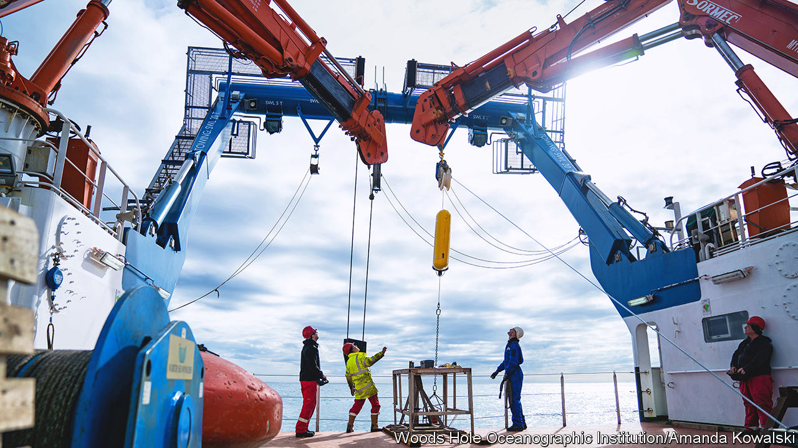

###### The ocean and climate change

# The ocean is as important to the climate as the atmosphere 

##### But only now is it beginning to be studied properly 

 

> Mar 8th 2023 

For , a dry-land species, discussions of the climate and how it is changing tend to revolve around what is going on in the atmosphere. This is a dangerously parochial attitude, for the atmosphere is but one of two fluid systems circulating above Earth’s solid surface. The other, the ocean, is in many ways the more important of the pair. 

It is the circulation of the ocean which, by redistributing heat, limits the temperature difference between tropics and poles to about 30°C. Were the atmosphere alone responsible for moving heat, that difference would be more like 110°C. And, when it comes to anthropogenic global warming, the problem would be far greater without the ocean’s buffering effect. 

Not only does the ocean absorb heat which would otherwise remain in the air, it also swallows a third of the carbon dioxide emitted by human activity. Though that makes seawater more acid (or, strictly speaking, less alkaline), which may harm some marine species, much of the CO involved ends up in the abyss, where it can cause no greenhouse effect, and where it is likely to remain for many centuries.

The poverty of human understanding of ocean circulation, compared with that of the atmosphere, is therefore lamentable. And the AAAS meeting was treated to an excellent lamentation on the matter by Susan Lozier of the Georgia Institute of Technology, who was also last year’s president of the American Geophysical Union.

Oceanographers worked out in the second half of the 20th century that the system’s engine room is in the North Atlantic. Here, in a process called the Atlantic meridional overturning circulation (AMOC), water moving up from the tropics cools, thus increasing in density, until it becomes so heavy that it starts to sink, pulling more water up from farther south to replace it. Having descended as much as 3km, it then heads south itself. 

Though some oceanic overturning of this sort goes on elsewhere, 90% of it happens in the North Atlantic. And it is this North Atlantic overturning which drives what is often described as a planet-spanning conveyor belt of connected currents.

That, at least, is conventional thinking. But Dr Lozier reckons it a bad analogy. A conveyor belt conveys an image of smooth and linear progress. This belt, though, jerks around all over the place, making it far harder to discover what is going on.

A smoothly moving belt need be examined only occasionally to check if its rate of progress is varying. So when, in 2005, a paper in  reported, on the basis of the five pertinent shipborne surveys which had been made since 1957, a 30% drop in the volume of AMOC between 1992 and 2004, there was serious concern. If such a fall continued, it would change weather patterns, particularly in Europe, by altering planetary heat distribution. It would also reduce the rate at which CO was carried into the deep ocean.

As it happened, though, 2004 was a turning-point in observations of what is going on, for it saw the beginning of the deployment of a set of recording instruments which are now known as RAPID AMOC. These monitor the Atlantic a couple of degrees north of the Tropic of Cancer, the part of the world where the surveys reported in the  paper had been conducted. RAPID AMOC was joined in 2014 by an arctic counterpart, OSNAP, the Overturning in the Subpolar North Atlantic Programme.

The upshot has been the discovery that the rate of overturning can vary, apparently at random, as much as six-fold during the course of a year. The fall described in the  paper was an artefact of an impoverished data set. 

Another finding of OSNAP has been that the details of where overturning happens in the North Atlantic are not as models had predicted. Most turnover, it turns out, occurs on the east side of the ocean, not the west, as previously believed. Though this may not matter much in the grand scheme of climate change, it is a further example of how poorly people have understood what is going on at sea.

The next step for OSNAP is to extend its remit into looking at carbon dioxide uptake. And more systematic studies are getting going in other parts of the ocean, too, as landlubbing humans are, at last, taking proper notice of the hitherto-neglected 71% of the surface of the planet they are pleased to call “Earth”, but which might, in truth, be better dubbed “Sea”. ■


