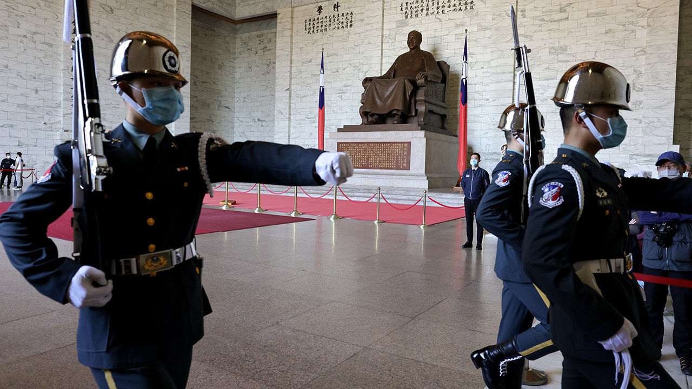
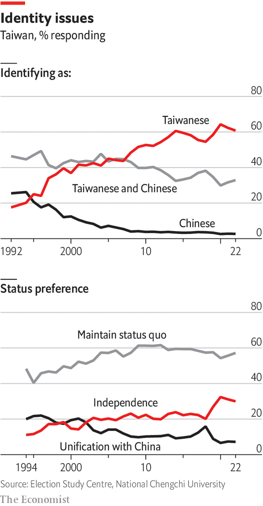
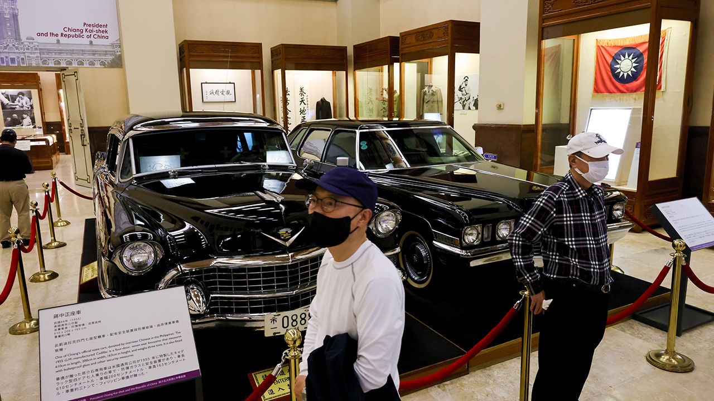

###### The past

# How Taiwan is shaped by its history and identity 

##### Understanding Taiwan requires study of its history 

 

> Mar 6th 2023 

In the centre of Taipei is a sprawling memorial to Chiang Kai-shek, leader of both the KMT and the Republic of China (ROC), which formally moved to Taiwan in 1949. A bronze statue of the general sits atop a white marble tower, gazing towards China and his lost capital of Nanjing. A newcomer to Taiwan might assume it is just a monument to a beloved founding father.

But inside the building the exhibitions divide into two. One side pays homage to the ROC. Dark display chests hold its founding charter. Two sleek black Cadillacs that once carried Chiang around Taipei hint at the glamour of ruling one of the world’s richest political parties. On the other side a new exhibit decries the KMT’s brutal dictatorship. Poems about censorship evoke the stark drama of a prison cell. Black-and-white portraits of massacre victims’ children line one wall. Another wall shows pictures of Taiwanese protesters demanding free speech. 

The two exhibits tell different versions of Taiwan’s story. The first is defined by a nationalist nostalgia for the lost homeland. The second displays a decades-long struggle for democratic rights. At the heart of Taiwan’s political divisions today is disagreement over how to reconcile the two sides of the island’s history.

When the KMT took over Taiwan in 1945, it imposed mainlanders’ rule on a people who had been colonised by the Japanese for half a century and hoped to be treated as equal citizens. Instead the Taiwanese were forced to adopt the Mandarin Chinese language and to watch as the KMT plundered the island’s resources to support its war. When Taiwanese people protested in 1947, KMT troops slaughtered an estimated 18,000-28,000 in what became known as the February 28th massacre. In 1949 the KMT imposed martial law on Taiwan, beginning a four-decade period of suppression often called the “white terror”.

 


The KMT asserted control over every aspect of life, using surveillance, propaganda and censorship reminiscent of the Chinese Communist Party’s. Its army served the party more than the country, and it had two enemies: communist spies and independence activists. At least 140,000 people were imprisoned, including many from the intellectual elite. Taiwanese activists suffered arrests, executions and exile in their 40-year fight for democracy. Only in 1987 did the KMT drop martial law. Only in 1996 did Taiwan hold its first competitive presidential election. In 2000 Taiwan elected its first opposition president and vice-president, Chen Shui-bian and Annette Lu (a former political prisoner).

Taiwan today feels a long way from this past. Old jails and execution sites are now independent bookshops and riverside parks. The streets are filled with banyan trees and bubble-tea shops. Taiwan’s residents enjoy one of the world’s best universal health-care systems. There is a vibrant civil society, with activists working for a better environment, for migrant rights and for gender equality. President Tsai Ing-wen apologised to Taiwan’s indigenous people for their mistreatment in 2016. In 2019 she oversaw the legalisation of same-sex marriage. 

Remembrance of things past

Yet Taiwan has not reached a consensus on its history or its identity. There was no sharp break of the sort that took place in post-war Germany or post-apartheid South Africa. That is good, says Nathan Batto of the Institute of Political Science at Academia Sinica: sudden transitions often come only after traumatic crises. But it also means that Taiwanese society exists without a reckoning for its authoritarian past. “This process comes differently for every person,” says Mr Batto. “Everyone will come to it at their own pace, in their own way—and some people won’t at all.”

The ROC legislature passed laws in the 1990s to compensate victims of the February 28th massacre and of martial law. In 1995 Lee Teng-hui, the KMT president, apologised publicly. A later KMT president, Ma Ying-jeou, approved the National Human Rights Museum. In 2018 Ms Tsai formed a transitional justice commission to open up political archives to the public, overturned wrongful convictions during the “white terror” and tried to remove authoritarian symbols such as statues of Chiang Kai-shek. These moves were controversial. DPP supporters complain that KMT-led efforts did not go far enough. KMT voters accused the DPP of exploiting the transitional justice commission for political gain. 

 


 Taiwan struggles to face its history without political acrimony, says Tsao Chin-jung. Mr Tsao is a 70-year-old author of a collection of oral histories from female survivors of KMT concentration camps set up in the 1950s on an island off Taiwan. Several thousand prisoners, including nearly a hundred women, were subjected to political re-education and forced labour. In 1953 some rebelled against camp demands that they write nationalist slogans in blood and tattoo them on their bodies. Fourteen prisoners were executed. It is a chilling parallel to the labour camps the Chinese Communist Party has always run. That is why Mr Tsao collected his accounts, he says. Taiwan must understand its history to avoid repeating it. China’s ambassador to France recently said Taiwanese citizens will need “re-education” after reunification.

Mr Tsao’s book of oral histories was turned into a film, “Untold Herstory”, last October. “The whole point of the film was to say, don’t be so quick to draw lines between you and me,” he says. He included complex characters who were at once collaborators and victims of an authoritarian system, in the hope of encouraging more nuanced reflection on the period. Yet public reaction to the film was “disappointing”, he says. Even before it came out, KMT supporters were criticising it as a distortion of the truth. It was released just before local elections, sparking accusations that this was done to win the DPP votes. One cinema in central Taiwan had to stop screening the film after online attacks. 

Such political polarisation may sound familiar to many. But Taiwan is unique in being a democracy without statehood, isolated by a superpower neighbour that denies its right to exist.■

Photos: I-Hwa ChenG

