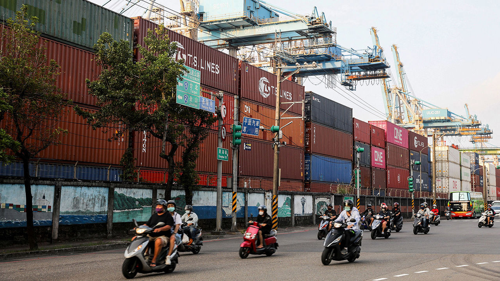
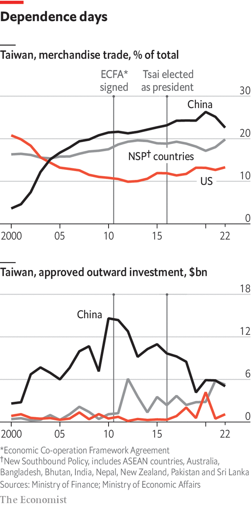
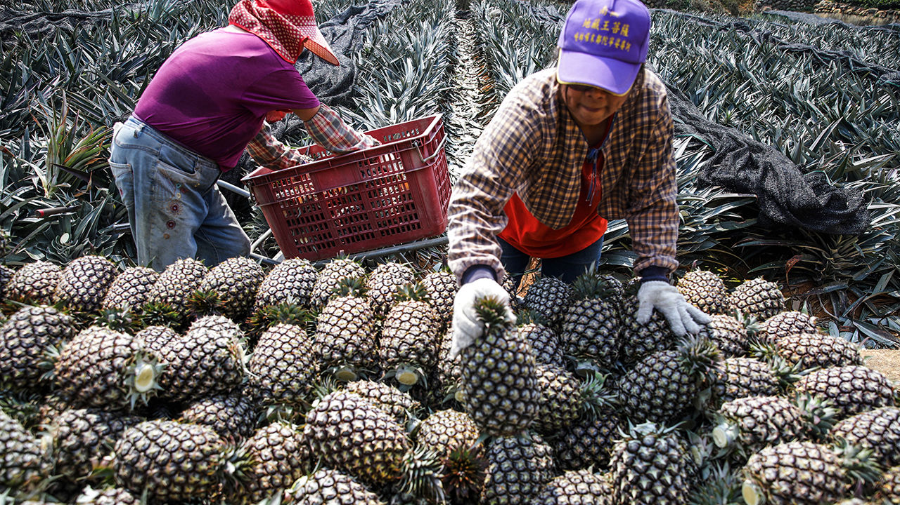

###### The economy

# It is time to divert Taiwan’s trade and investment from China 

##### Taiwan’s economy is strong, but it needs to reduce its dependence on China 

 

> Mar 6th 2023 

Taiwan has long depended on America for defence and China for growth. That worked when the two superpowers broadly co-operated. Taiwan flourished in an age of globalisation, building both a strong economy and its own security on hopes that free trade would prevent conflict. But in the process it became dependent on trade with its greatest threat. Now China is using its economic clout to isolate Taiwan.

In 2010 Taiwan signed the Economic Co-operation Framework Agreement (ECFA), a deal with China that allowed cross-strait trade to grow. China had been Taiwan’s leading trade partner since 2005, when it made up 17% of its trade flows. Last year China accounted for 25% of Taiwan’s exports and 20% of its imports, roughly the same shares as in 2016, when Tsai Ing-wen became president. She was elected after a student movement had protested against growing dependence on China. She herself had criticised the ECFA, but has not changed it as president. That is because her priority was stability, says Taiwan’s deputy minister of economic affairs, C.C. Chen. “From day one, when President Tsai took office, China has been our largest trade partner. We don’t want to rock the boat. We want to make it stable.” 

Instead of pushing for decoupling from China, the new government pursued diversification, particularly to South-East Asia. Ms Tsai’s “New Southbound Policy” promotes trade and investment with the rest of the region, including ten members of the Association of South-East Asian Nations (ASEAN), six other countries in South Asia, and Australia and New Zealand. The value of trade with all these countries has increased from $96bn in 2016 to $180bn in 2022. Investment flows have risen from $2.4bn in 2016 to $5.3bn in 2022. In 2022 Taiwan’s investment in these countries combined made up about 35% of its total investment abroad, outstripping investment in China for the first time. 

 


Taiwanese investment in China has dropped partly because of political risk and covid-19. But it is also because manufacturing is moving to South-East Asia in pursuit of lower labour costs. That reflects regionalisation of supply chains, not wholesale exit from China. Yet Taiwan faces a unique obstacle to further regional integration: China wants to exclude it, and has the clout to pressure its neighbours. Taiwan has but a handful of free-trade agreements. It hoped its latest FTAs, signed with Singapore and New Zealand in 2013, would pave the way for its eventual entry into the Regional Comprehensive Economic Partnership (RCEP), which includes 15 Asia-Pacific countries. But it has been blocked by China. 

Taiwan has also applied to join the Comprehensive and Progressive Agreement for Trans-Pacific Partnership (CPTPP), a trade deal that replaced the Trans-Pacific Partnership after Donald Trump pulled America out in 2017. However China has applied too. According to Taiwan’s foreign minister, Joseph Wu, the CPTPP members agree that Taiwan meets the required standards. Yet they fear Chinese retaliation if they were to admit the island.

China has found other ways to punish Taiwan for asserting its sovereignty. In August 2022, just after Nancy Pelosi’s visit, China suspended imports of more than 2,000 Taiwanese food products. It has banned Taiwanese pineapples, beer, grouper fish, pomelo and other goods heavily dependent on the Chinese market. Mr Chen notes that these goods comprise less than 2% of Taiwan’s total trade with China, so the economic impact is small. China has noticeably refrained from banning Taiwanese chips or other high-tech products it most needs. 

Taiwan’s government has launched campaigns (#FreedomPineapple) asking friendly countries like Japan to import more Taiwanese farm products whenever China imposes a new ban. They say this has increased Taiwan’s trade diversification. Yet the bans still have a political impact, and they affect Taiwanese livelihoods. 


“We want the world to recognise that our policy is actually to maintain the status quo,” says Mr Chen. China is trying to shrink Taiwan’s economic space, he says. Taiwan joined the WTO in January 2002 (just after China) and should accordingly have a right to trade as freely as China. But China continues to use its economic clout to intimidate Taiwan’s would-be trade partners not to sign free-trade deals or include the island in trade blocs. 

 


Mr Chen argues that trade deals would stabilise the Taiwan strait by strengthening the status quo. Foreign governments should not accept China’s view that trading with Taiwan is an escalation that hurts China’s interests, he argues. “A free-trade agreement is nothing more than trade. It just puts us on an equal footing.” The most sought-after partner would be America, Taiwan’s second-largest market. America accounted for 13% of Taiwan’s total trade in 2022, compared with China’s 23%. Yet the American consensus on supporting Taiwan has not translated into stronger support for a free-trade agreement.

Donald Trump was popular in Taiwan because he took an early call from Ms Tsai and was hawkish on China. But his administration put bilateral trade relations in an “ice age”, says Andrew Wylegala, president of the American Chamber of Commerce in Taiwan. The Trump administration froze trade talks with Taiwan for four years as Robert Lighthizer, the trade representative, focused on a deal with China. Such treatment feeds Taiwanese anxieties about being a pawn in the two superpowers’ game.

The Biden administration is no less serious about countering China’s rise, though it favours alliance-building and security partnerships. Yet it is behind on the economic front. In 2022 America launched the Indo-Pacific Economic Framework for Prosperity, an initiative meant to increase trade with Asian partners that fell short of a free-trade deal. It excluded Taiwan. Too many Asian partners feared punishment from China. America has instead designed separate smaller trade initiatives with Taiwan.

Taiwanese officials still hope to move closer towards a free-trade deal. Ms Tsai eased rules on imports of American pork in 2020, despite public concerns about its safety. The main obstacle to a deal now is neither Chinese intimidation nor Taiwanese protectionism, but American public opinion, says Mr Wylegala. If America really wants to wean Taiwan off its dependence on China, it must overcome its “allergy to free-trade deals”, he concludes.■

Photos: I-Hwa ChenG/GETTY IMAGES

