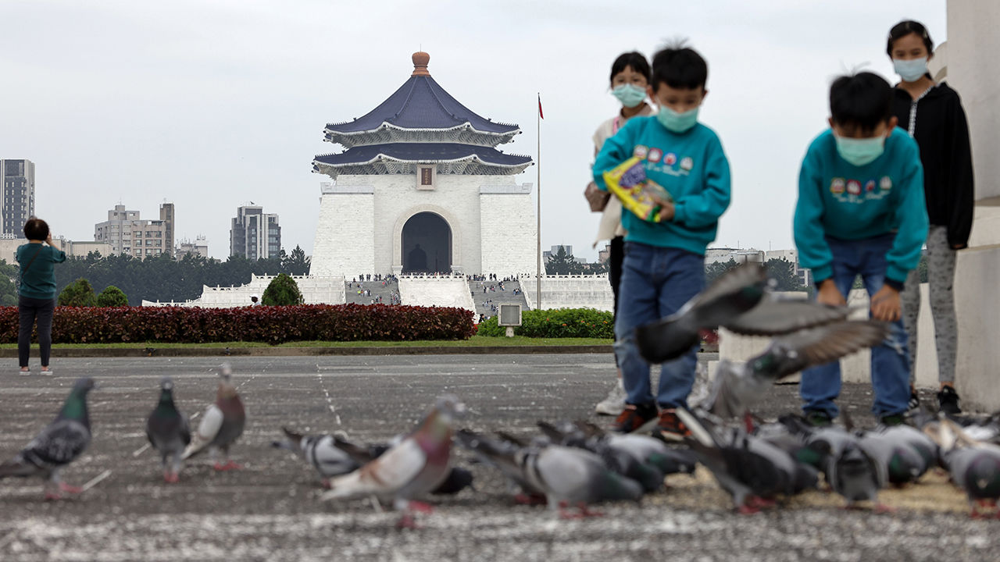

###### What Taiwan needs

# Taiwan desperately needs support from the world 

##### A vibrant small democracy needs protection from a big autocracy 

 

> Mar 6th 2023 

In 2021 Lithuania allowed Taiwan to open a representative office in Vilnius under its own name, not “Chinese Taipei”, as most de facto embassies are called. An infuriated China shut the Lithuanian embassy in Beijing, revoked its diplomatic visas and stopped trade. Lithuania’s economy suffered. But it did not change course. In November 2022 it opened a trade representative office in Taipei. Taiwan said it would invest €10m ($9.9m) in Lithuania’s chip industry. Some west Europeans complained about a lack of warning. But the Czech president, Petr Pavel, wants to meet Taiwan’s president. Joseph Wu, the foreign minister, says most people do not see Lithuania as a warning against upsetting China. “They look at Lithuania and think, ‘China shouldn’t have done that.’ ”

That is the change in thinking Taiwan needs. For decades China has tried to isolate it, keeping the ROC out of international institutions and regional trade pacts. China has used its economic power to scare firms and governments from even using the name “Taiwan”. That may be understandable for poor countries in need of Chinese money. But rich, democratic countries should not let China dictate their relations with Taiwan. Doing so only strengthens China’s belief that it will enjoy impunity if it invades.

Russia’s invasion of Ukraine was a wake-up call. Nearly 200 foreign officials came to Taiwan in 2022, many eager to discuss how to contain Chinese aggression. Such visits have accelerated since Nancy Pelosi’s trip of August 2022, despite China’s show of force that followed. Ms Pelosi’s successor as house speaker, Kevin McCarthy, has promised to go to Taiwan. That could provoke China again. Mr Wu promises a welcome for Mr McCarthy—and indeed anyone else. “They cannot dictate how we make friends with the international community,” he says. Such visits boost confidence, which is what the Taiwanese need most. “Any kind of gesture, however symbolic, allows Taiwanese people to understand that we are not alone,” he adds. 

 


Analysts are divided over how best to help Taiwan. Some actions are symbolic not substantive, says Bonnie Glaser of the German Marshall Fund. The national defence authorisation act of 2018 allowed American warships to call at Taiwan’s ports, for example. Yet that would provoke a punitive response without improving Taiwan’s defences, says Ms Glaser. Renaming Taiwan’s de facto embassy in Washington or designating it as a non-NATO ally, both of which were proposed but dropped from a congressional bill in 2022, might create openings for Beijing to change the status quo in the Taiwan strait more in its favour. 

“Of course we should not let Beijing define what we do and don’t do,” says Ms Glaser. But foreign governments should balance how China responds to acts of support against how they will bolster Taiwan’s security. The most important way to do this is military help. Aside from arms sales, America is trying to improve training. European countries could do the same. If Taiwan decided to form territorial defence forces, they could learn from European experience. Asian countries might provide real-time intelligence to Taiwan in war, especially if undersea cables were cut.

The least confrontational yet most underutilised tools to strengthen Taiwan are economic. “I’d rather see a bilateral trade agreement than any of the sexiest, biggest weapons systems the United States could come up with to sell Taiwan,” says Rupert Hammond-Chambers, president of the US-Taiwan business council. Despite resistance to free-trade deals in America, there is rare bipartisan consensus on the need to support Taiwan. A study by the Heritage Foundation finds that a free-trade agreement would benefit both economies. More important, it would set a precedent for other countries.

The other form of messaging that matters is to China. America and its allies should clearly communicate the cost of any use of force against Taiwan. They should let China know it will be isolated and subject to sanctions just as Russia was after its attack on Ukraine. Some say America should end its strategic ambiguity altogether and tell China it will fight for Taiwan. Others argue that greater clarity might merely heighten the risk of war. The Biden administration has chosen to let actions speak louder than words. The formation in 2021 of AUKUS, a security pact between Australia, Britain and America, was a signal of stronger military determination in the Indo-Pacific. So was the expansion of American military co-ordination with Japan and the Philippines announced earlier this year.

This special report has argued that Taiwan’s own people must determine their future. But many of the actions they take on the economy, identity, politics and defence need to be bolstered by greater support from the rest of the world. Taiwan should be included in trade pacts, allowed into international institutions and given greater military and diplomatic assistance. 

Taiwan endures China’s economic, military, and psychological threats, as well as social fissures from its own history. This is a moment for Taiwanese democracy to prove its resilience. Its people overcame an authoritarian past. They now have to ward off an authoritarian future. They should not be left to stand alone. ■

Photos: I-Hwa ChenG

