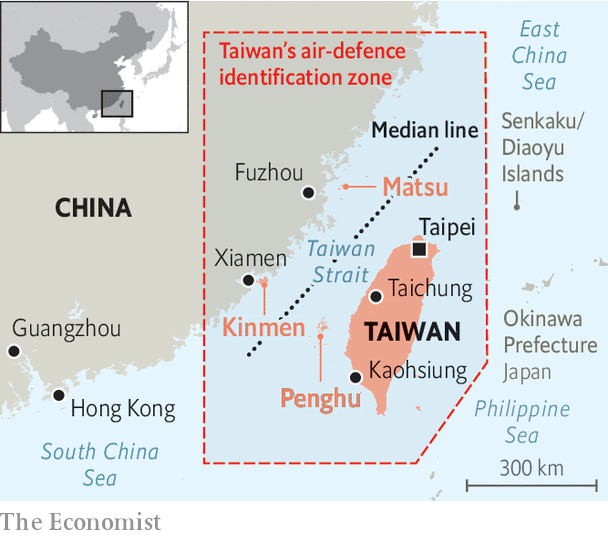

###### Taiwan

# Taiwan is a vital island that is under serious threat 

##### Taiwan’s fate will, ultimately, be decided by the battle-readiness of its people, says Alice Su 

 

> Mar 6th 2023 

When Taiwan’s president, Tsai Ing-wen, announced the extension of military conscription in December 2022, she called it an “incomparably difficult decision”. Taiwan’s young were previously subject to only four months of conscription. Starting from 2024, they will serve a year each, with improved training. “No one wants war,” she said. “But peace will not fall from the sky.” Taiwan must prepare for war, she added, to prevent it.

 


Ms Tsai’s decision should not have been so difficult. That it was reflects a troubling reality: Taiwan has not made up its mind how or even whether to defend itself. It is at once the “most dangerous place in the world” yet numb to . Only since Russia’s invasion of Ukraine has serious debate about a possible Chinese invasion become normal. That is in part because China’s Communist Party is engaged in an information war designed to sow confusion. It also reflects Taiwan’s tortuous history and politics. 

Western officials are already planning for Taiwan’s possible struggle against China. Yet Taiwanese have no consensus on who they are, how they relate to China or if they should ever fight. Their future depends on how they answer these questions especially as the next presidential election approaches. 

China sees Taiwan as a renegade province that it has threatened with invasion for more than 70 years. But until recently war seemed unlikely. With American help, Taiwan had the military edge throughout the 20th century, and an ambiguous but secure place within a peaceful Sino-American relationship. In the past decade, though, that relationship has flipped from economic co-operation into overt competition. China’s president, Xi Jinping, speaks of national rejuvenation in terms of victory over America, and has expanded his army at an alarming pace. The People’s Liberation Army has begun beating the Americans in war games. China boasts the largest navy in the world, with an expected force of 400 ships by 2025 (America has less than 300, Taiwan just 26). It has expanded its missile and nuclear arsenal to keep foreign forces away from the Taiwan strait.

China is also taking more “grey zone” actions (threatening moves short of war). The number of Chinese warplanes crossing the strait’s median line, an unofficial divider, and entering Taiwan’s south-west air-defence identification zone, has almost doubled in the past two years. The figure rose especially sharply after Nancy Pelosi, who was then speaker of America’s House of Representatives, visited the island in August 2022. China acted out a mock blockade after her visit, firing missiles directly over Taiwan for the first time.

While American officials prepare for a worst-case scenario of all-out invasion, Taiwan’s defence ministry is more concerned about “grey zone” actions such as a blockade or the seizure of an outlying island. Taiwan’s main island is roughly 160km away from the Chinese coast, but the island of Kinmen is only 3km away. Kinmen has been a conduit of cross-strait tourism and economic exchange. It has been importing water from China through a 16km pipeline ever since 2018. Some of those who urge Taiwan to prepare for invasion have suggested that, after seeing the impact of sanctions on Russia because of its attack on Ukraine, China would need a quick conquest of Taiwan, not a drawn-out conflict. Taiwanese officials worry that grey zone actions might serve as an early test of international will. America might well fight China to defend Taiwan—but would anyone fight for Kinmen?

As Chinese pressure on Taiwan grows, the Taiwanese look for the world’s support. Taiwan stands “at the vanguard of the global defence of democracy”, Ms Tsai has said. To let it go under would be a devastating step towards the might-is-right world that both Mr Xi and Russia’s Vladimir Putin seem to favour. 


Taiwan also has outsize importance in the world economy. A conflict over Taiwan would do a lot more damage even than Russia’s war on Ukraine. Taiwan makes more than 60% of the world’s semiconductors, which power everything from mobile phones to guided missiles, and 90% of the most advanced sort. Rhodium Group, a research outfit, estimates that a Chinese blockade of Taiwan could cost the world economy more than $2trn.

First defend yourself

Taiwan’s leaders know that neither strong democracy nor economic importance is enough. The Ukraine war has taught them that a small country bullied by a bigger neighbour must demonstrate that it has the will to resist. Fight back, and there is more chance that the world will come to your aid. But Taiwan is not ready to fight. After decades of falling defence spending, its army has shrunk to a paltry 163,000 active soldiers (against China’s 2m). It has more than 2m reservists, but can train only 110,000 of them each year. Taiwanese conscripts often liken their training time to “summer camp”, joking about sweeping floors and pulling up weeds, not learning to fire weapons. 

American officials and retired Taiwanese military leaders worry about Taiwan’s defence strategy. Its generals spend too much of their defence budget on fighter jets, tanks and battleships that may have been useful 30 years ago against a weaker China, but are now vulnerable to Chinese missiles. Taiwan’s government repeats American talking-points about asymmetric warfare, the fighting a small country needs to defend itself against a larger enemy, but its army has yet to commit to it. Ms Tsai’s announcements of conscription and training reform are a step forward, but not enough.

The most threatening Chinese attack against Taiwan may be psychological. Since the Ukraine war began, Taiwanese media have been flooded with conspiracy theories and Chinese propaganda stirring mistrust of America. NATO backed Russia into a corner, it is often claimed, and is sacrificing Ukraine for American interests. Taiwan must beware of America pushing it to be the next Ukraine. Such stories are surprisingly widespread in Taiwan. When China launched military exercises around Taiwan after the Pelosi visit, many blamed the Taiwanese government and American politicians for provoking it, not China for threatening the island.


Such victim-blaming is in part a product of Chinese disinformation designed to upset Taiwanese society. But it also reflects Taiwan’s history. Taiwan’s official name is the Republic of China (ROC), which dates from 1912, when the Qing dynasty was overthrown. The nationalist Kuomintang (KMT) party incorporated Taiwan into the ROC in 1945. It fled to the island after losing the civil war in 1949, and then imposed an authoritarian one-party system and four decades of martial law, forcing the local population to speak Mandarin and to embrace a Chinese identity. 

Only after Taiwan democratised fully in the late 1980s did a suppressed local identity re-emerge. Polls in 1992 found just 17.6% of respondents identifying as Taiwanese, against 25.5% as Chinese and 46.4% as both. By 2022 a similar poll by the Election Study Centre at National Chengchi University found 61% of respondents identifying as Taiwanese, 2.7% as Chinese, and 32.9% as both. Younger generations born after the lifting of martial law hold especially strong Taiwanese identity. Yet a minority of Taiwan’s older generation still identifies with China and hopes one day to be part of the mother country. America’s switch of recognition to communist China and its discouragement of Taiwan’s independence have also fostered more mistrust of Washington. 

The next presidential election is due in early 2024. Candidates will have to propose a new vision for Taiwan’s future in a world of deepening Sino-American hostility. Looking at the identity polls, it might seem that Ms Tsai’s pro-independence Democratic Progressive Party (DPP) should win easily. Support for independence has grown and support for unification has dropped. KMT affiliation has fallen as DPP affiliation has risen.

Identity is not the only factor in Taiwan’s politics. A plurality of Taiwanese are undecided on either party affiliation or on independence versus unification. Around 57% of respondents in recent polls support the “status quo” of de facto independence—and no war. Yet voters may have to choose between one or the other: fighting for sovereignty or surrendering for peace. The Chinese Communist Party pushes the defeatist message that America is manipulating Taiwan’s “separatist” leaders to provoke China, and it will be their fault if China is “forced” to attack. Taiwanese should instead quietly co-operate with China against a deceitful West.

Taiwan’s youth may be inured to such propaganda. But they are the group with the lowest voter turnout. The highest turnout is among those aged 55-75, who include conservatives most likely to favour appeasement. “Vote for the DPP and your youth go to the battlefield. Vote for the KMT and there will be no cross-straits war,” declared Ma Ying-jeou, a former president and KMT leader, before local elections in November, which the KMT won. Local elections may be more of a judgment on city- and county-level government than on policy to China. But the talk of war in this campaign was a preview of a larger debate about to take place in Taiwan.

Taiwan is a democracy, so its future lies in its people’s hands. But that makes it vulnerable to authoritarian exploitation. China is already promoting defeatist and divisive ideas in the Taiwanese media. It is up to the Taiwanese to unite against them. They must decide who they are, what they believe in, whether they will fight and what that might cost. They should value their freedoms enough to be ready to make sacrifices for them. That is a politically difficult message, though not an entirely new one. After all, the freedom they enjoy now also came at a price.■

Photo: I-Hwa ChenG

