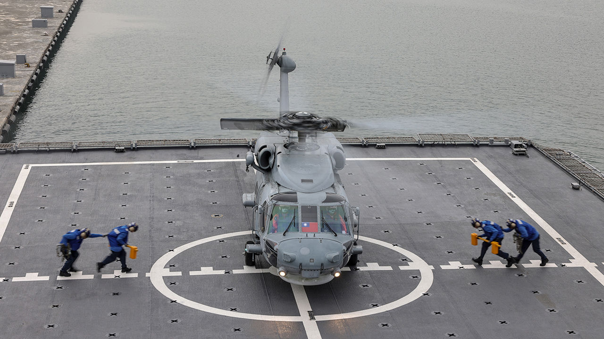
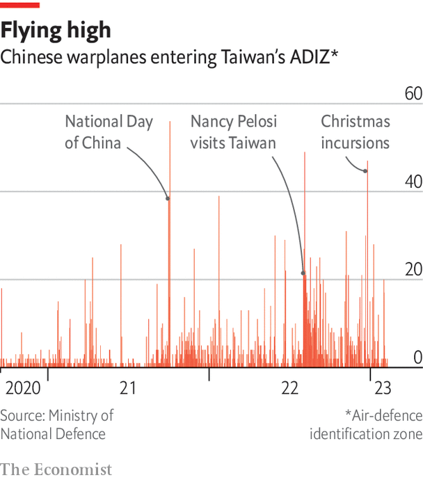
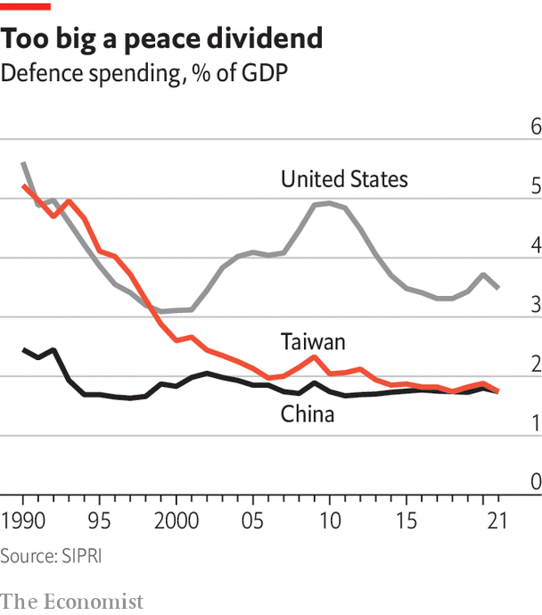
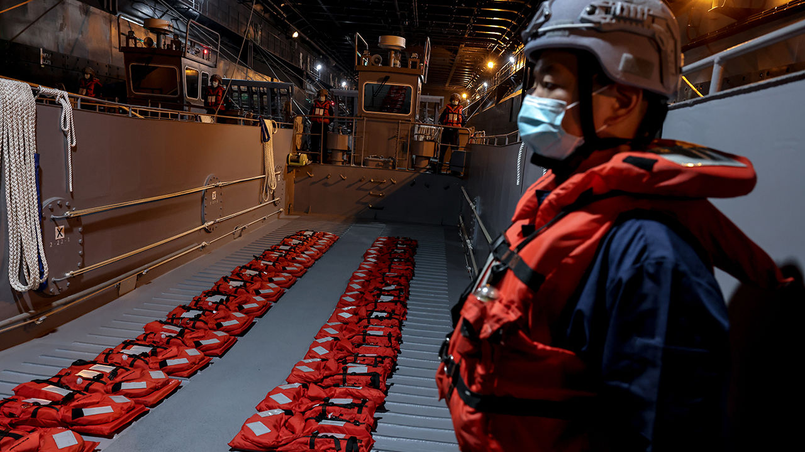

###### Defence

# Taiwan needs a new defence strategy to deal with China 

##### Taiwan needs to prioritise becoming a porcupine, but ambiguity clouds its strategic decisions 

 

> Mar 6th 2023 

The  landing platform is one of the navy’s largest vessels. The 10,000-tonne warship rises out of the water at Zuoying naval base, its missiles pointing skyward. In January the defence ministry invited reporters aboard, noting that the ship could carry amphibious assault vehicles, land helicopters and launch smaller boats. This is Taiwan’s first amphibious warship of such a size, replacing an American one built in 1969. President Tsai Ing-wen praised it as a symbol of Taiwan’s “national defence autonomy”. Taiwan must counter Chinese threats by giving its armed forces the best equipment, she declared.


The  is certainly impressive. But Taiwan’s prioritisation of such equipment is at the heart of a debate over its defence strategy. American experts criticise Taiwan for spending too much on expensive items without asking what they would do in a war. Instead of buying and building big ships, jets and tanks that can easily be disabled by Chinese missiles, they say Taiwan should build up ammunition reserves and buy cheaper and more mobile weapons. Taiwan needs a “porcupine” strategy to make it more painful for China to take over. That requires an approach that treats invasion as the top priority, rather than seeing invasion and “grey zone” threats as equally important.

Taiwan’s leaders do now speak of “asymmetric warfare”, the need for small powers to focus on the weakest point of a bigger enemy. Yet they are unwilling to give up conventional defence, because there is no guarantee that America would step in. America has had no obligation to defend Taiwan since 1979, when it ended its mutual-defence treaty. It enacted the Taiwan Relations Act, under which America provides arms “of a defensive character” and sees any non-peaceful effort to determine Taiwan’s future as “a threat to the peace and security in the Western Pacific area and of grave concern to the United States”.

This leaves the issue of American military intervention deliberately vague. Joe Biden has said four times that American troops would defend Taiwan if China invaded. Each time the White House has clarified that policy is unchanged. Officially America holds only to the view that Taiwan’s sovereignty should be “decided peacefully by the Chinese themselves”. But Mr Biden has tweaked the phrasing. “Taiwan makes their own judgments about their independence,” he said last September. Nancy Pelosi added that independence is “up to Taiwan to decide”. Former Trump officials have gone further, calling for recognition of Taiwan as a country and an end to strategic ambiguity.

Taiwan also needs to change strategy because China has changed. It began in the 1990s, when China fired missiles into the Taiwan strait. America’s navy sent two carrier groups, sailing one through the Taiwan strait, to deter further action. China has since been developing the naval, air and missile capacity to stop America defending the island. Experts fear that China’s missiles could disable Taiwan’s navy and air force: jets could not take off if runways were bombed and the navy would have to set sail to survive.

America’s defence planners realised they had to change course to deal with a stronger China. American troops are returning to bases in the Philippines after a 30-year absence. The marines have got rid of tanks and are reorganising their land army into smaller, island-hopping amphibious regiments. They have urged Taiwan to shift towards focusing less on overpowering China (now an impossibility) and more on fortifying the homeland. 

 


Admiral Lee Hsi-ming, the ROC chief of general staff in 2017-19, shares this approach. He proposed a defence concept that prioritises the littoral battle, meaning less spending on the newest, biggest tanks, jets and ships, and more on missiles and mines that might obstruct a Chinese invasion, as well as on mobile weapons. However the admiral worries that Taiwan has lost sight of this concept since he retired. Taiwan continued to ask for expensive weapons like M-1A2 Abrams battle tanks and F-16 fighter jets—although American defence experts say these could serve no sensible purpose. In recent years Americans have lost patience with Taiwan’s military leaders. The government is starting to reject Taiwanese weapons requests and attempting to sell asymmetric systems instead.

My weapons are bigger than yours 

Critics say the problem is old-fashioned thinking among service chiefs who joined up in the days of martial law. They want to upgrade their forces according to battle plans built around the old dream of taking back the mainland. “They’re building what they want based on their image of themselves, rather than what they need based on the threat that they face,” says Drew Thompson, who managed defence relations between America and Taiwan at the Pentagon in 2011-18 and is now at the Lee Kuan Yew school of public policy in Singapore. 

Taiwan is mistakenly following the American military model, argues Mr Lee, despite its small size. “Even America is trying to tell Taiwan, don’t follow me. Follow small, resilient countries like Ukraine. But we keep trying to buy more jets, tanks, and ships,” says Mr Lee. The defence ministry counters that it needs conventional weapons to respond to grey zone activity around Taiwan. China sent 1,732 planes into Taiwan’s air-defence identification zone in 2022, almost twice the number of incursions in 2021. 

Some argue that Taiwan must prepare for all contingencies because doubts over whether America would intervene may persist even if fighting breaks out. If Taiwan could count on America joining the battle come what may, its armed forces could pivot back to being a porcupine that is hard to digest. But without that clarity, they must fear that they may fight alone. Americans retort that what Taiwan needs to demonstrate most is that it can survive more than a few days after a Chinese invasion. Even if America were committed to intervene, it might take a few weeks to mobilise, says Ivan Kanapathy, director for China, Taiwan and Mongolia at the National Security Council in 2018-2021. “No matter what we say, it’s a question of what we can do. If we can’t do it, it doesn’t matter,” says Mr Kanapathy.

 


Taiwan continues to build big ships and to buy better planes partly as a public-relations exercise. Politicians like to point to arms sales as evidence of American support. Better weapons boost morale. They demonstrate to the public that the government and the army are standing up to Chinese incursions.

Yet public polling finds low confidence in Taiwan’s defences. Civil-military relations are complicated by the ROC’s history. Under the one-party system, the army’s enemies were not just China, but also independence activists. Only after Taiwan’s democratisation was the army properly separated from the KMT. Reforms in the 1990s and early 2000s asserted civilian control, dismantled the army’s secret police and removed political indoctrination from training. But the army is still one of Taiwan’s most conservative, pro-KMT institutions. Many officers are “equally as suspicious of the United States as they are of China,” says an American official once based in Taipei. As late as the mid-2010s, officers told him the Chinese were their cousins and they would “never fight for Taiwan’s independence,” he adds.

 


Democratisation also meant a shifting of budget priorities. Taiwan’s defence spending dropped from a peak of 7.6% of GDP in 1979 to just 1.8% of GDP in 2016, when Ms Tsai took office (she has since raised it to an expected 2.4% of GDP this year). Those spending cuts were supported by both the DPP and the KMT. Both parties chose to spend more on politically popular areas like education and health care. Taiwan also began reducing conscription terms, from two years to one year in 2008 and then to only four months in 2013. The goal of cutting conscription was to create a more professional all-volunteer force. That would allow better training and a reshaping of the army from being a symbol of Chinese nationalist rule into a defender of Taiwanese sovereignty.

The results have been disappointing. Although training has improved, Taiwan’s all-volunteer force was still 7,000 short of its target in March 2022, when it was only 163,000 strong. Joining the army is not popular, despite Ms Tsai’s frequent donning of combat fatigues in photos. Both pay and social status of soldiers are low, and retention rates are poor. Taiwan also has a shrinking and ageing population, with a birth rate of only 0.87 per woman in 2022. Its interior ministry has warned that Taiwan’s 2022 military intake was the lowest in a decade, and that the numbers of military-age youths will continue to decline.

Taiwan and America agree a Chinese invasion is not imminent, because China is not confident that it could deter American intervention and take the island. But it is past time for Taiwan to act. Just as Russia’s annexation of Crimea in 2014 spurred reforms and new military training in Ukraine, Taiwan must overhaul its defences to prepare for Chinese aggression. It has taken some steps by extending conscription, increasing defence spending, changing arms purchases and improving training. Taiwan needs a better national security strategy and a serious public debate to build consensus, says Andrew Yang, a former defence minister. But, he adds, this would require a “healthy political environment” which Taiwan lacks. That is a test for the next presidential election.■

Photos: I-Hwa ChenG

