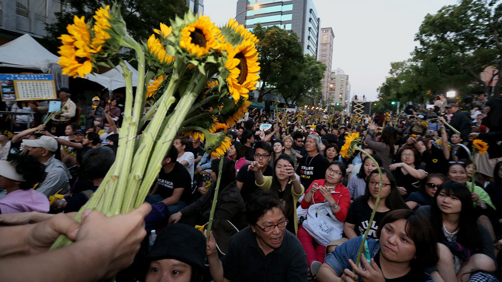

###### Politics

# Taiwanese politics faces a crucial election in early 2024 

##### The presidential election will do much to decide Taiwan’s future 

 

> Mar 6th 2023 

Taiwan’s next presidential election is due in early 2024. As in past elections, the vote will be in large part a referendum on Taiwan’s identity and future vis-à-vis China. Taiwanese identity is stronger than ever, with 61% of its people identifying as Taiwanese only. Yet it is not guaranteed that the Democratic Progressive Party (DPP) will win. Opinion polls find support for both main parties hovering around 25%, with the rest uncommitted to either party.

The DPP’s probable nominee, Lai Ching-te, has expressed his vision of Taiwan: it is already independent, so has no need to declare independence. That clever phrasing was coined by President Tsai Ing-wen to reassure those worried that the DPP might provoke China by declaring independence. “Already independent” clearly affirms Taiwanese sovereignty. It remains a popular stance, but the DPP must sell a harder message now: that the Taiwanese have to make sacrifices to preserve that independence. This means embracing policies to prepare for war.

The KMT promises prosperity and peace. Under martial law, it had purged Taiwan of suspected communist spies. After democratisation, the KMT became a chief advocate of closer ties with the Chinese Communist Party, hoping economic interdependence would stop conflict and pull the two sides together. Ma Ying-jeou, a former KMT leader who was president in 2008-16, led a honeymoon with China, signing 23 treaties on cross-strait trade, and opening direct flights and school and business exchanges. 

This engagement rests on what is called the “1992 consensus”, based on a meeting between unofficial representatives of both sides. Neither could agree to the other’s claim of ruling all of mainland China plus Taiwan. But they agreed that Taiwan was part of China, whoever ruled it. So they settled on the notion that “There is only one China, but there are different interpretations of what that China is.” This was “Chinese playing word games, the highest level of rhetoric,” says Jiang Yi-huah, prime minister during Mr Ma’s second term. Nathan Batto at Academia Sinica has a less charitable description. “It was a lie to China, a lie to Taiwanese voters, a lie to the KMT themselves. It was based on everyone else ignoring the part they didn’t like.” Yet the ambiguity has allowed both sides to trade and prosper.

Born independent

Growing cross-strait ties have however raised anxiety about dependence on China. In 2014 students occupied Taiwan’s legislature for more than three weeks in what became known as the Sunflower Movement, demanding a halt to a trade deal they said would open Taiwan up too much to Chinese influence. When they broke into the cabinet building, the government deployed riot police to expel them. Over 100,000 protesters rallied outside, waving banners with slogans such as “Save democracy, don’t sell our country”.

That movement marked a new generation in Taiwanese politics: youth born after martial law, often called , “born independent”. The Sunflower Movement helped Ms Tsai win the presidency in 2016. China’s crackdown on Hong Kong then carried her to re-election in 2020. She beat the KMT candidate, who promoted the old mantra of getting rich through trade with China. That has lost appeal for a generation more concerned with sovereignty than with being Chinese. 

The KMT will struggle to offer a new vision in the election. Its party charter still includes the 1992 consensus. But even Mr Jiang, the former prime minister, admits this has been overtaken. Were Taiwan to revert to the 1992 consensus, Xi Jinping insists it now means accepting that the Chinese Communist Party rules China, including Taiwan. That is unacceptable to most Taiwanese. American-Chinese relations have moved from engagement to confrontation, with Taiwan as a potential flashpoint. “This has gone far past what Taiwan can control on its own,” says Mr Jiang.

The KMT has been unable to articulate a new cross-strait strategy beyond continuing dialogue with the Chinese Communist Party. That is no longer popular. The party’s vice-chairman, Andrew Hsia, has been criticised by both the DPP and even by some KMT members for visiting China in August 2022 after its military exercises, and then again last month. Yet the DPP has also been hesitant about telling voters to prepare for war. DPP officials say the party leadership worries that talk of war is unpopular. The DPP has already softened its messaging, from Ms Tsai’s slogan of , “Resist China and protect Taiwan”, to the more pacific , “Peacefully protect Taiwan”.

It is not clear that Taiwanese public opinion is as allergic to talk of war as the DPP believes. In January the Taiwan Public Opinion Foundation found 72.7% backing for extending conscription. If the DPP takes serious action on defence reform, that may boost its vote. Polls find wide agreement that it is needed.

Taiwan’s identity battle has gone beyond Taiwanese against Chinese, says Wu Jieh-min of the Institute of Sociology at Academia Sinica. He does not fear a vote for unification. But it is harder to persuade voters to support painful reforms for the sake of a sovereign future. They must be willing to endorse a “long-term vision for Taiwan,” says Mr Wu, even if it requires sacrifices such as longer military service or a decoupling from China. ■

Photo: I-Hwa ChenG

